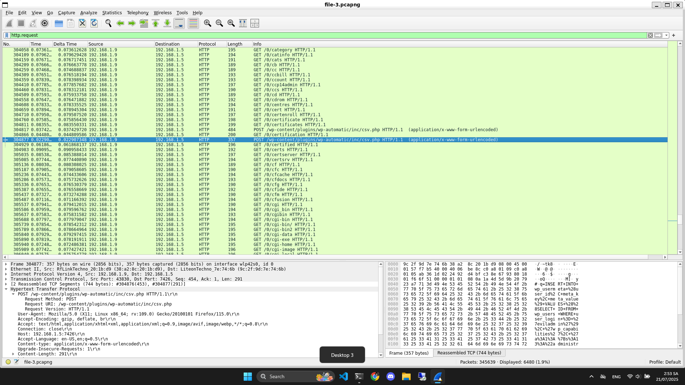

# Write Up

🧨 Lỗ hổng đã biết:
Đây rất khớp với lỗ hổng nghiêm trọng: RCE trong plugin WP Automatic.

🔍 CVE-2024-27956
WP Automatic <= 3.9.2.0 – Authenticated RCE thông qua file csv.php

Plugin cho phép upload CSV chứa mã PHP

Sau đó có thể được include hoặc thực thi

Dẫn đến thực thi lệnh hệ thống từ xa (RCE)

Flag: BDSEC{CVE-2024-27956}
