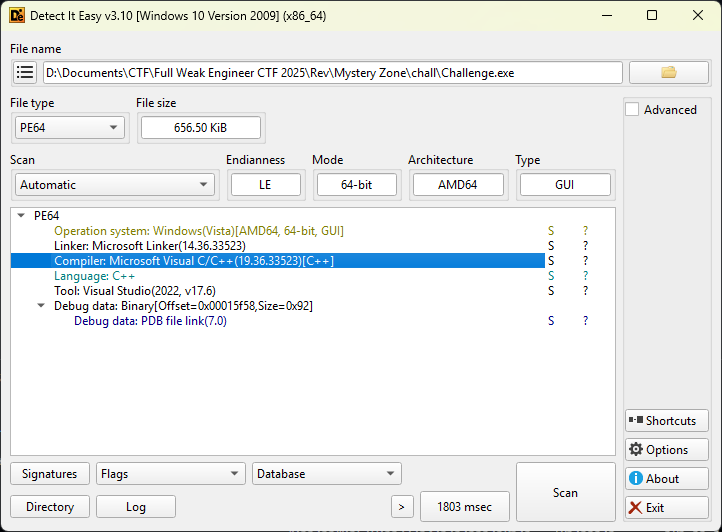

# Write Up

## DIE

Sử dụng DIE để phân tích xem file `Challenge.exe` được code bằng gì



Thấy file được code bằng `C++` nên tôi dùng Ghidra để đọc xem sao

---

## Ghidra

Sau khi mở `Ghidra` và phân tích thử thì nhận thấy cũng không có gì để đọc lắm nên tôi chuyển hướng phân tich

---

## File dll

Tôi bắt đầu chuyển hướng qua phân tích file `dll`

Trong số những file chúng ta có thì có 1 file trông cũng khá sú là `Assembly-CSharp.dll`

Sau khi nhờ ChatGPT trích xuất ra strings trong file `Assembly-CSharp.dll` thì cũng có 1 string khá sú là `TransFlag`

Có thể đây là 1 hàm trong file

---

## dnSpy

Dùng công cụ `dnSpy` để đọc và chỉnh sửa file `dll`

Nhận thấy trong class `Shellmove` có hàm `Update` như sau

```csharp
// Token: 0x06000004 RID: 4 RVA: 0x00002074 File Offset: 0x00000274 
private void Update() { 
    Vector3 position = base.gameObject.transform.position; 
    if (Input.GetKey(KeyCode.Delete)) 
    { 
        SceneManager.LoadScene("Main"); 
    } 
    if (this.Len(position) >= 50.0) 
    { 
        this.TransError(); 
    } 
    if (position == new Vector3(65535f, 65535f)) 
    { 
        this.TransFlag(); 
    } 
    if (!this.ismoving && this.canmove)
    { 
        Vector3 zero = Vector3.zero; 
        if (Input.GetKeyDown(KeyCode.W)) 
        { 
            zero = new Vector3(0f, this.grid); 
            this.walksound.Play();
        } 
        if (Input.GetKeyDown(KeyCode.S)) 
        { 
            zero = new Vector3(0f, -this.grid); 
            this.walksound.Play(); 
        } 
        if (Input.GetKeyDown(KeyCode.D)) 
        { 
            zero = new Vector3(this.grid, 0f); 
            this.walksound.Play(); 
        } 
        if (Input.GetKeyDown(KeyCode.A)) 
        { 
            zero = new Vector3(-this.grid, 0f); 
            this.walksound.Play(); 
        } 
        if (zero != Vector3.zero) 
        { 
            base.StartCoroutine(this.MoveSmooth(zero)); 
        }
    } 
}
```

**Phân tích chương trình**

Đây là một đoạn script Unity (MonoBehaviour) gắn vào `GameObject`, xử lý cập nhật mỗi frame trong hàm `Update()` (Unity gọi hàm này tự động). Nó chịu trách nhiệm:
- Reset lại scene nếu người chơi bấm `Delete`
- Kiểm tra điều kiện đặc biệt (gọi hàm ẩn flag, error)
- Điều khiển di chuyển nhân vật theo lưới (grid movement) bằng phím `WASD`

1. Lấy vị trí hiện tại

```csharp
Vector3 position = base.gameObject.transform.position;
```

Lưu tọa độ hiện tại của `GameObject` vào biến `position`

`base.gameObject` là `GameObject` chứa script này

2. Reset Game khi ấn `Delete`

```csharp
if (Input.GetKey(KeyCode.Delete)) 
{ 
    SceneManager.LoadScene("Main"); 
}
```

Nếu người chơi nhấn phím `Delete`, thì load lại scene `Main` (reset game)

3. Kiểm tra di chuyển

```csharp
if (this.Len(position) >= 50.0) 
{ 
    this.TransError(); 
}
```

Hàm `Len(position)` nhiều khả năng trả về độ dài vector / khoảng cách từ gốc (0,0,0)

Nếu đối tượng đi quá xa >= 50 đơn vị, gọi `TransError()` → Crash Game và phải chơi lại

4. Gọi Flag

```csharp
if (position == new Vector3(65535f, 65535f)) 
{ 
    this.TransFlag(); 
}
```

Có thể thấy nếu như chúng ta đến được vị trí `(x, y) = (65535, 65535)` thì có thể lấy được Flag

---

## Chỉnh sửa

Có thể thấy như ở trên thì chỉ cần `position == new Vector3(65535f, 65535f)` là chúng ta có thể gọi được Flag

Vậy thì ở bài này tôi nghĩ sẽ có 2 hướng

Một là có thể vào trong hàm `TransFlag()` để tiếp tục dịch ngược

Hai là có thể sửa chương trình cho nó gọi luôn Flag

Tôi sử dụng cách 2 và sửa chương trình thành như sau

```csharp
private void Update()
{
    this.TransFlag();
}
```

Như này thì khi mở chương trình lên nó sẽ gọi thẳng đến hàm `TransFlag()` và lấy được Flag

---

## Flag

Flag: fwectf{K494ku_no_Ch1k4r4_t7e_5u63h!}