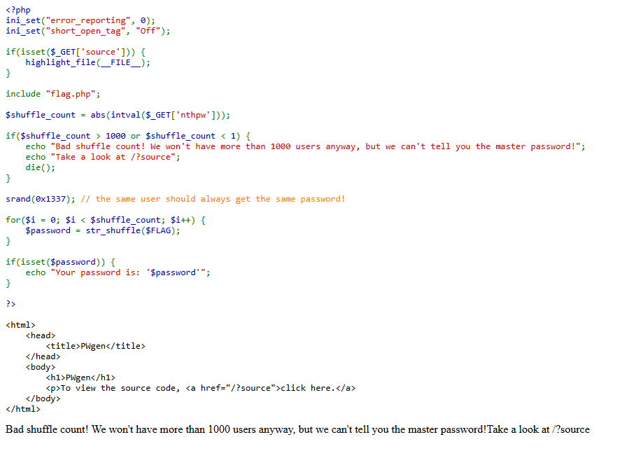

# Write Up

## Web


Thử đọc source xem sao

---

## Source



Thấy nó sử dụng hoán vị để đảo vị trí của web với `srand(0x1337);`

---

## Script

Anh em sẽ code script giải hoán vị theo Fisher-Yates

```python
t = "7F6_23Ha8:5E4N3_/e27833D4S5cNaT_1i_O46STLf3r-4AH6133bdTO5p419U0n53Rdc80F4_Lb6_65BSeWb38f86{dGTf4}eE8__SW4Dp86_4f1VNH8H_C10e7L62154"

# MT19937 như PHP
class MT19937:
    def __init__(self, seed):
        self.N, self.M = 624, 397
        self.MATRIX_A = 0x9908B0DF
        self.UPPER_MASK = 0x80000000
        self.LOWER_MASK = 0x7fffffff
        self.mt = [0]*self.N
        self.mti = self.N + 1
        self.init(seed)

    def init(self, s):
        self.mt[0] = s & 0xffffffff
        for i in range(1, self.N):
            self.mt[i] = (1812433253 * (self.mt[i-1] ^ (self.mt[i-1] >> 30)) + i) & 0xffffffff
        self.mti = self.N

    def genrand_int32(self):
        mag01 = [0x0, self.MATRIX_A]
        if self.mti >= self.N:
            for kk in range(self.N - self.M):
                y = (self.mt[kk] & self.UPPER_MASK) | (self.mt[kk+1] & self.LOWER_MASK)
                self.mt[kk] = self.mt[kk + self.M] ^ (y >> 1) ^ mag01[y & 1]
            for kk in range(self.N - self.M, self.N - 1):
                y = (self.mt[kk] & self.UPPER_MASK) | (self.mt[kk+1] & self.LOWER_MASK)
                self.mt[kk] = self.mt[kk + (self.M - self.N)] ^ (y >> 1) ^ mag01[y & 1]
            y = (self.mt[self.N - 1] & self.UPPER_MASK) | (self.mt[0] & self.LOWER_MASK)
            self.mt[self.N - 1] = self.mt[self.M - 1] ^ (y >> 1) ^ mag01[y & 1]
            self.mti = 0
        y = self.mt[self.mti]
        self.mti += 1
        y ^= (y >> 11)
        y ^= (y << 7) & 0x9d2c5680
        y ^= (y << 15) & 0xefc60000
        y ^= (y >> 18)
        return y & 0xffffffff

def php_mt_rand_range(mt, a, b):
    # range inclusive [a,b], rejection sampling y như PHP
    n = b - a + 1
    limit = (0xFFFFFFFF // n) * n
    while True:
        r = mt.genrand_int32()
        if r < limit:
            return a + (r % n)

def unshuffle(shuffled, seed):
    n = len(shuffled)
    mt = MT19937(seed)
    swaps = []
    # forward Fisher–Yates (như str_shuffle)
    for i in range(n-1, 0, -1):
        j = php_mt_rand_range(mt, 0, i)
        swaps.append((i, j))
    # đảo ngược swap để hồi nguyên bản
    s = list(shuffled)
    for i, j in reversed(swaps):
        s[i], s[j] = s[j], s[i]
    return "".join(s)

flag = unshuffle(t, 0x1337)
print(flag)
```

---

## Flag

Flag: ENO{N3V3r_SHUFFLE_W1TH_STAT1C_S333D_OR_B4D_TH1NGS_WiLL_H4pp3n:-/_0d68ea85d88ba14eb6238776845542cf6fe560936f128404e8c14bd5544636f7}