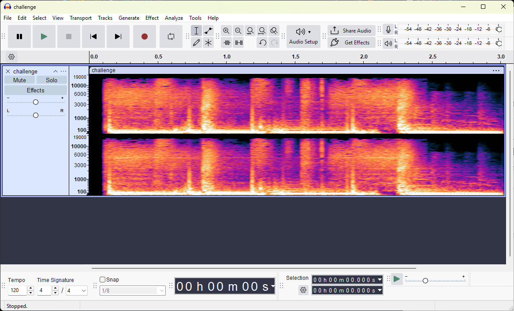

# Write Up

## Phân tích file

Đầu tiên mình sẽ thử kiểm tra file xem đây là định dạng gì

```bash
$ file challenge.mp3
challenge.mp3: Audio file with ID3 version 2.4.0, contains: MPEG ADTS, layer III, v1, 128 kbps, 48 kHz, Stereo
```

Đây sẽ chỉ là file âm thanh bình thường, mình sẽ tiếp tục phân tích sâu hơn

---

## Quang phổ

Việc đầu tiên khi gặp file âm thanh mình làm sẽ là kiểm tra thử quang phổ của nó vì đây là cách giấu Flag cơ bản nhất



Nhận thấy quang phổ không thể hiện ra thông điệp gì hết và âm thanh cũng không để lại giấu hiệu gì quá rõ ràng

---

## Binwalk

Tiếp theo mình sử dụng binwalk để kiểm tra xem có file ẩn không

```bash
$ binwalk challenge.mp3

DECIMAL       HEXADECIMAL     DESCRIPTION
--------------------------------------------------------------------------------
0             0x0             MP3 ID3 tag, v2.4
49241         0xC059          Zip archive data, encrypted at least v2.0 to extract, compressed size: 37, uncompressed size: 25, name: flag.txt
49370         0xC0DA          End of Zip archive, footer length: 22
```

Nhận thấy nó có 1 file zip yêu cầu mật khẩu chứa file `flag.txt`

Hãy thử extract nó ra xem sao

```bash
$ dd if=challenge.mp3 of=Hublot.zip bs=1 skip=49241 count=151 status=none
```

---

## John the Ripper

Thử sử dụng John để brute-force mật khẩu cho file zip này

```bash
$ zip2john Hublot.zip > zip.hash
ver 2.0 Hublot.zip/flag.txt PKZIP Encr: cmplen=37, decmplen=25, crc=2A4629F1 ts=4E22 cs=2a46 type=0

$ john --wordlist=/usr/share/wordlists/rockyou.txt zip.hash
Using default input encoding: UTF-8
Loaded 1 password hash (PKZIP [32/64])
Will run 8 OpenMP threads
Note: Passwords longer than 21 [worst case UTF-8] to 63 [ASCII] rejected
Press 'q' or Ctrl-C to abort, 'h' for help, almost any other key for status
0g 0:00:00:03 DONE (2025-09-22 09:27) 0g/s 4524Kp/s 4524Kc/s 4524KC/s "2parrow"..*7¡Vamos!
Session completed.
```

John không thể tìm ra mật khẩu cho file zip này

---

## Strings

Tiếp theo mình sẽ thử sử dụng strings để dò các xâu trong file mp3 xem có để lộ ra hint mật khẩu nào không

```bash
$ strings challenge.mp3
...
Hint: base64 -> SGVoZUBA
...
```

Nhận thấy nó có 1 hint được mã hóa base64, thử giải mã xem sao

```bash
$ printf 'SGVoZUBA' | base64 -d
Hehe@@
```

Nhận được chuỗi `Hehe@@` - Đây có thể là mật khẩu để unzip file zip

---

## Unzip

Thử unzip file zip với chuỗi nhận được

```bash
$ 7z x -p'Hehe@@' Hublot.zip -oHublot_unzip

7-Zip 24.09 (x64) : Copyright (c) 1999-2024 Igor Pavlov : 2024-11-29
 64-bit locale=en_US.UTF-8 Threads:8 OPEN_MAX:1024, ASM

Scanning the drive for archives:
1 file, 151 bytes (1 KiB)

Extracting archive: Hublot.zip
--
Path = Hublot.zip
Type = zip
Physical Size = 151

Everything is Ok

Size:       25
Compressed: 151
```

Thấy unzip thành công, tìm file `flag.txt` và lấy ra flag

```bash
$ cat Hublot_unzip/flag.txt
PTITCTF{Warm_Up_so_Crazy}
```

---

## Flag

Flag: `PTITCTF{Warm_Up_so_Crazy}`