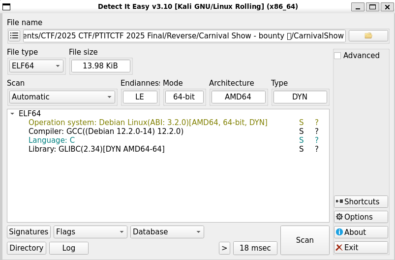

# Write Up

## DIE

Phân tích file



File được code bằng ngôn ngữ C và cũng không có gì đặc biệt lắm

Sử dụng IDA để phân tích code

---

## IDA

Khi mới vào nó sẽ cho chúng ta vào hàm `start` sau

```C
// positive sp value has been detected, the output may be wrong!
void __fastcall __noreturn start(__int64 a1, __int64 a2, void (*a3)(void))
{
  __int64 v3; // rax
  int v4; // esi
  __int64 v5; // [rsp-8h] [rbp-8h] BYREF
  char *retaddr; // [rsp+0h] [rbp+0h] BYREF

  v4 = v5;
  v5 = v3;
  _libc_start_main(main, v4, &retaddr, 0LL, 0LL, a3, &v5);
  __halt();
}
```

Ở bên dưới sẽ thấy nó gọi hàm `main`, nội dung hàm `main` như sau

```C
__int64 __fastcall main(int a1, char **a2, char **a3)
{
  printf("flag (maybe?): %s\n", "PTITCTF{W3lcome_T0_My_Chall!!!}");
  return 0LL;
}
```

Thấy ở đây sẽ in ra chuỗi flag: `PTITCTF{W3lcome_T0_My_Chall!!!}`

Nhưng đây là fake flag chứ không phải flag chuẩn

Ở đây mình thấy hàm `start` chỉ gọi hàm `main` và không còn bất kỳ lời gọi hàm nào khác, trong hàm `main` cũng chỉ gọi `printf` và sau đó là kết thúc hàm

Vậy bước tiếp theo mình sẽ xem những hàm ẩn còn lại và tìm kiếm thông tin trong đấy

Sau một hồi tìm kiếm thì mình thấy hàm `sub_1300` có nội dung như sau

```C
void __noreturn sub_1300()
{
  char v0; // r13
  char *v1; // rbx
  char *v2; // rax
  void (__fastcall __noreturn *v3)(); // rax
  __int64 v14; // r12
  char *v15; // rbp
  size_t v16; // rcx
  char *v17; // rax
  struct sigaction *v18; // rdi
  size_t v19; // rsi
  size_t v20; // r10
  int v21; // edx
  int v22; // r11d
  unsigned int v23; // eax
  unsigned int v24; // r13d
  char v25; // al
  char v26; // al
  size_t v27; // r8
  int v28; // eax
  __int64 v29; // rsi
  int v30; // ecx
  char v31; // al
  char *v32; // rdx
  int v33; // r10d
  char *v34; // rax
  int v35; // edx
  unsigned int v36; // r10d
  char v37; // si
  unsigned __int64 j; // rcx
  char v39; // al
  char v40; // dl
  struct sigaction *v41; // rax
  struct sigaction *v42; // rdx
  unsigned __int64 v43; // [rsp+0h] [rbp-348h] BYREF
  __int64 v44; // [rsp+8h] [rbp-340h]
  unsigned __int64 v45; // [rsp+10h] [rbp-338h]
  unsigned __int64 i; // [rsp+18h] [rbp-330h]
  char s[256]; // [rsp+20h] [rbp-328h] BYREF
  struct sigaction rlimits[3]; // [rsp+120h] [rbp-228h] BYREF
  char v49; // [rsp+320h] [rbp-28h] BYREF

  if ( syscall(101LL, 0LL, 0LL, 1LL, 0LL) == -1 )
  {
    sub_12B0(2, (__int64)"Debugger detected (ptrace).\n", 0x1CuLL);
    exit(1337);
  }
  if ( sub_1040() )
  {
    sub_12B0(2, (__int64)"Debugger detected (TracerPid).\n", 0x1FuLL);
    exit(1338);
  }
  v0 = sub_10F0();
  if ( v0 )
  {
    sub_12B0(2, (__int64)"Debugger parent detected.\n", 0x1AuLL);
    exit(1339);
  }
  v1 = getenv("LD_PRELOAD");
  v2 = getenv("DYLD_INSERT_LIBRARIES");
  if ( v1 && *v1 || v2 && *v2 )
  {
    sub_12B0(2, (__int64)"Suspicious preload env.\n", 0x18uLL);
    exit(1340);
  }
  v43 = __rdtsc();
  v44 = 0LL;
  for ( i = 0LL; i <= 0xF423F; ++i )
    v44 += i;
  v45 = __rdtsc();
  if ( (__int64)(v45 - v43) > 40000000 )
  {
    sub_12B0(2, (__int64)"Suspicious single-step timing.\n", 0x1FuLL);
    exit(1341);
  }
  v3 = sub_1300;
  do
  {
    if ( *(_BYTE *)v3 == 0xCC )
    {
      sub_12B0(2, (__int64)"Breakpoint detected near checker.\n", 0x23uLL);
      exit(1342);
    }
    v3 = (void (__fastcall __noreturn *)())((char *)v3 + 1);
  }
  while ( (void (__fastcall __noreturn *)())((char *)sub_1300 + 64) != v3 );
  _RAX = 0LL;
  __asm { cpuid }
  if ( (_DWORD)_RAX )
  {
    _RAX = 1LL;
    __asm { cpuid }
    if ( (int)_RCX < 0 )
      sub_12B0(2, (__int64)"[warn] Running under hypervisor.\n", 0x21uLL);
  }
  v14 = 0LL;
  *(_OWORD *)&rlimits[0].sa_handler = 0LL;
  setrlimit(RLIMIT_CORE, (const struct rlimit *)rlimits);
  prctl(4, 0LL);
  prctl(15, "[kworker/u:0]", 0LL, 0LL, 0LL);
  memset(&rlimits[0].sa_mask, 0, 0x90uLL);
  rlimits[0].sa_handler = (__sighandler_t)sub_1A40;
  sigemptyset(&rlimits[0].sa_mask);
  sigaction(5, rlimits, 0LL);
  sigaction(14, rlimits, 0LL);
  alarm(3u);
  sub_12B0(1, (__int64)"Enter flag: ", 0xCuLL);
  while ( read(0, rlimits, 1uLL) > 0 && LOBYTE(rlimits[0].sa_handler) != 10 )
  {
    s[v14++] = (char)rlimits[0].sa_handler;
    v15 = s;
    if ( v14 == 255 )
    {
      s[255] = 0;
      goto LABEL_26;
    }
  }
  s[v14] = 0;
  v15 = s;
  if ( !v14 )
  {
    sub_12B0(1, (__int64)"No input.\n", 0xAuLL);
    exit(2);
  }
LABEL_26:
  prctl(22, 1LL);
  v16 = strlen(s);
  if ( 4 * ((v16 + 2) / 3) == 60 )
  {
    if ( v16 )
    {
      v18 = rlimits;
      v19 = 0LL;
      do
      {
        v27 = v19 + 1;
        v28 = (unsigned __int8)s[v19];
        if ( v19 + 1 < v16 )
        {
          v20 = v19 + 2;
          v21 = (unsigned __int8)s[v27] << 8;
          if ( v19 + 2 >= v16 )
          {
            v19 += 2LL;
            v22 = 0;
          }
          else
          {
            v22 = (unsigned __int8)s[v20];
            v19 += 3LL;
          }
        }
        else
        {
          v20 = ++v19;
          v22 = 0;
          v21 = 0;
        }
        v23 = v28 << 16;
        v24 = v23 | v22 | v21;
        LOBYTE(v23) = aQwertyuiopasdf[v23 >> 18];
        BYTE1(v23) = aQwertyuiopasdf[(v24 >> 12) & 0x3F];
        LOWORD(v18->sa_handler) = v23;
        v25 = 46;
        if ( v27 < v16 )
          v25 = aQwertyuiopasdf[(v24 >> 6) & 0x3F];
        BYTE2(v18->sa_sigaction) = v25;
        v26 = 46;
        if ( v20 < v16 )
          v26 = aQwertyuiopasdf[v24 & 0x3F];
        BYTE3(v18->sa_sigaction) = v26;
        v18 = (struct sigaction *)((char *)v18 + 4);
      }
      while ( v19 < v16 );
    }
    v29 = 0LL;
    v30 = 1;
    do
    {
      v31 = v30;
      v30 += 3;
      v32 = (char *)&v43 + v29 + 800;
      *(_DWORD *)((char *)&rlimits[0].sa_handler + v29) = (unsigned __int8)v32[(v31 & 3) - 512] | (((unsigned __int8)v32[(((v31 & 3) + 1) & 3) - 512] | (((unsigned __int8)v32[(((v31 & 3) + 2) & 3) - 512] | ((unsigned __int8)v32[(((v31 & 3) + 3) & 3) - 512] << 8)) << 8)) << 8);
      v29 += 4LL;
    }
    while ( v30 != 46 );
    v33 = -2128831035;
    v34 = "n0_dbg^_^";
    do
    {
      v35 = (unsigned __int8)*v34++;
      v33 = 16777619 * (v35 ^ v33);
    }
    while ( v34 != "" );
    v36 = v33 ^ 0x9E377985;
    v37 = 0;
    for ( j = 0LL; j != 60; ++j )
    {
      v36 ^= ((v36 ^ (v36 << 13)) >> 17) ^ (v36 << 13) ^ (32 * (((v36 ^ (v36 << 13)) >> 17) ^ v36 ^ (v36 << 13)));
      v39 = v36 + aN0Dbg[j - (j / 9 + (((0xE38E38E38E38E38FLL * (unsigned __int128)j) >> 64) & 0xFFFFFFFFFFFFFFF8LL))];
      v40 = byte_2220[j] ^ *((_BYTE *)&rlimits[0].sa_handler + j);
      v37 |= v40 ^ v39;
    }
    v41 = rlimits;
    do
    {
      v42 = v41;
      v41 = (struct sigaction *)((char *)v41 + 1);
      LOBYTE(v42->sa_handler) = 0;
    }
    while ( v41 != (struct sigaction *)&v49 );
    v0 = v37 == 0;
  }
  do
  {
    v17 = v15++;
    *v17 = 0;
  }
  while ( v15 != (char *)rlimits );
  if ( v0 )
  {
    sub_12B0(1, (__int64)"Correct! GG.\n", 0xDuLL);
    exit(0);
  }
  sub_12B0(1, (__int64)"Nope.\n", 6uLL);
  exit(1);
}
```

---

## Phân tích

Ở phần đầu của hàm `sub_1300` chúng ta sẽ thấy nó thực hiện những công việc sau:

- `syscall(101LL, 0LL, 0LL, 1LL, 0LL)` ⇒ nếu `== -1`: in `"Debugger detected (ptrace).\n"` rồi `exit(1337)`
- Đọc `TracerPid` (hàm `sub_1040()`) ⇒ nếu `>0`: `"Debugger detected (TracerPid).\n"`, `exit(1338)`
- `sub_10F0()` kiểm tra PPID/cha nghi vấn ⇒ `"Debugger parent detected.\n"`, `exit(1339)`.
- Cấm preload: nếu có `LD_PRELOAD` hoặc `DYLD_INSERT_LIBRARIES`: `"Suspicious preload env.\n"`, `exit(1340)`
- Timing: đo `__rdtsc()` trước/sau 1 vòng `sum(i)` lớn ⇒ nếu chậm quá (`> 40,000,000`): `"Suspicious single-step timing.\n"`, `exit(1341)`
- Quét `0xCC` (INT3) quanh `sub_1300` 64 byte ⇒ `"Breakpoint detected near checker.\n"`, `exit(1342)`
- `cpuid` cảnh báo hypervisor (chỉ warn)
- Cài `setrlimit`, `prctl`, `signal handler`, `alarm(3)`

Tiếp đến chương trình cho ta đọc input và gán biến

```C
v16 = strlen(s);
if ( 4 * ((v16 + 2) / 3) == 60 )
```

Chương trình sẽ đọc tối đa 255 ký tự vào `s`, dừng ở `\n`

Sau đó kiểm tra `4 * ((v16 + 2) / 3) == 60` ⇒ tức là sau khi encode Base64 thì phải ra 60 ký tự

Tiếp đến mình tìm thấy 1 đoạn mã base64 sau

```C
v18 = rlimits;
v19 = 0LL;
do
{
    v27 = v19 + 1;
    v28 = (unsigned __int8)s[v19];
    if ( v19 + 1 < v16 )
    {
        v20 = v19 + 2;
        v21 = (unsigned __int8)s[v27] << 8;
        if ( v19 + 2 >= v16 )
        {
            v19 += 2LL;
            v22 = 0;
        }
        else
        {
            v22 = (unsigned __int8)s[v20];
            v19 += 3LL;
        }
    }
    else
    {
        v20 = ++v19;
        v22 = 0;
        v21 = 0;
    }
    v23 = v28 << 16;
    v24 = v23 | v22 | v21;
    LOBYTE(v23) = aQwertyuiopasdf[v23 >> 18];
    BYTE1(v23) = aQwertyuiopasdf[(v24 >> 12) & 0x3F];
    LOWORD(v18->sa_handler) = v23;
    v25 = '.';
    if ( v27 < v16 )
        v25 = aQwertyuiopasdf[(v24 >> 6) & 0x3F];
    BYTE2(v18->sa_sigaction) = v25;
    v26 = '.';
    if ( v20 < v16 )
        v26 = aQwertyuiopasdf[v24 & 0x3F];
    BYTE3(v18->sa_sigaction) = v26;
    v18 = (struct sigaction *)((char *)v18 + 4);
}
while ( v19 < v16 );
```

Sau đó mình tìm thấy bảng chữ cái nằm trong `aQwertyuiopasdf`

```txt
QWERTYUIOPASDFGHJKLZXCVBNMqwertyuiopasdfghjklzxcvbnm0123456789-_
```

Nhận thấy nó hoạt động như base64 chuẩn

Phần padding sẽ khác đi một tí khi dùng dấu `.` thay dấu `=`

Ngay dưới sẽ là đoạn mã hóa base64 theo quy tắc padding trên

```C
v29 = 0LL;
v30 = 1;
do
{
    v31 = v30;
    v30 += 3;
    v32 = (char *)&v43 + v29 + 800;
    *(_DWORD *)((char *)&rlimits[0].sa_handler + v29) = (
        unsigned __int8)v32[(v31 & 3) - 512]
        | (((unsigned __int8)v32[(((v31 & 3) + 1) & 3) - 512]
        | (((unsigned __int8)v32[(((v31 & 3) + 2) & 3) - 512]
        | ((unsigned __int8)v32[(((v31 & 3) + 3) & 3) - 512] << 8)) << 8)) << 8
    );
    v29 += 4LL;
}
while ( v30 != 46 );
```

`v30` tăng +3 mod 4 ⇒ chuỗi `(v31&3)` lặp: `1, 0, 3, 2, ...`

Hiệu ứng tương đương rotate-left từng block 4 byte với số bước theo mẫu đó:

- Block 0: ROL 1
- Block 1: ROL 0
- Block 2: ROL 3
- Block 3: ROL 2
- … lặp lại cho đủ 15 block (15×4 = 60)

Khi biết được quy luật của `v30`, khi dịch ngược chúng ta sẽ sử dụng rotate-right theo mẫu `[3,0,1,2]`

Sau đó là đoạn tạo keystream 60 byte:

- FNV-1a trên chuỗi seed `"n0_dbg^_^"` bắt đầu từ `0x811C9DC5`
- XOR với hằng `0x9E377985`

```C
v33 = -2128831035;
v34 = "n0_dbg^_^";
do
{
    v35 = (unsigned __int8)*v34++;
    v33 = 16777619 * (v35 ^ v33);
}
while ( v34 != "" );
v36 = v33 ^ 0x9E377985;
```

- Mỗi j=0..59 thực hiện xorshift32

```C
v37 = 0;
for ( j = 0LL; j != 60; ++j )
{
    v36 ^= ((v36 ^ (v36 << 13)) >> 17) ^ (v36 << 13) ^ (32 * (((v36 ^ (v36 << 13)) >> 17) ^ v36 ^ (v36 << 13)));
    v39 = v36 + aN0Dbg[j - (j / 9 + (((0xE38E38E38E38E38FLL * (unsigned __int128)j) >> 64) & 0xFFFFFFFFFFFFFFF8LL))];
    v40 = byte_2220[j] ^ *((_BYTE *)&rlimits[0].sa_handler + j);
    v37 |= v40 ^ v39;
}
```

Sau cùng sẽ là đoạn kiểm tra

```C
// Đoạn gán phía trước
v0 = v37 == 0;

// Đoạn if cuối cùng
if ( v0 )
{
sub_12B0(1, (__int64)"Correct! GG.\n", 0xDuLL);
exit(0);
}
```

Nếu như `v37` có kết quả `= 0` thì `v0 = 1` và sẽ in ra `Correct! GG.\n`

---

## Script

Đến đây chúng ta tiến hành dịch ngược

```python
aQwertyuiopasdf = b"QWERTYUIOPASDFGHJKLZXCVBNMqwertyuiopasdfghjklzxcvbnm0123456789-_"
aN0Dbg = b"n0_dbg^_^"
byte_2220 = [
    0x87,0xA4,0x55,0x21,0xAC,0x4B,0x57,0xAE,0x13,0xAB,
    0x5D,0x97,0x5C,0xFD,0xF0,0xB5,0xCA,0x5D,0x22,0xCF,
    0xE7,0xE0,0x3F,0x98,0x49,0x58,0x06,0xAF,0x87,0x90,
    0x50,0xBC,0xE3,0xA9,0x30,0xFC,0xE0,0xB3,0x8F,0xAE,
    0x4C,0x04,0x56,0x39,0x76,0xC0,0x39,0x93,0xDC,0x08,
    0x21,0xF7,0xC2,0xE2,0x56,0xFC,0xFE,0x16,0xDE,0x43
]

def fnv():
    h = 0x811C9DC5
    for b in aN0Dbg:
        h = ((h ^ b) * 16777619) & 0xFFFFFFFF
    return h

def last():
    v = (fnv() ^ 0x9E377985) & 0xFFFFFFFF
    result = []
    for j in range(60):
        a = ((v ^ ((v << 13) & 0xFFFFFFFF)) >> 17) & 0xFFFFFFFF
        b = (v << 13) & 0xFFFFFFFF
        u = (a ^ v ^ b) & 0xFFFFFFFF
        v = (v ^ a ^ b ^ ((32 * u) & 0xFFFFFFFF)) & 0xFFFFFFFF

        idx = j - (j // 9 + (((0xE38E38E38E38E38F * j) >> 64) & 0xFFFFFFFFFFFFFFF8))
        result.append((v + aN0Dbg[idx % len(aN0Dbg)]) & 0xFF)
    return result

def xorr(c_bytes, prng):
    return [c ^ p for c, p in zip(c_bytes, prng)]

def rotation(eperm):
    enc = []
    v31 = 1
    for i in range(0, len(eperm), 4):
        block = eperm[i:i+4]
        s = v31 & 3
        if s:
            rotated = block[-s:] + block[:-s]
        else:
            rotated = block[:]
        enc.extend(rotated)
        v31 += 3
    return bytes(enc)

def base64_decode(enc_bytes):
    pad_byte = ord('.')
    inv = {aQwertyuiopasdf[i]: i for i in range(len(aQwertyuiopasdf))}
    out = bytearray()
    for i in range(0, len(enc_bytes), 4):
        chunk = enc_bytes[i:i + 4]
        if len(chunk) < 4:
            chunk = chunk.ljust(4, bytes([pad_byte]))
        pad_count = chunk.count(pad_byte)
        vals = [(0 if b == pad_byte else inv.get(b, 0)) for b in chunk]
        v = (vals[0] << 18) | (vals[1] << 12) | (vals[2] << 6) | vals[3]
        b1 = (v >> 16) & 0xFF
        b2 = (v >> 8) & 0xFF
        b3 = v & 0xFF
        if pad_count == 0:
            out += bytes([b1, b2, b3])
        elif pad_count == 1:
            out += bytes([b1, b2])
        elif pad_count == 2:
            out += bytes([b1])
    return bytes(out)

def decode():
    xorr_result = xorr(byte_2220, last())
    encoded_bytes = rotation(xorr_result)
    decoded = base64_decode(encoded_bytes)
    return decoded


flag = decode()
print(flag.decode())
```

---

## Flag

Flag: `PTITCTF{Y0u_c4n_bypass_4ll_types_0f_4nt1!!!}`