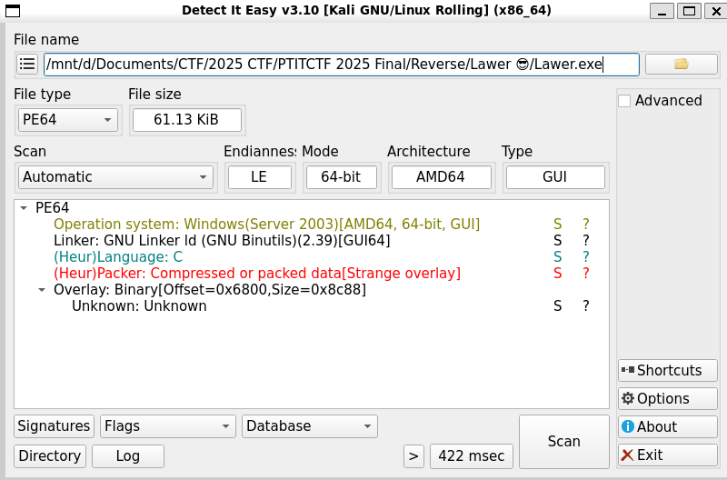
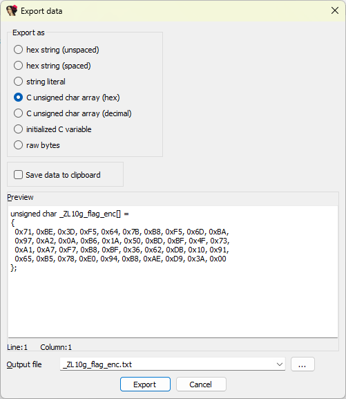

# Write Up

## DIE

Xem thông tin file



File được code bằng ngôn ngữ C và cũng không có gì đặc biệt nữa

Sử dụng IDA để phân tích

---

## IDA

Đầu tiên khi vào chúng ta sẽ thấy hàm `main` sau

```C
int __fastcall main(int argc, const char **argv, const char **envp)
{
  char v3; // si
  char *v4; // rbx
  unsigned int v5; // ecx
  char v6; // al
  int wShowWindow; // r9d
  _STARTUPINFOA StartupInfo; // [rsp+20h] [rbp-88h] BYREF

  v3 = 0;
  _main(argc, argv, envp);
  v4 = *_p__acmdln();
  if ( v4 )
  {
    while ( 1 )
    {
      v5 = *v4;
      if ( *v4 <= 32 )
      {
        if ( !(_BYTE)v5 )
          goto LABEL_15;
        if ( (v3 & 1) == 0 )
        {
          do
            v6 = *++v4;
          while ( v6 && v6 <= 32 );
          goto LABEL_15;
        }
        v3 = 1;
      }
      else if ( (_BYTE)v5 == 34 )
      {
        v3 ^= 1u;
      }
      if ( ismbblead(v5) )
        v4 += -(v4[1] == 0) + 1;
      ++v4;
    }
  }
  v4 = (char *)&unk_1400040A0;
LABEL_15:
  memset(&StartupInfo, 0, sizeof(StartupInfo));
  GetStartupInfoA(&StartupInfo);
  wShowWindow = 10;
  if ( (StartupInfo.dwFlags & 1) != 0 )
    wShowWindow = StartupInfo.wShowWindow;
  return WinMain((HINSTANCE)refptr___image_base__, 0LL, v4, wShowWindow);
}
```

Sau một hồi xem xét thì mình nhận thấy hàm này không làm gì mấy mà sẽ gọi hàm `WinMain` ở cuối

Vậy mình sẽ check hàm `WinMain`:

```C
int __stdcall WinMain(HINSTANCE hInstance, HINSTANCE hPrevInstance, LPSTR lpCmdLine, int nShowCmd)
{
  BOOL v4; // ebx
  BOOL v5; // eax
  int v6; // ebx
  HANDLE CurrentProcess; // rax
  int v8; // ebx
  HMODULE ModuleHandleA; // rax
  HMODULE v10; // rsi
  FARPROC ProcAddress; // rdi
  HANDLE v12; // rsi
  unsigned int v13; // r12d
  HANDLE ProcessHeap; // rax
  char *v15; // rbp
  int v16; // r10d
  unsigned __int64 i; // r9
  char v18; // al
  int v19; // eax
  char *v20; // rdx
  char *v21; // rcx
  HANDLE v22; // rax
  unsigned __int64 v24; // rdx
  unsigned __int64 j; // rax
  char *v26; // rcx
  HANDLE v27; // rax
  int v28; // [rsp+3Ch] [rbp-4Ch] BYREF
  __int64 v29; // [rsp+40h] [rbp-48h] BYREF
  _QWORD v30[8]; // [rsp+48h] [rbp-40h] BYREF

  hide_from_debugger();
  v4 = NtCurrentPeb()->BeingDebugged != 0;
  v5 = IsDebuggerPresent();
  LODWORD(v30[0]) = 0;
  v6 = v4 - (!v5 - 1);
  CurrentProcess = GetCurrentProcess();
  _IAT_start__(CurrentProcess, v30);
  v8 = v6 - ((LODWORD(v30[0]) == 0) - 1);
  ModuleHandleA = GetModuleHandleA("ntdll.dll");
  v10 = ModuleHandleA;
  if ( ModuleHandleA )
  {
    ProcAddress = GetProcAddress(ModuleHandleA, "NtQueryInformationProcess");
    GetProcAddress(v10, "NtSetInformationThread");
    if ( ProcAddress )
    {
      v29 = 0LL;
      v12 = GetCurrentProcess();
      if ( ((int (__fastcall *)(HANDLE, __int64, __int64 *, __int64, _QWORD))ProcAddress)(v12, 7LL, &v29, 8LL, 0LL) >= 0 )
        v8 -= (v29 == 0) - 1;
      v30[0] = 0LL;
      if ( ((int (__fastcall *)(HANDLE, __int64, _QWORD *, __int64, _QWORD))ProcAddress)(v12, 30LL, v30, 8LL, 0LL) >= 0 )
        v8 -= (v30[0] == 0LL) - 1;
      v28 = 0;
      if ( ((int (__fastcall *)(HANDLE, __int64, int *, __int64, _QWORD))ProcAddress)(v12, 31LL, &v28, 4LL, 0LL) >= 0 )
        v8 += v28 == 0;
    }
  }
  v13 = 1590204330;
  if ( v8 >= 2 )
    v13 = -2140842124;
  ProcessHeap = GetProcessHeap();
  v15 = (char *)HeapAlloc(ProcessHeap, 0, 0x28uLL);
  if ( !v15 )
    goto LABEL_20;
  v16 = 85;
  for ( i = 0LL; i != 39; ++i )
  {
    v18 = v16 ^ __ROR1__(g_flag_enc[i], i - (i / 5 + (((0xCCCCCCCCCCCCCCCDuLL * (unsigned __int128)i) >> 64) & 0xFC)));
    v16 += 7;
    v15[i] = (v13 >> (8 * (i & 3))) ^ v18;
  }
  v15[39] = 0;
  if ( v8 <= 1
    || lstrlenA(v15) <= 8
    || *v15 != 80
    || v15[1] != 84
    || v15[2] != 73
    || v15[3] != 84
    || v15[4] != 67
    || v15[5] != 84
    || v15[6] != 70
    || v15[7] != 123 )
  {
    v19 = lstrlenA(v15);
    v20 = v15;
    v21 = &v15[v19];
    if ( v19 )
    {
      if ( (v19 & 1) == 0 || (v20 = v15 + 1, *v15 = 0, v21 != v15 + 1) )
      {
        do
        {
          *v20 = 0;
          v20 += 2;
          *(v20 - 1) = 0;
        }
        while ( v21 != v20 );
      }
    }
    v22 = GetProcessHeap();
    HeapFree(v22, 0, v15);
LABEL_20:
    Sleep(0xC8u);
    return v8 >= 2;
  }
  OutputDebugStringA("[CTF] FLAG: ");
  OutputDebugStringA(v15);
  DebugBreak();
  v24 = lstrlenA(v15);
  for ( j = 0LL; j < v24; ++j )
  {
    v26 = &v15[j];
    *v26 = 0;
  }
  v27 = GetProcessHeap();
  HeapFree(v27, 0, v15);
  return v8 >= 2;
}
```

---

## Phân tích `WinMain`

Trong `WinMain` mình nhận thấy nó có 1 đoạn XOR như sau

```C
v16 = 85;
for ( i = 0LL; i != 39; ++i )
{
    v18 = v16 ^ __ROR1__(g_flag_enc[i], i - (i / 5 + (((0xCCCCCCCCCCCCCCCDuLL * (unsigned __int128)i) >> 64) & 0xFC)));
    v16 += 7;
    v15[i] = (v13 >> (8 * (i & 3))) ^ v18;
}
v15[39] = 0;
```

Mình thấy được rằng ở đoạn code này giá trị trong mảng `g_flag_enc` được Rotate Right (ROR) và XOR nhiều lần, nên mình khá chắc đây là hàm mã hóa flag, thử phân tích từng phần

**1. ROR trên từng byte mã hoá**

```C
__ROR1__(g_flag_enc[i], i - ( i/5 + (((0xCCCCCCCCCCCCCCCD * i) >> 64) & 0xFC)))
```

- `__ROR1__` = rotate-right 8-bit (trên 1 byte), đếm quay lấy mod 8

- Biểu thức dịch `i/5` và tích với hằng số `0xCCCC...CCCD` là thủ thuật chia 5 kiểu "magic number"
Cụ thể, `((0xCCCC...CD * i) >> 64)` ~ ⌊(4*i)/5⌋ (nhân nghịch đảo để lấy thương 4/5 bằng 1 phép nhân và 1 phép dịch)

- `& 0xFC` ⇒ ép phần đó về bội số của 4 (xoá 2 bit thấp)

**2. Khóa XOR tăng dần**

```C
v16 = 85;          // 0x55
...
v18 = v16 ^ ROR8(...);
v16 += 7;
```

`v16` bắt đầu từ 85 và cộng 7 mỗi bước ⇒ lấy byte thấp của `v16` (0..255) là một keystream cộng dồn tuyến tính mod 256

**3. XOR thêm khóa 32-bit**

```C
v15[i] = (v13 >> (8 * (i & 3))) ^ v18;
```

- Lấy 1 byte của `v13` theo thứ tự little-endian (LSB trước), và lặp chu kỳ 4:
  Với `v13_good = 0x80655774` ⇒ chu kỳ khóa là `[0x74, 0x57, 0x65, 0x80]`

- Phân tích điều kiện:
  Nếu `v8 >= 2` ⇒ `v13 = 0x80655774`
  Nếu không ⇒ `v13 = 0x5EC897AA`

---

## Script

Đầu tiên chúng ta sẽ lấy data của `g_flag_enc` ra trước



Đến đây thì chỉ cần dịch ngược đoạn code trên là xong

```python
g_flag_enc = bytes([
    0x71,0xBE,0x3D,0xF5,0x64,0x7B,0xB8,0xF5,0x6D,0xBA,0x97,0xA2,0x0A,0xB6,0x1A,0x50,
    0xBD,0xBF,0x4F,0x73,0xA1,0xA7,0xF7,0xB8,0xBF,0x36,0x62,0xDB,0x10,0x91,0x65,0xB5,
    0x78,0xE0,0x94,0xB8,0xAE,0xD9,0x3A
])

def ror8(x, n):
    n &= 7
    x &= 0xFF
    return ((x >> n) | ((x << (8 - n)) & 0xFF)) & 0xFF

def decode(v13: int) -> bytes:
    out = bytearray()
    v16 = 85  # starts at 85, +7 each step
    for i, b in enumerate(g_flag_enc):
        # s = i - (i/5 + (((0xCCCCCCCCCCCCCCCD * i) >> 64) & 0xFC))
        magic = (0xCCCCCCCCCCCCCCCD * i) >> 64  # floor(4*i/5)
        s = i - (i // 5 + (magic & 0xFC))
        r = ror8(b, s)
        v18 = (v16 & 0xFF) ^ r
        v16 = (v16 + 7) & 0xFFFFFFFF
        k = (v13 >> (8 * (i & 3))) & 0xFF  # 4-byte key cycling
        out.append(v18 ^ k)
    return bytes(out)

if __name__ == "__main__":
    import sys
    # v13 chọn theo nhánh anti-debug (v8 >= 2)
    v13 = 0x80655774
    if len(sys.argv) > 1:
        v13 = int(sys.argv[1], 0)  # cho phép truyền 0x... hoặc thập phân
    pt = decode(v13)
    try:
        print(pt.decode("ascii"))
    except UnicodeDecodeError:
        print(pt)
```

---

## Flag

Flag: `PTITCTF{This_1snot_m4lware_don't_worry}`