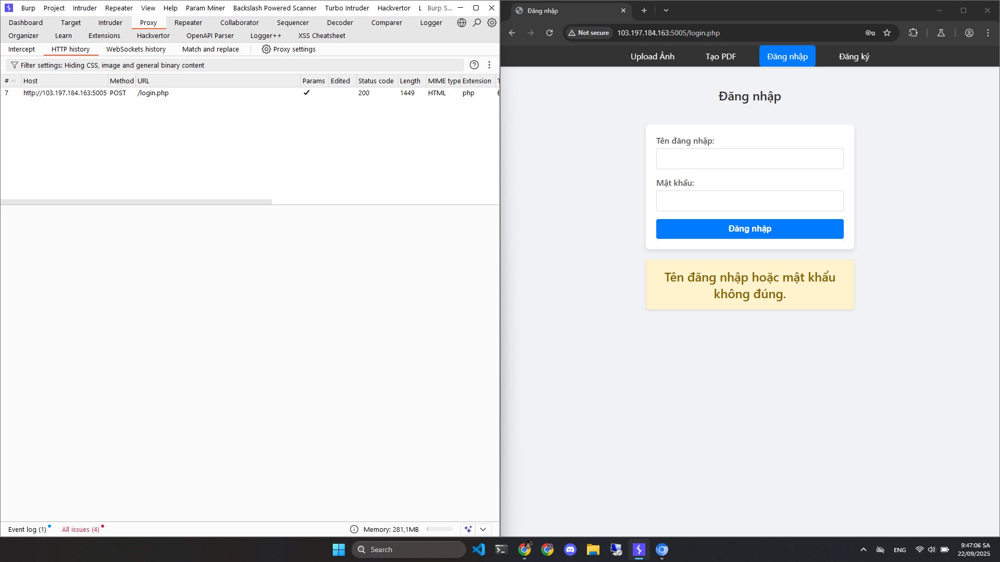
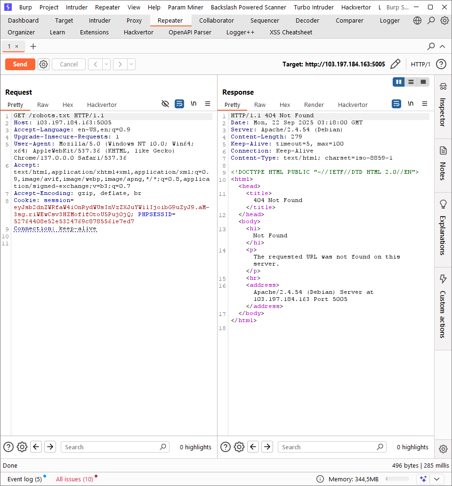
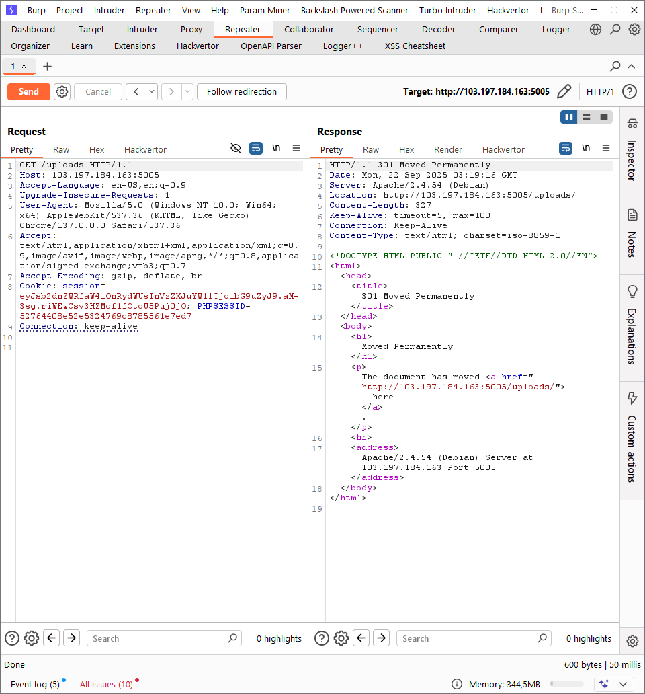
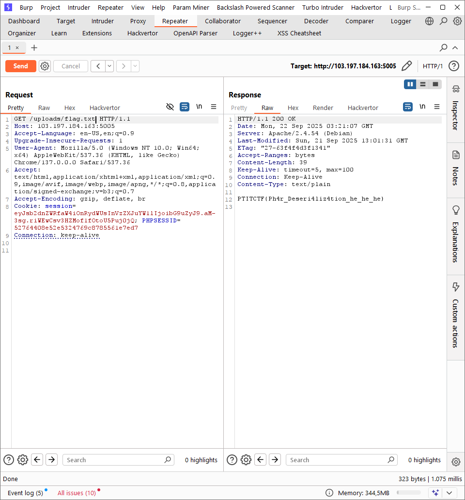

# Write Up

## Phân tích

`Đăng ký` tài khoản mới và `Đăng nhập`

---

## Path Traversal

Mình sẽ thử kỹ thuật cơ bản là Path Traversal xem sao

`/robots.txt`

`/etc/passwd`

`/uploads`

`/uploads/flag.txt`

Sau một hồi mày mò với những file cơ bản và hàng tá dạng obfuscaste URL thì cuối cùng mình cũng mò ra `/uploads/flag.txt` chứa flag

---

## Flag

Flag: `PTITCTF{Ph4r_Deseri4liz4tion_he_he_he}`