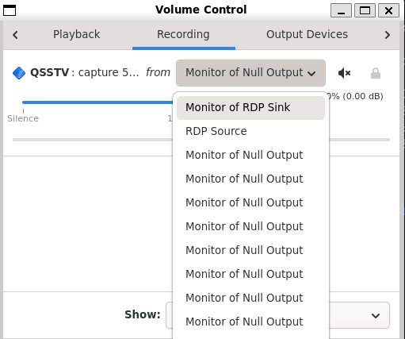
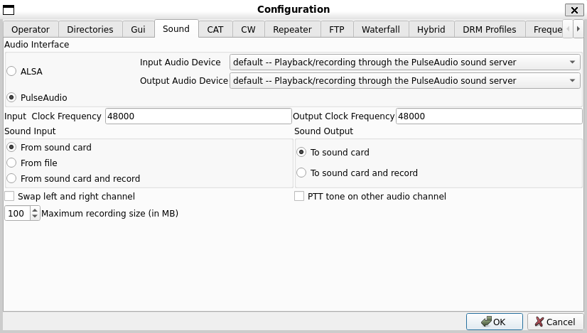
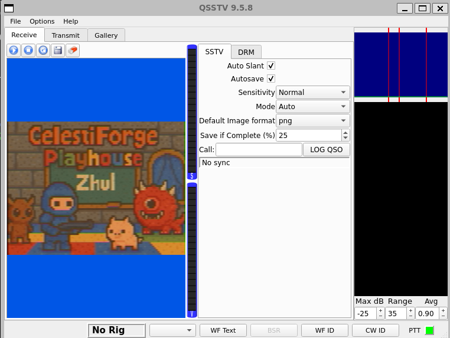

# Write Up

## Set up 

```bash
pactl load-module module-null-sink sink_name=virtual-cable
```

Mở `pavucontrol`

```bash
pavucontrol
```

Đảm bảo trong `Output Devices` có `Null Output`



Mở `qsstv`

```bash
qsstv
```

Chọn `Options` -> `Configuration` -> `Sound` -> `Pulse Audio`



---

## Chạy file

```bash
paplay -d virtual-cable scream.wav
```



---

## Flag

Flag: starpwn{CelestiForge_Playhouse_Zhul}