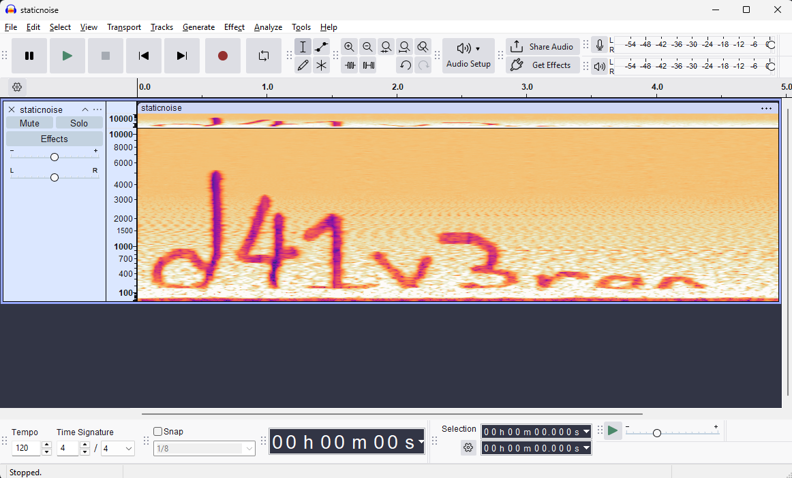

# Write Up

## Kiểm tra file

```bash
$ binwalk avocado.jpg 
DECIMAL HEXADECIMAL DESCRIPTION 
-------------------------------------------------------------------------------- 
0 0x0 JPEG image data, JFIF standard 1.01 
100599 0x188F7 Zip archive data, encrypted at least v1.0 to extract, compressed size: 234, uncompressed size: 222, name: justsomezip.zip 
100922 0x18A3A Zip archive data, encrypted at least v2.0 to extract, compressed size: 408140, uncompressed size: 437908, name: staticnoise.wav 509321 0x7C589 End of Zip archive, footer length: 22
```

---

## Extract

```bash
$ binwalk -e avocado.jpg 
DECIMAL HEXADECIMAL DESCRIPTION 
-------------------------------------------------------------------------------- 
100599 0x188F7 Zip archive data, encrypted at least v1.0 to extract, compressed size: 234, uncompressed size: 222, name: justsomezip.zip 
100922 0x18A3A Zip archive data, encrypted at least v2.0 to extract, compressed size: 408140, uncompressed size: 437908, name: staticnoise.wav 

WARNING: One or more files failed to extract: either no utility was found or it's unimplemented
```

---

## Dò password

Đầu tiên anh em extract lại mỗi file `.zip` thôi

```bash
dd if=avocado.jpg of=embedded_full.zip bs=1 skip=100599 status=progress
```

Sau đó là sửa thử xem nó bị hỏng không

```bash
zip -FF embedded_full.zip --out repaired.zip 
```

Tiếp theo là do mật khẩu với `fcrackzip`

```bash
fcrackzip -v -u -D -p /usr/share/wordlists/rockyou.txt repaired.zip
```

---

## Xem file wav

Sau khi dò xong mật khẩu anh em sẽ check file `.wav` để tìm password cho file `.zip` tiếp



Chọn chế độ quang phổ để xem

---

## Flag

Flag: scriptCTF{1_l0ve_d41_v3r0n}