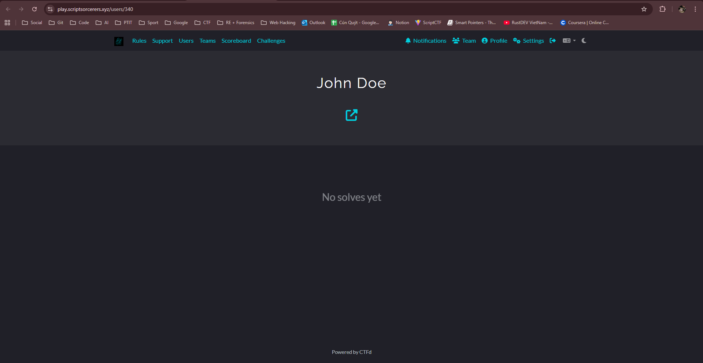
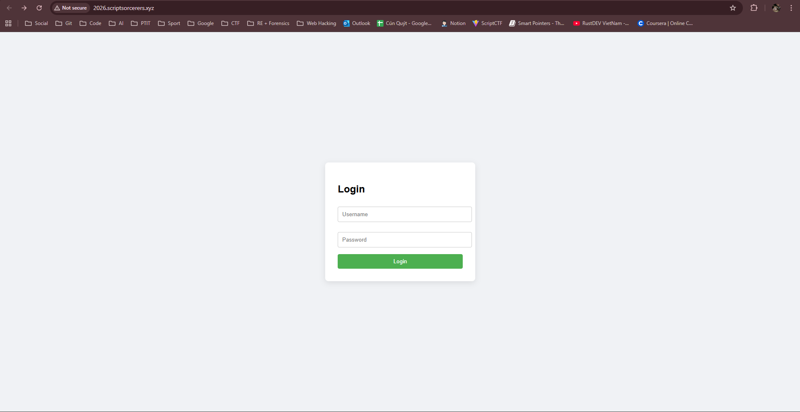

# Write Up

## Profile

Anh em sẽ thấy ở đây có một website

---

## Web

Truy cập vào website đó

Tiếp tục truy cập vào website bằng cách ấn vào icon dưới

Anh em sẽ thấy 1 web login

---

## GitHub

Trong profile còn 1 link GitHub

Truy cập vào link GitHub, anh em sẽ thấy 1 repo lưu tài khoản và mật khẩu

Sau đó chỉ cần đăng nhập là được

---

## Flag

Flag: scriptCTF{scriptCTF_2026_leaked?!!}