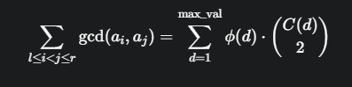

# Write Up

> Đây là một thử thách lập trình (programming/pwn) yêu cầu người chơi giải quyết 8 vòng tính toán trên một "cửa sổ trượt" (sliding window) để nhận được cờ.

---

## Phân tích

Dữ liệu đầu vào: Một mảng `a` gồm `n = 1,000,000` số nguyên ngẫu nhiên.

Kích thước cửa sổ: `window_size = 500,000`.

Yêu cầu: Với mỗi vòng, ta phải tính một giá trị cho tất cả các cửa sổ trượt có thể có.

Ràng buộc chính: `n` và `window_size` rất lớn. Một giải pháp tính toán lại từ đầu cho mỗi cửa sổ (độ phức tạp `O(N * W)`) chắc chắn sẽ bị quá thời gian TLE (Time Limit Exceeded). Do đó, bắt buộc phải sử dụng thuật toán cửa sổ trượt với việc cập nhật kết quả hiệu quả (thường là `O(1)` hoặc `O(log N)`) khi cửa sổ dịch chuyển.

---

## Giải quyết từng vòng

### Vòng 1-3 & 7: Sums, Xors, Means, # of Distinct Numbers (Các bài toán cơ bản)

Đây là những ứng dụng kinh điển của cửa sổ trượt.

- Cách giải:

  1. Tính giá trị cho cửa sổ đầu tiên.

  2. Khi cửa sổ trượt sang phải một vị trí, ta chỉ cần:

     - Loại bỏ ảnh hưởng của phần tử bên trái vừa ra khỏi cửa sổ.

     - Thêm ảnh hưởng của phần tử bên phải mới vào cửa sổ.

- Chi tiết:

  - Sums/Means: sum_mới = sum_cũ - phần_tử_cũ + phần_tử_mới.

  - Xors: xor_mới = xor_cũ ^ phần_tử_cũ ^ phần_tử_mới.

  - Distinct Numbers: Dùng một Counter (bộ đếm tần suất). Khi thêm phần tử, nếu tần suất của nó từ 0 lên 1, tăng biến đếm số riêng biệt. Khi bỏ, nếu tần suất từ 1 về 0, giảm biến đếm.

### Vòng 4: Median (Trung vị)

Việc duy trì một danh sách được sắp xếp và cập nhật nó sẽ rất chậm. Vì giá trị các số bị giới hạn trong khoảng `[0, 100000]`, ta có thể dùng một cấu trúc dữ liệu hiệu quả hơn.

- Cách giải: Sử dụng Fenwick Tree (BIT) trên miền giá trị của các số.

  1. Xây dựng một cây BIT có kích thước `MAX_VAL`. `BIT[v]` sẽ lưu số lượng các số có giá trị nhỏ hơn hoặc bằng `v`.

  2. Khi thêm/bớt một số, ta cập nhật cây BIT tại chỉ số tương ứng với giá trị của số đó (`O(log M)`).

  3. Để tìm trung vị (phần tử thứ `k = 250,000`), ta có thể dùng tìm kiếm nhị phân (binary search) trên cây BIT để tìm giá trị `v` nhỏ nhất sao cho tổng số phần tử từ 0 đến `v` lớn hơn hoặc bằng `k`. Thao tác này cũng mất `O(log M)`.

### Vòng 5: Modes (Số xuất hiện nhiều nhất)

Tương tự Median, việc tìm mode một cách ngây thơ là rất chậm.

- Cách giải: Dùng hai cấu trúc dữ liệu để theo dõi:

  1. Một mảng/map `counts` để đếm tần suất của mỗi số.

  2. Một map `freq_groups` trong đó `key` là tần suất và `value` là một tập hợp (set) các số có tần suất đó.

  3. Duy trì một biến `max_freq` để lưu tần suất cao nhất hiện tại.

- Khi cập nhật, ta xóa số khỏi nhóm tần suất cũ, cập nhật `counts`, và thêm nó vào nhóm tần suất mới. Sau đó, cập nhật lại `max_freq` nếu cần. Cách này cho phép cập nhật trong `O(1)`.

### Vòng 6: Mex (Minimum Excluded)

Tìm số nguyên không âm nhỏ nhất không có trong cửa sổ.

- Cách giải:

  1. Dùng một mảng `counts` để đếm tần suất.

  2. Duy trì một biến `current_mex`.

  3. Khi thêm một số `x` vào cửa sổ, nếu `x == current_mex`, ta tăng `current_mex` lên cho đến khi tìm thấy một giá trị không có trong cửa sổ (`counts[current_mex] == 0`).

  4. Khi bớt một số `x`, nếu `counts[x]` trở về 0 và `x < current_mex`, thì `x` chính là mex mới.

### Vòng 8: Sum of pairwise GCD (Tổng GCD của các cặp)

Đây là vòng khó nhất, đòi hỏi kiến thức về số học.

- Cách giải: Một giải pháp `O(W^2)` là không thể. Ta sử dụng một đẳng thức trong lý thuyết số:



Trong đó:

- ϕ(d) là Hàm phi Euler.

- C(d) là số lượng các số trong cửa sổ hiện tại chia hết cho d.

- Phát hiện và Sửa lỗi (The Bug & The Fix):

  - Lỗi: Giải pháp ban đầu của tôi đã thất bại ở vòng này. Nguyên nhân là server có thể sinh ra số 0, trong khi công thức trên chỉ đúng với các số nguyên dương. Về mặt toán học, `gcd(k, 0) = k`, điều mà công thức đã bỏ qua.

  - Sửa lỗi: Ta phải xử lý các số 0 một cách riêng biệt. Tổng cuối cùng được tính là:
`Tổng GCD = (Tổng GCD của các số khác 0) + (Số lượng số 0) * (Tổng tất cả các số trong cửa sổ)`

  - Ta chỉ áp dụng công thức số học cho các số khác không, đồng thời duy trì biến đếm số 0 và tổng các phần tử trong cửa sổ để tính toán phần còn lại.

---

## Script

```python
#!/usr/bin/env python3
from pwn import *
from collections import Counter, defaultdict
import math

# Connection details
HOST = "play.scriptsorcerers.xyz"
PORT = 10467

# Challenge constants
N = 1000000
WINDOW_SIZE = N // 2
MAX_VAL = 100001 # Max value of a number is 100000

# ==============================================================================
#  PRE-COMPUTATION FOR ROUND 8 (Pairwise GCD Sum)
# ==============================================================================
log.info("Starting pre-computation for Round 8...")
phi = list(range(MAX_VAL))
divisors = [[] for _ in range(MAX_VAL)]

# Sieve to compute Euler's Totient function (phi)
for i in range(2, MAX_VAL):
    if phi[i] == i: # i is prime
        for j in range(i, MAX_VAL, i):
            phi[j] -= phi[j] // i

# Pre-calculate all divisors for each number
for i in range(1, MAX_VAL):
    for j in range(i, MAX_VAL, i):
        divisors[j].append(i)
log.success("Pre-computation finished.")

# ==============================================================================
#  FENWICK TREE (BIT) FOR ROUND 4 (Median)
# ==============================================================================
class FenwickTree:
    def __init__(self, size):
        self.tree = [0] * (size + 1)
        self.size = size

    def add(self, i, delta):
        i += 1 # 1-based index
        while i <= self.size:
            self.tree[i] += delta
            i += i & -i

    def query(self, i): # query prefix sum up to i
        i += 1 # 1-based index
        s = 0
        while i > 0:
            s += self.tree[i]
            i -= i & -i
        return s

    def find_kth(self, k):
        # Find the smallest index i such that query(i) >= k
        # (Binary search on the BIT)
        low, high = 0, self.size - 1
        ans = -1
        while low <= high:
            mid = (low + high) // 2
            if self.query(mid) >= k:
                ans = mid
                high = mid - 1
            else:
                low = mid + 1
        return ans

# ==============================================================================
#  SOLVERS FOR EACH ROUND
# ==============================================================================
def solve_round(r, a, round_func):
    log.info(f"Solving Round {r}: {round_func.__name__}...")
    ans = round_func(a)
    log.success(f"Sending answer for Round {r}")
    conn.sendline(' '.join(map(str, ans)).encode())

def sums(a):
    results = []
    current_sum = sum(a[:WINDOW_SIZE])
    results.append(current_sum)
    for i in range(1, N - WINDOW_SIZE + 1):
        current_sum = current_sum - a[i-1] + a[i + WINDOW_SIZE - 1]
        results.append(current_sum)
    return results

def xors(a):
    results = []
    current_xor = 0
    for i in range(WINDOW_SIZE):
        current_xor ^= a[i]
    results.append(current_xor)
    for i in range(1, N - WINDOW_SIZE + 1):
        current_xor = current_xor ^ a[i-1] ^ a[i + WINDOW_SIZE - 1]
        results.append(current_xor)
    return results

def means(a):
    s = sums(a)
    return [x // WINDOW_SIZE for x in s]

def median(a):
    results = []
    bit = FenwickTree(MAX_VAL)
    kth_element = (WINDOW_SIZE + 1) // 2
    
    for i in range(WINDOW_SIZE):
        bit.add(a[i], 1)
    results.append(bit.find_kth(kth_element))

    for i in range(1, N - WINDOW_SIZE + 1):
        bit.add(a[i-1], -1)
        bit.add(a[i + WINDOW_SIZE - 1], 1)
        results.append(bit.find_kth(kth_element))
    return results

def modes(a):
    results = []
    counts = [0] * MAX_VAL
    freq_groups = defaultdict(set)
    max_freq = 0

    # Initial window
    for i in range(WINDOW_SIZE):
        val = a[i]
        old_freq = counts[val]
        if old_freq > 0:
            freq_groups[old_freq].remove(val)
        
        counts[val] += 1
        new_freq = counts[val]
        freq_groups[new_freq].add(val)
        if new_freq > max_freq:
            max_freq = new_freq

    results.append(max(freq_groups[max_freq]))

    # Sliding window
    for i in range(1, N - WINDOW_SIZE + 1):
        leaving = a[i-1]
        entering = a[i + WINDOW_SIZE - 1]

        # Remove leaving element
        old_freq = counts[leaving]
        freq_groups[old_freq].remove(leaving)
        if not freq_groups[old_freq] and old_freq == max_freq:
            max_freq -= 1
        counts[leaving] -= 1
        new_freq = counts[leaving]
        if new_freq > 0:
            freq_groups[new_freq].add(leaving)

        # Add entering element
        old_freq = counts[entering]
        if old_freq > 0:
            freq_groups[old_freq].remove(entering)
        counts[entering] += 1
        new_freq = counts[entering]
        freq_groups[new_freq].add(entering)
        if new_freq > max_freq:
            max_freq = new_freq
        
        results.append(max(freq_groups[max_freq]))
    return results

def mex(a):
    results = []
    counts = [0] * (N + 1) # Mex can be up to N
    current_mex = 0
    
    # Initial window
    for i in range(WINDOW_SIZE):
        counts[a[i]] += 1
    while counts[current_mex] > 0:
        current_mex += 1
    results.append(current_mex)
    
    # Sliding window
    for i in range(1, N - WINDOW_SIZE + 1):
        leaving = a[i-1]
        entering = a[i + WINDOW_SIZE - 1]
        
        counts[leaving] -= 1
        if counts[leaving] == 0 and leaving < current_mex:
            current_mex = leaving
        
        counts[entering] += 1
        if entering == current_mex:
            while counts[current_mex] > 0:
                current_mex += 1
        results.append(current_mex)
    return results

def distinct(a):
    results = []
    counts = Counter(a[:WINDOW_SIZE])
    distinct_count = len(counts)
    results.append(distinct_count)
    
    for i in range(1, N - WINDOW_SIZE + 1):
        leaving = a[i-1]
        entering = a[i + WINDOW_SIZE - 1]
        
        counts[leaving] -= 1
        if counts[leaving] == 0:
            distinct_count -= 1
        
        if counts[entering] == 0:
            distinct_count += 1
        counts[entering] += 1
        
        results.append(distinct_count)
    return results

def pairwise_gcd(a):
    results = []
    
    # Data for the current window
    counts = [0] * MAX_VAL
    gcd_sum_non_zeros = 0
    element_sum = 0
    zero_count = 0

    # --- Initial Window ---
    for i in range(WINDOW_SIZE):
        val = a[i]
        element_sum += val
        if val == 0:
            zero_count += 1
        else:
            # Apply number theory logic only to non-zeros
            for d in divisors[val]:
                gcd_sum_non_zeros += phi[d] * counts[d]
                counts[d] += 1
    
    results.append(gcd_sum_non_zeros + zero_count * element_sum)

    # --- Sliding Window ---
    for i in range(1, N - WINDOW_SIZE + 1):
        leaving = a[i-1]
        entering = a[i + WINDOW_SIZE - 1]

        # Update total sum and zero count
        element_sum = element_sum - leaving + entering
        if leaving == 0:
            zero_count -= 1
        if entering == 0:
            zero_count += 1
            
        # Update GCD sum for non-zeros
        if leaving != 0:
            for d in divisors[leaving]:
                counts[d] -= 1
                gcd_sum_non_zeros -= phi[d] * counts[d]
        
        if entering != 0:
            for d in divisors[entering]:
                gcd_sum_non_zeros += phi[d] * counts[d]
                counts[d] += 1
        
        results.append(gcd_sum_non_zeros + zero_count * element_sum)
        
    return results

# ==============================================================================
#  MAIN SCRIPT
# ==============================================================================
conn = remote(HOST, PORT)

# Receive the numbers
log.info("Receiving numbers from server...")
line = conn.recvline().strip()
a = list(map(int, line.split()))
log.success("Received all numbers.")

# Define the rounds
rounds = [
    (1, "Sums", sums),
    (2, "Xors", xors),
    (3, "Means", means),
    (4, "Median", median),
    (5, "Modes", modes),
    (6, "Mex", mex),
    (7, "# of Distinct Numbers", distinct),
    (8, "Sum of pairwise GCD", pairwise_gcd)
]

# Solve each round
for r, name, func in rounds:
    conn.recvuntil(f"Round {r}:".encode())
    solve_round(r, a, func)

# Get the flag
flag = conn.recvall().decode()
log.success(f"Flag: {flag.strip()}")
```

---

## Flag

Flag: scriptCTF{i_10v3_m4_w1nd0wwwwwwww5_33cc17371ed9}