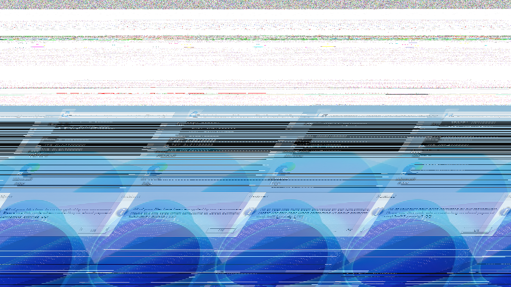
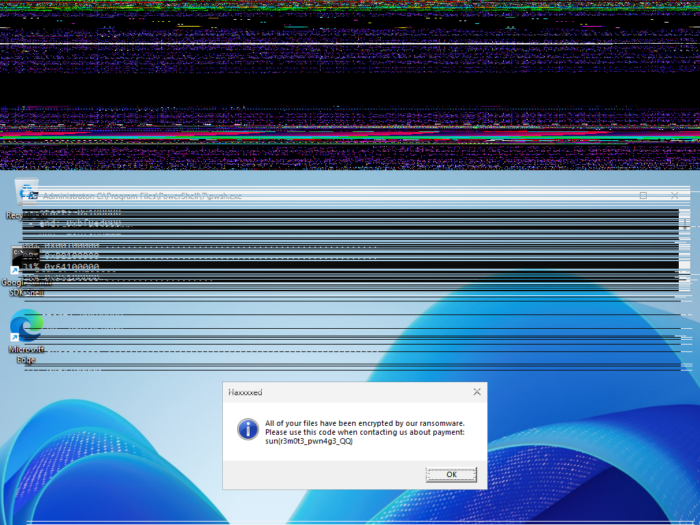

# Write‑up: Remotely Interesting (SunshineCTF 2025)

## Mô tả thử thách

> One of our scientists was connected remotely to his Windows workstation via RDP when he suddenly saw a strange window open and then got locked out. The EDR software immediately detected the threat and performed a memory dump of the Desktop Windows Manager process, which we've been able to recover. Can you find out what the scientist saw?
>
> Challenge handout: <https://drive.google.com/file/d/1PE_WcWk9XkTO9mz9nHwc6Qnwf7RET4jx/view?usp=sharing>

---

## Phân tích

`dwm.exe` (Desktop Window Manager) là `compositor` của Windows: nó giữ các `surface` (khung hình) của từng cửa sổ và cả khung hình tổng hợp cuối cùng. Những `surface` này thường nằm ở dạng buffer `32-bit BGRA` với `row pitch` được đệm lên bội 256 byte (không phải đúng `width*4`), đôi khi có `premultiplied alpha`

Khi EDR chụp `dump` đúng lúc “cửa sổ lạ” vừa hiện lên, các buffer đó thường vẫn còn trong vùng nhớ của `dwm.exe`. Việc của mình là cắt đúng vùng, giải đệm từng dòng (`pitch → width*4`), đổi kênh `BGRA→RGBA`, và lưu ra `PNG` → ra đúng “cái đã hiện trên màn hình”

**Lưu ý**:

- Không phải dump tiến trình nào cũng dựng được ảnh; `dwm.exe` là ứng cử viên tốt nhất vì nó quản lý ảnh màn hình của mọi cửa sổ
- Nếu ảnh bị “xé/sọc” → sai `pitch`; nếu tối viền → do `premultiplied alpha` (ép alpha=255 trước khi lưu)
- Minidump có thể không chứa đủ vùng ảnh; full dump dễ hơn

---

## Tiền xử lý

### Quét thumbnail

File `dwm.exe.dmp` sẽ không mở được ngay mà sẽ cần phải quét thumbnail trước bởi vì mình sẽ không biết:

- Ảnh nằm ở `offset` nào trong dump
- Độ phân giải (`W×H`) là bao nhiêu
- `Pitch/stride` mỗi dòng là bao nhiêu (thường > `W*4` do padding)
- Thứ tự kênh (`BGRA` hay `RGBA`) và có `premultiplied alpha` hay không

Ở bước thumbnail, ta cố ý bỏ qua `pitch`; ảnh có thể rách/sọc nhưng chỉ cần nhìn ra viền UI là đủ chọn offset neo

### Mục tiêu

Thumb sweep không cố dựng ảnh chuẩn ngay. Nó chỉ nhằm:

- Tìm “neo” (`anchor`): một mẩu ảnh (`thumbnail`) có dấu hiệu UI (viền cửa sổ, text bar, nút, đường kẻ thẳng…)
- Xác nhận độ phân giải hợp lý (vd. 1024×768, 1366×768…)
- Khoanh vùng `offset` quanh nơi có khả năng là `surface` màn hình

Khi đã có neo, bước sau chỉ cần brute-force `pitch` và `offset` quanh neo (± vài MB) thay vì quét cả file

### Môi trường

Đầu tiên mình sẽ cần một vài sự chuẩn bị trước khi run script

```bash
$ pip install pillow numpy
sudo apt-get install tesseract-ocr && pip install pytesseract
```

### Script

```python
import os, subprocess
src = "dwm.exe.dmp"
outdir = "raw_candidates"; os.makedirs(outdir, exist_ok=True)

sizes = [(1366,768),(1024,768),(1920,1080)]
step = 16 * 1024 * 1024
L = os.path.getsize(src)
idx = 0

def try_slice(offset,w,h,fmt,idx):
    size = w*h*4
    with open(src,"rb") as f: f.seek(offset); buf=f.read(size)
    if len(buf)!=size: return
    raw=f"{outdir}/slice_{idx:05d}_{w}x{h}_{fmt}_off{offset}.raw"
    png=raw.replace(".raw",".png"); open(raw,"wb").write(buf)
    try:
        subprocess.run(["convert","-size",f"{w}x{h}","-depth","8",f"{fmt}:{raw}",png],check=True)
    except: pass
    finally: os.remove(raw)

for off in range(0,L,step):
  for (w,h) in sizes:
    for fmt in ("rgba","bgra"):
      try_slice(off,w,h,fmt,idx); idx+=1
```

Sau khi chạy script tìm neo xong mình sẽ xem các ảnh

Nhận thấy có một ảnh khá là rõ nét tại `offset=16777216`



Mình sẽ tiến hành brute-force `pitch` và `offset` xung quanh neo này

---

## Dựng lại ảnh

Sau bước tiền xử lý là trích xuất ra các neo, mình sẽ đến bước hai là brute-force `pitch` và `offset` quanh neo để ảnh hết bị sọc và thấy rõ cửa sổ

### Script

```python
import sys
from PIL import Image
src,offset,W,H,pitch,out=sys.argv[1],int(sys.argv[2]),int(sys.argv[3]),int(sys.argv[4]),int(sys.argv[5]),sys.argv[6]

need=pitch*H
with open(src,"rb") as f: f.seek(offset); buf=f.read(need)
rowbytes=W*4; tight=bytearray(W*H*4)
for y in range(H):
    row=buf[y*pitch:y*pitch+rowbytes]
    for x in range(0,rowbytes,4):
        b,g,r,a=row[x:x+4]; i=y*rowbytes+x
        tight[i:i+4]=bytes([r,g,b,255])
Image.frombytes("RGBA",(W,H),bytes(tight)).save(out)
```

### Run script

```bash
$ BASE=16777216
SPAN=524288
STEP=4096
W=1024; H=768
PITCHES=(3840 4096 4352)

mkdir -p png_1024x768_scan
for off in $(seq $((BASE - SPAN)) $STEP $((BASE + SPAN))); do
  for p in "${PITCHES[@]}"; do
    out=png_1024x768_scan/cand_off${off}_p${p}.png
    [ "$p" -lt $((W*4)) ] && continue
    python3 repack_surface.py dwm.exe.dmp $off $W $H $p $out || true
    [ -f "$out" ] && [ $(stat -c%s "$out") -lt 20000 ] && rm -f "$out"
  done
done
```

Sau khi chạy xong script, nó sẽ lưu ra 1 folder là `png_1024x768_scan/`, đến đây thì mình sẽ dò chay để tìm ra ảnh hiện flag rõ nét nhất



---

## Flag

**Flag:** `sun{r3m0t3_pwn4g3_QQ}`
