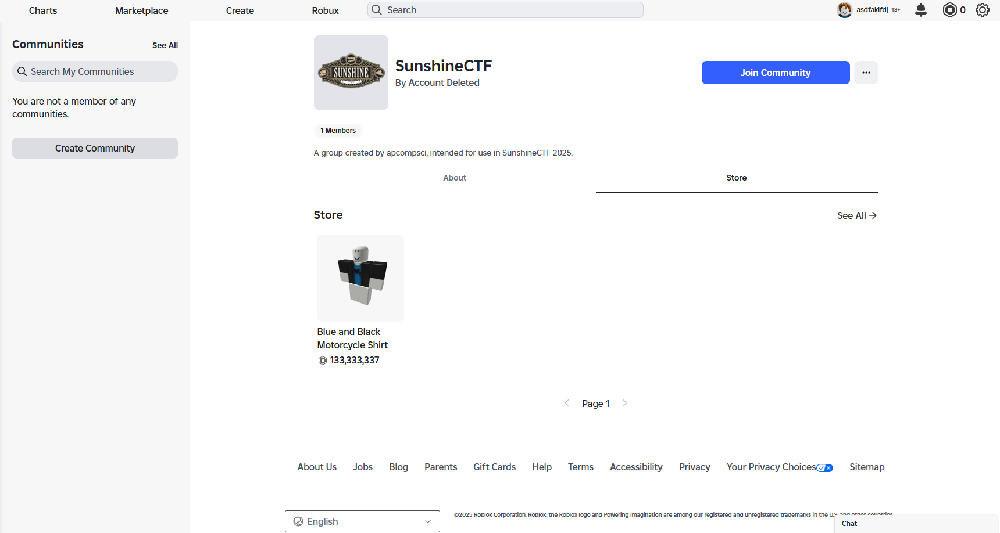
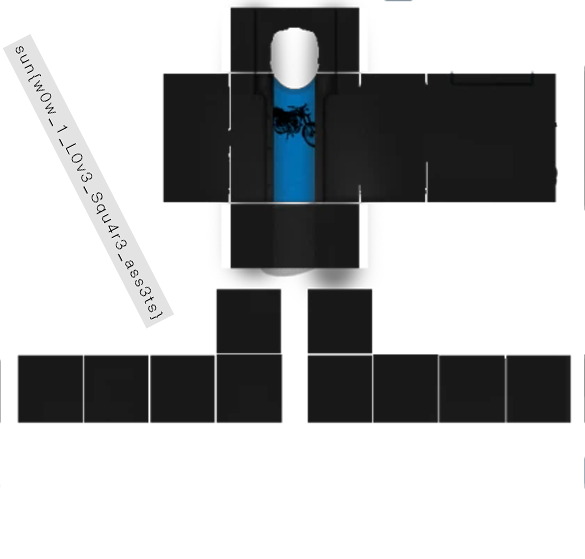

# Write-up: Rocommunications (SunshineCTF 2025)

## Mô tả thử thách

> Yet another Rogue Robloxian is on the loose! Apparently, this one is communicating through its shirt.
>
> https://www.roblox.com/communities/917253937/SunshineCTF#!/about
>
> Note: Roblox Studio, as well as a Roblox account, are required for the intended solve, however this is solvable without it.

---

## Phân tích

Chall cho ta 1 trang web, ta sẽ xem qua thử, có vẻ là 1 trang community của Roblox

Nhìn qua thì cũng không có gì đặc biệt, phần **Store** có bán 1 cái áo với giá đắt đỏ

Đọc lại đề bài, họ có gợi ý rằng ta phải dùng Roblox Studio, 1 phần mềm tạo game cho nền tảng Roblox

Như vậy ta có thể đoán được ra là ta phải đưa chiếc áo này vào trong Roblox Studio rồi tiếp tục mò flag

Ta tạo 1 game mới

Bấm vào môi trường, click chuột phải → `Insert Object` (hoặc tổ hợp phím `Ctrl + I`)

Ta điền `Shirt` trên thanh tìm kiếm, nhằm đưa `ID` của áo lên môi trường

Chọn Shirt

Tại đây để ý phần `Explorer`

Phần `Shirt` chúng ta vừa tạo là `Clothing`

Phía dưới, phần `Appearance` ta có `ShirtTemplate`, dán `URL` của chiếc áo trên web

Sau đó ta được `assetid`, đó là `ID` của `Object shirt` trong môi trường

Ta chỉ cần quan tâm tới dãy số `99859692989451`

Tiếp theo ta dán vào đường `https://assetdelivery.roblox.com/v1/asset?id=99859692989451`

Khi đó máy sẽ download về file sau

Đổi đuôi file thành png, ta sẽ có texture của áo

---

## Flag

**Flag:** `sun{w0w_1_L0v3_Squ4r3_ass3ts}`
