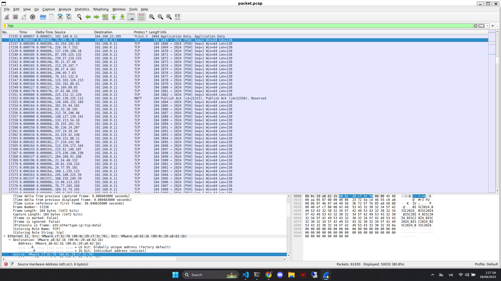
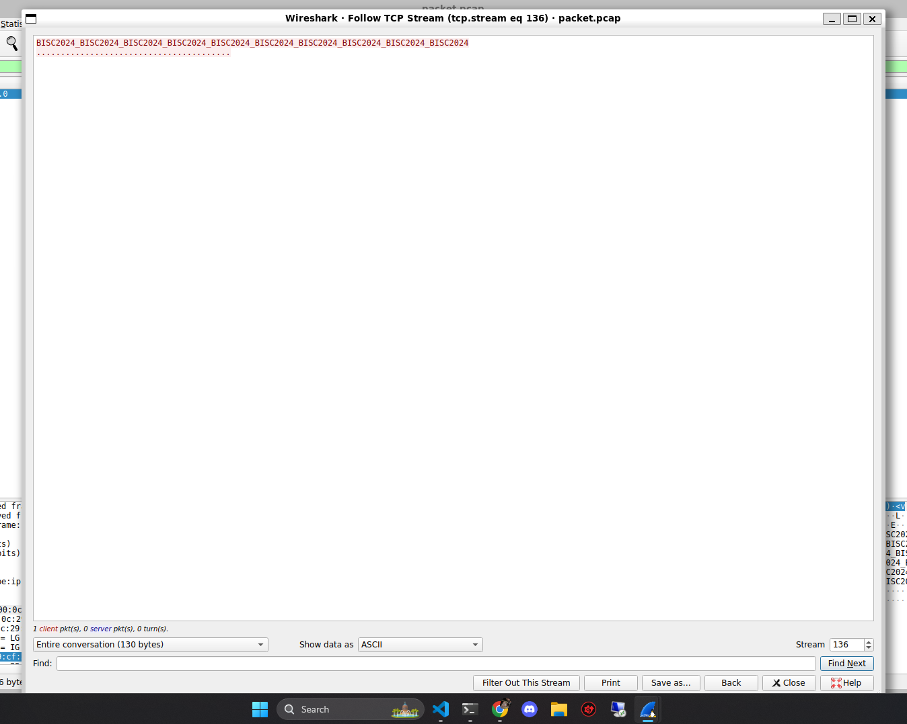
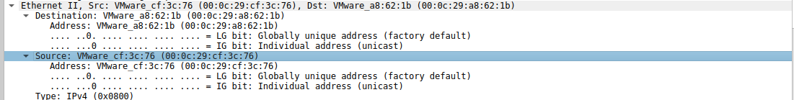
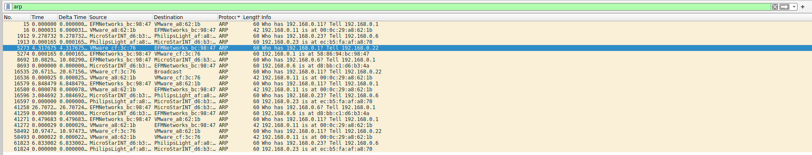
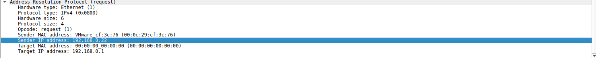

# Write Up

---

## Phân tích

Vì tên bài là DoS nên chúng ta sẽ tìm xem có đoạn nào bị tấn công DoS không

Sơ qua về tấn công DoS

> Tấn công DoS (Denial of Service – từ chối dịch vụ) là một loại tấn công mạng với mục đích làm gián đoạn hoặc ngắt quãng dịch vụ của hệ thống, máy chủ, hoặc mạng, khiến người dùng hợp pháp không thể truy cập được.

Các loại tấn công DoSDoS

| Loại DoS                | Mô tả                                                                                   |
| ----------------------- | --------------------------------------------------------------------------------------- |
| **Flooding (ngập lụt)** | Gửi số lượng lớn yêu cầu (HTTP, TCP, ICMP, UDP...) khiến hệ thống quá tải.              |
| **Crash (gây lỗi)**     | Gửi dữ liệu bất thường gây lỗi phần mềm (buffer overflow, malformed packets).           |
| **Logic attack**        | Lợi dụng lỗ hổng logic, ví dụ tạo kết nối TCP nhưng không hoàn tất bắt tay (SYN flood). |

---

## Tìm kiếm

Chúng ta sẽ lọc các gói tin HTTP, UDP, TCP để xem đoạn nào giống tấn công DoS



Từ đây chúng ta thấy địa chỉ đích là `192.168.0.11` những địa chỉ nguồn thì thay đổi liên tục

Rất dễ là tấn công DoS

Khi Follow TCP Stream sẽ thấy đoạn được truyền đi như sau



Vậy ta có thể khẳng định đây chính là đoạn tấn công DoS

---

## Truy vết

Để truy vết ra đâu là địa chỉ IP của kẻ tấn công, ta cần biết địa chỉ MAC của IP này

Vì địa chỉ MAC là duy nhất nên ta có thể dùng nó để truy vết lại



Ta có thể thấy địa chỉ MAC chính là `00:0c:29:cf:3c:76`

Bây giờ chúng ta sẽ tìm địa chỉ IP từ địa chỉ MAC sau

Để tìm được địa chỉ IP từ địa chỉ MAC, chúng ta sẽ lần theo giao thức ARP



Mò dần dần



Tìm được địa chỉ của kẻ tấn công là `192.168.0.22`

---

## Mã hóa

```bash
$ echo "192.168.0.22" | base64
MTkyLjE2OC4wLjIyCg==
```

---

## Flag

Flag: bisc2024{MTkyLjE2OC4wLjIyCg==}