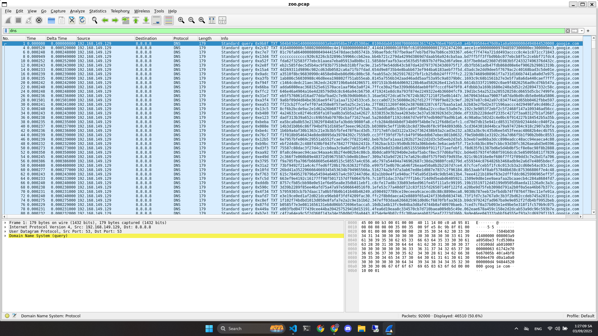

# Write Up

## Phân tích file pcap



Lọc file pcap phàn protocol `DNS` sẽ thấy nó gửi nhiều truy vấn khá sú

---

## Trích xuất

Sử dụng `tshark` để trích xuất hex ra

```bash
tshark -r zoo.pcap -Y "dns.flags.response==0 && dns.qry.type==TXT" \
  -T fields -e frame.number -e dns.qry.name \
| sort -n -k1,1 \
| awk -F'\t' '{print $2}' \
| awk -F'.' '{
  for(i=1;i<=NF;i++){
    if($i ~ /^[0-9A-Fa-f]+$/ && (length($i)%2)==0) printf "%s",$i
  }
} END{print ""}' > dns_hex.txt
```

---

## Chuyển đổi

Bây giờ sẽ thử chuyển tất cả mã hex về dạng nhị phân thì tôi thấy có magicbyte của file zip là `PK`

```bash
xxd -r -p dns_hex.txt carved.zip
```

---

## Giải nén

Unzip file `carved.zip` vừa lấy được

```bash
7z x -ounzipped carved.zip || unzip -d unzipped carved.zip || true
```

---

## Phân tích 2

Tiếp tục chúng ta sẽ phân tích tiếp folder `unzipped`, có rất nhiều ảnh các con vật ở đây

