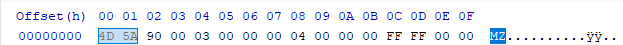
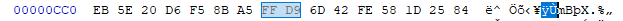
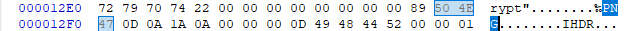

# Write Up

## 🧠 1. Kiến thức về định dạng file

### 📷 JPEG (JPG)

Bắt đầu bằng magic bytes: `FF D8`

Kết thúc bằng: `FF D9`

Có thể bị lỗi nếu có dữ liệu chen giữa hoặc thiếu phần kết thúc.

### 🖼️ PNG

Bắt đầu bằng magic bytes: `89 50 4E 47 0D 0A 1A 0A`

Kết thúc bằng: `49 45 4E 44 AE 42 60 82`

Rất nhạy cảm với thiếu dữ liệu — thiếu 1 byte có thể làm file không mở được.

---

## 🧰 2. Kỹ năng sử dụng công cụ

Trong bài này chúng ta sẽ sử dụng thuần `HxD` để đọc và chỉnh sửa file.

---

## 🔍 3. Phân tích

### 1. JPG

Đầu tiên chúng ta sẽ mở file `Enc` trước.



Nhận thấy file bắt đầu bằng magic byte: `4D 5A` hay `MD` ở định dạng mã ASCII.

Đây là dạng file thực thi trên windows, vậy nên chúng ta hãy đổi tên nó thành file `.exe` để chạy thử.

```bash
mv Enc Enc.exe
```

Sau khi đổi định dạng file xong chúng ta hãy thử run nó.

Mở file `flag.jpg`

Chúng ta tìm đến byte `0xFF 0xD9` đây là byte kết thúc của file `.jpg`.




Nhận thấy nó xuất hiện 2 lần, tức là đã bị chèn 2 byte `0xFF 0xD9` ở giữa, tại offset `0xCC7` để chia cắt file.

Ta copy từ đầu đến 2 byte kết thúc thứ hai, tại offset `0x12C6`.

Nhấn `Ctrl + N` để tạo file mới, `Ctrl + V` để paste và lưu thành `flag2.jpg`.

Mở `flag2.jpg` lên sẽ thấy phần đầu của flag.

### 2. TXT

Chúng ta sử dụng `Ctrl + F` để tìm kiếm.

Đoạn này tôi nhập bừa thì nó ra thôi, anh em cứ tìm mấy từ khóa kiểu: `Flag`, `Here`, `txt`, `String`, ...

Nhập thử tất cả những gì anh em nghĩ ra thôi tại đoạn này nó chỉ đơn giản là 1 xâu nó ẩn trong file thôi.

Còn cách khác, cách này tôi làm thì tìm ra nhanh hơn, còn anh em muốn thuần `HxD` thì thử cách trên.

```bash
strings flag.jpg
```

Nó sẽ trả về mọi xâu ẩn trong `flag.jpg`, anh em thấy cái nào giống flag nhất thì nó là flag.

### 3. PNG

`Ctrl + F` tìm kiếm theo magic byte của dạng file `.png` hay tìm theo string là `PNG` cũng được.



Bắt đầu tìm kiếm bên dưới thôi.

Ở bài `Broken-PNG` tôi cũng có nói file `.png` là định dạng file rất nhạy cảm, nếu có đoạn dữ liệu bị lỗi thì ảnh có thể sẽ không mở được.

Nhưng khi copy hết phần của file `.png` và gán ra file khác thì nhận thấy file ảnh vẫn mở được.

Tức là nó đã chèn dữ liệu ở chỗ nào đó khiến cho file vẫn chạy.

Ở đây tôi đã tìm hiểu qua và thấy có 2 kỹ thuật:

- Chèn vào chunk phụ: `tEXT`, `pHYs`, `gAMA`...
- Chèn vào giữa 2 chunk.

Ở bài này sử dụng kỹ thuật chèn vào giữa 2 chunk.

Anh em hãy tìm những chunk như `IHDR`, `IDAT`, `IEND`...

Rồi kiểm tra xem đằng trước nó có xâu nào không là được

---

## 🚩 4. Flag

DH{How_ENc_ECrypt_yo}