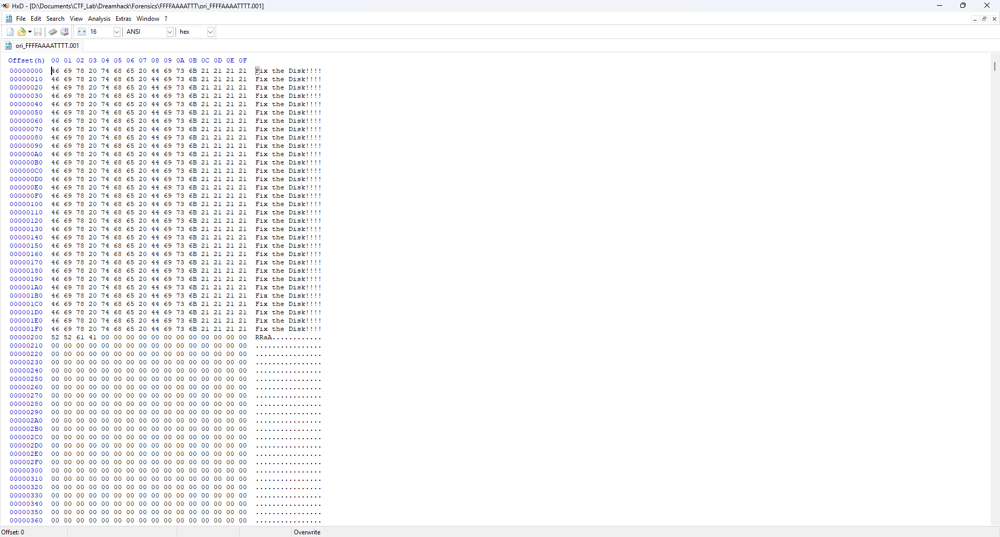
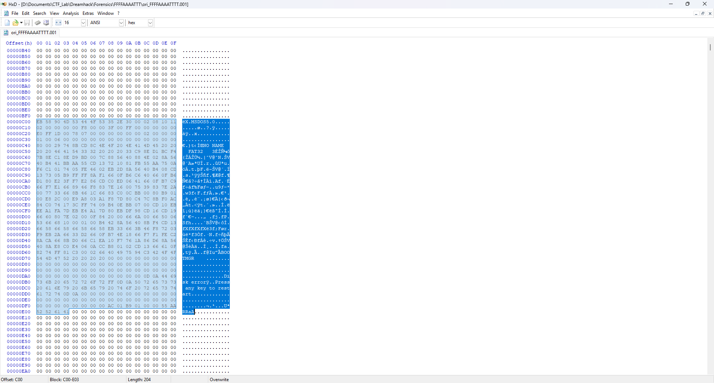
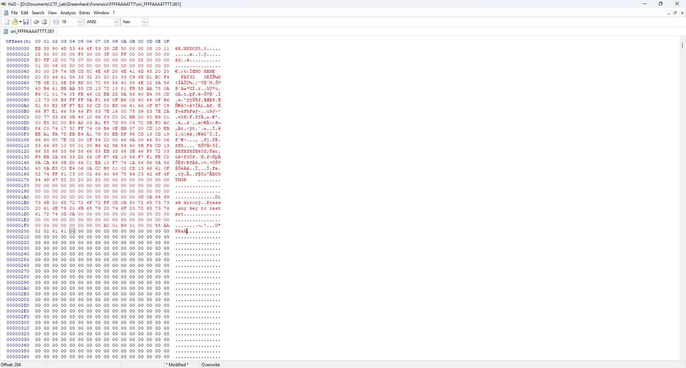
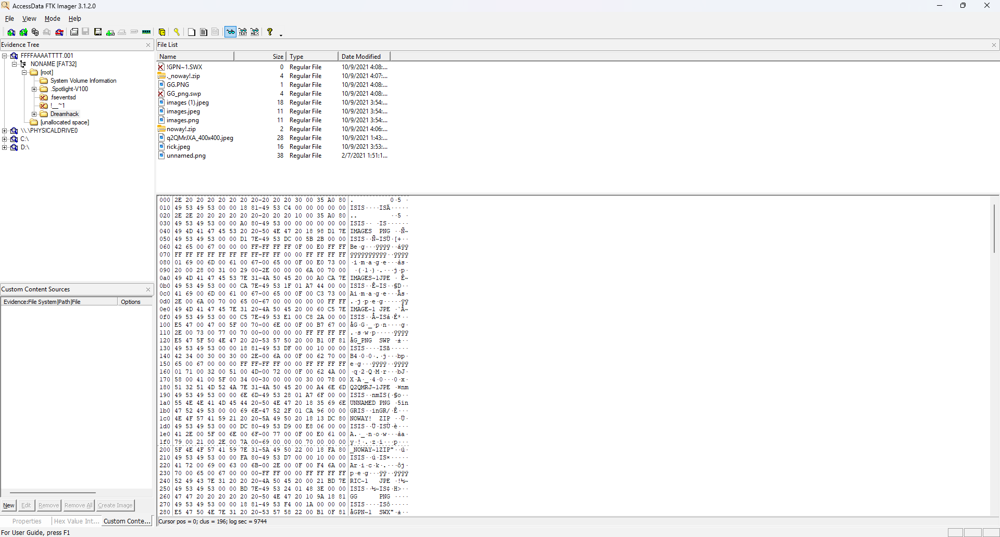
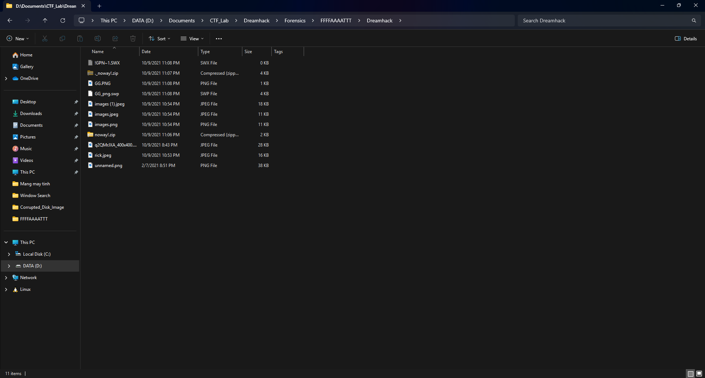
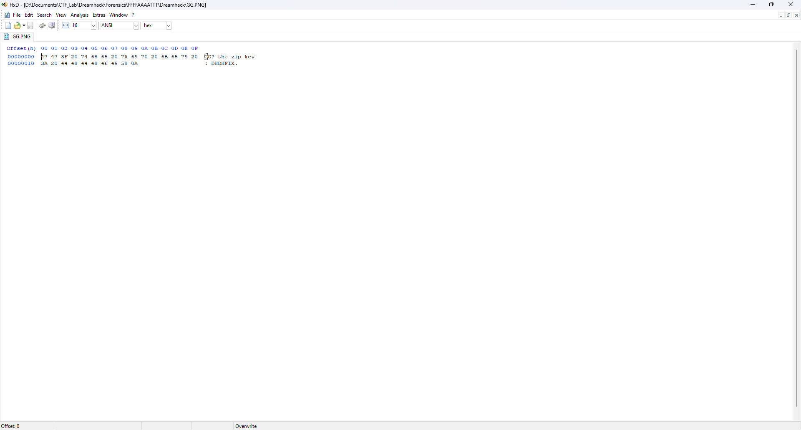
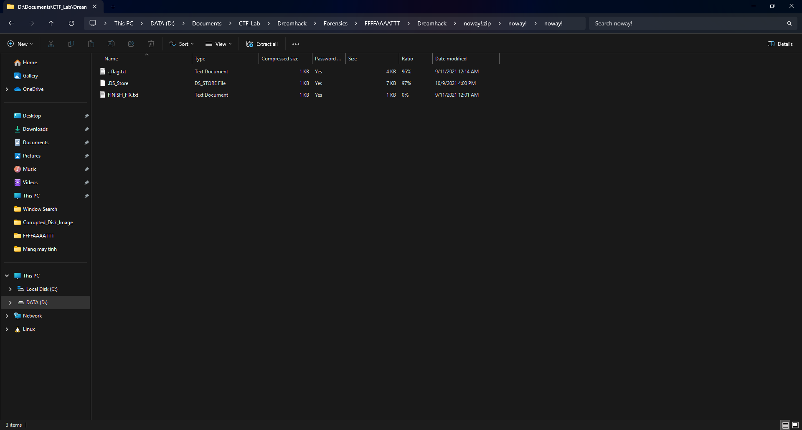

# Write Up

---

## 1. **Hiểu về FAT32**

`FAT32` là hệ thống tập tin (file system) phổ biến.
`FAT32` sẽ được format như sau:

1. **Mỗi Section là 512 bytes.**

2. **Section0 (Main Boost Sector):** Chứa thông tin quan trọng:
   - Số sector mỗi cluster.
   - Offset của bảng FAT.
   - Offset của vùng dữ liệu.
   - Mã phân vùng v.v...

3. **Section6 (Backup Boost Sector):**
   - Được FAT32 thiết kế để dự phòng.
   - Khi Sec0 lỗi vì có thể copy đoạn dữ liệu của Sec6 dán vào.

---

## 2. **Chỉnh sửa file**

Đầu tiên chúng ta sẽ dùng công cụ là `HxD` để xem dạng hex của file.



`Fix the Disk!!!!`

Chúng ta dễ dàng nhận thấy Section 0 của file đã bị lỗi.

Vậy thì hãy thử sửa Section 0 thông qua Section 6.

Ấn `Ctrl + G` và nhập `3072 = 512 bytes * 6` sau đó chọn `dec` để đến Section 6



Sau khi đến Section 6, các bạn hãy copy hết data của phần này rồi quay trở lại dán vào Section 0.



Sau khi dán xong thì nhấn `Ctrl + S` để lưu.

---

## 3. **Mở file chỉnh sửa**

Sử dụng công cụ `FTK Imager` để mở file sau khi sửa.



Chúng ta nhận thấy có 1 folder là `Dreamhack`

Tải folder đấy về máy bằng cách chọn `Export Files` và chọn folder bạn muốn lưu folder `Dreamhack` về.

---

## 4. **Thử mở các files đã tải về**



Sau khi tải về folder của bạn sẽ chứa những file sau.

Thử mở file `GG.PNG` bằng `HxD`



Bạn sẽ nhận được 1 ZIP KEY là:

```txt
DHDHFIX
```

---

## 5. **Giải nén folder noway!.zip**

Giải nén folder bằng key vừa tìm được
Ta sẽ nhận được các file sau:



Thử mở file `FINISH_FIX.txt`

---

## 6. **Flag**

DH{3a5y_FAT32_r3bui1d}