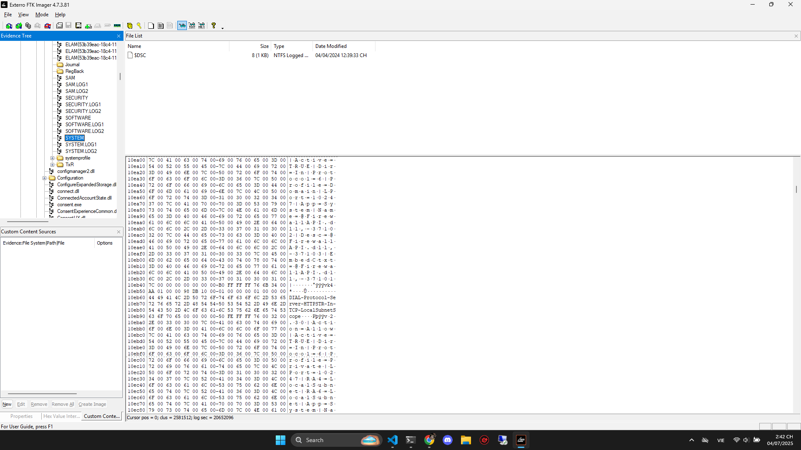
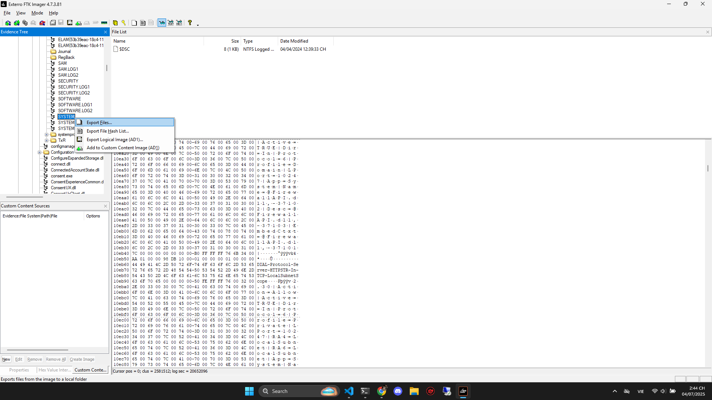

# 🧠 Write-up: Find the USB – Dreamhack CTF

## 🗂️ Thông tin ban đầu

Ta được cung cấp một file ảnh đĩa định dạng `.E01` có tên: `DiskImage.E01`

Đây là ảnh forensic được tạo bởi FTK Imager hoặc EnCase, chứa toàn bộ nội dung của ổ đĩa đã bị ghi lại

---

## 🔍 Bước 1: Do phân vùng hệ thống

Mở file `DiskImage.E01` bằng FTK Imager



Đến địa chỉ `NONAME/root/Windows/System32/config/SYSTEM`

---

## 📁 Bước 2: Trích xuất file registry



Chọn `Export File` để lưu file ra máy

---

## 🔬 Bước 3: Phân tích registry để tìm USB

Dùng `RegRipper` – công cụ trích xuất và phân tích các plugin registry:

### ⚙️ Cài đặt RegRipper:

```bashbash
git clone https://github.com/keydet89/RegRipper3.0.git
sudo apt install libparse-win32registry-perl
```

### 🔍 Chạy plugin `usb` để tìm thiết bị USB đã cắm:

```bash
perl ~/RegRipper3.0/rip.pl -r SYSTEM -p usb

Launching usb v.20200515
usb v.20200515
(System) Get USB key info

USBStor
ControlSet001\Enum\USB

ROOT_HUB [2024-01-17 01:59:22Z]
  S/N: 5&2891968b&0 [2024-04-04 12:39:54Z]
  Properties Key LastWrite: 2024-01-17 02:08:22Z
    ParentIdPrefix: 6&35d1f50b&0
    First InstallDate     : 2024-01-17 01:59:22Z
    InstallDate           : 2024-01-17 01:59:22Z
    Last Arrival          : 2024-04-04 12:39:54Z

ROOT_HUB20 [2024-01-17 01:59:21Z]
  S/N: 5&36a4b5d6&0 [2024-04-04 12:39:54Z]
  Properties Key LastWrite: 2024-01-17 02:08:23Z
    First InstallDate     : 2024-01-17 01:59:21Z
    InstallDate           : 2024-01-17 01:59:21Z
    Last Arrival          : 2024-04-04 12:39:54Z

ROOT_HUB30 [2024-01-17 01:59:21Z]
  S/N: 5&11106705&0&0 [2024-04-04 12:39:54Z]
  Properties Key LastWrite: 2024-01-17 02:05:01Z
    ParentIdPrefix: 6&39d724fe&0
    First InstallDate     : 2024-01-17 01:59:21Z
    InstallDate           : 2024-01-17 01:59:21Z
    Last Arrival          : 2024-04-04 12:39:54Z

VID_058F&PID_6387 [2024-04-04 12:08:49Z]
  S/N: 03A49E66 [2024-04-04 12:08:49Z]
  Properties Key LastWrite: 2024-04-04 12:09:11Z
    First InstallDate     : 2024-04-04 12:08:49Z
    InstallDate           : 2024-04-04 12:08:49Z
    Last Arrival          : 2024-04-04 12:08:49Z
    Last Removal          : 2024-04-04 12:20:01Z
```

---

## 🔑 Tại sao lại chọn `SYSTEM` để phân tích USB

Vì `Registry` hive SYSTEM chứa thông tin về thiết bị phần cứng từng được cắm vào, bao gồm:

- USB devices

- Driver

- Volume mount point

- Services

- Network interfaces

---

## Flag

DH{058F_6387_03A49E66}