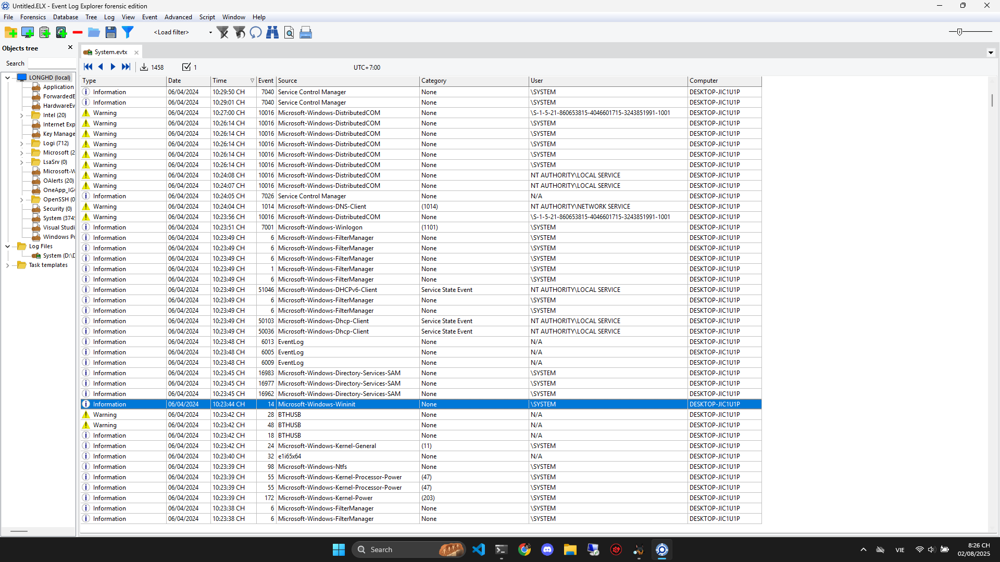

# Write Up

## Event ID

---

## 📌 Microsoft-Windows-Wininit / Event ID 14

`Wininit = Windows Initialization`

Event này xuất hiện khi tiến trình `wininit.exe` được gọi trong giai đoạn khởi tạo hệ thống đầu tiên sau `BIOS`, ngay trước khi người dùng có thể đăng nhập.

Nó xảy ra trước cả `Event ID 6005` và thường là dấu hiệu boot thực sự sớm nhất trong Windows.

---

## 🔬 So sánh

| Event ID | Provider                    | Ý nghĩa                                                           |
| -------- | --------------------------- | ----------------------------------------------------------------- |
| 14       | `Microsoft-Windows-Wininit` | Windows kernel đã bắt đầu khởi tạo → **boot marker chuẩn nhất** ✅ |
| 12       | `Kernel-General`            | OS khởi động xong (hơi trễ hơn ID 14)                             |
| 6005     | `EventLog`                  | Event log service started (sau khi boot hoàn tất)                 |
| 4608     | `Security-Auditing`         | Khởi tạo audit security (không phải lúc nào cũng có)              |
