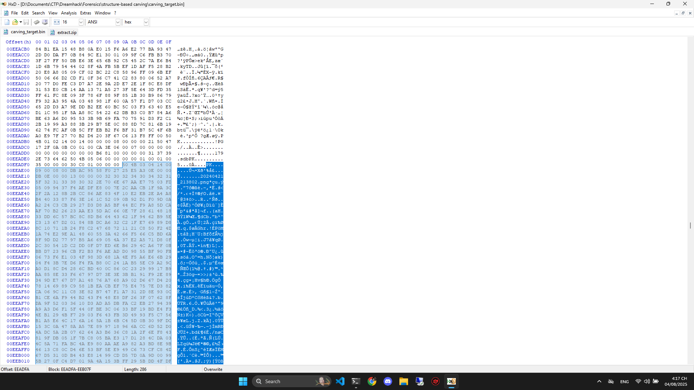
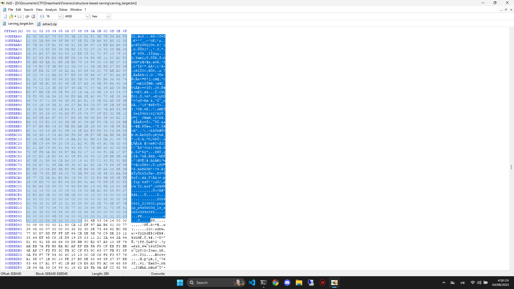
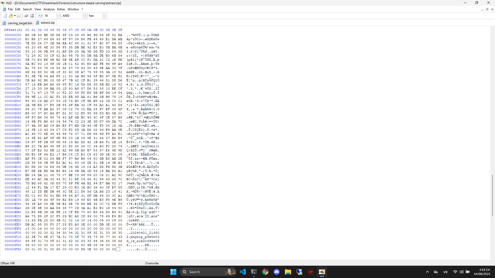
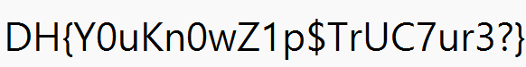

# Write Up

## Phân tích

Đầu tiên tôi chạy binwalk trước, và thấy có rất nhiều file `.java` nhưng trong đó có 1 file lạ

```bash
15642106      0xEEADFA        Zip archive data, encrypted at least v2.0 to extract, compressed size: 3747, uncompressed size: 3803, name: 20240421_213802.png
```

Là 1 file zip những được mã hóa

---

## HxD

Thử mở `HxD` và tìm đến nơi nén file `20240421_213802.png` thì thấy dòng sau

```txt
20240421_213802.pngz1p_p4s5w03d_1s_a1b2c3d4e5f6
```

Đây có thể là mật khẩu để giải nén file

---

## Extract

Chúng ta sẽ lấy ra file `20240421_213802.png` này

Anh em sẽ trích từ offset `EEADFA`



Đến offset `EEBD48`



Lưu thành `extract.zip`



---

## Unzip

Cuối cùng sẽ là bước giải nén thôi

```bash
$ zipinfo extract.zip
Archive:  extract.zip
Zip file size: 3919 bytes, number of entries: 1
-rw-a--     2.0 fat     3803 BX defN 24-Apr-21 21:38 20240421_213802.png
1 file, 3803 bytes uncompressed, 3735 bytes compressed:  1.8%

$ unzip extract.zip
Archive:  extract.zip
[extract.zip] 20240421_213802.png password: a1b2c3d4e5f6
  inflating: 20240421_213802.png
error: invalid zip file with overlapped components (possible zip bomb)
```

---

## Png

Xem file `20240421_213802.png` vừa được giải nén

```bash
$ xdg-open 20240421_213802.png
```



---

## Flag

Flag: DH{Y0uKn0wZ1p$TrUC7ur3?}