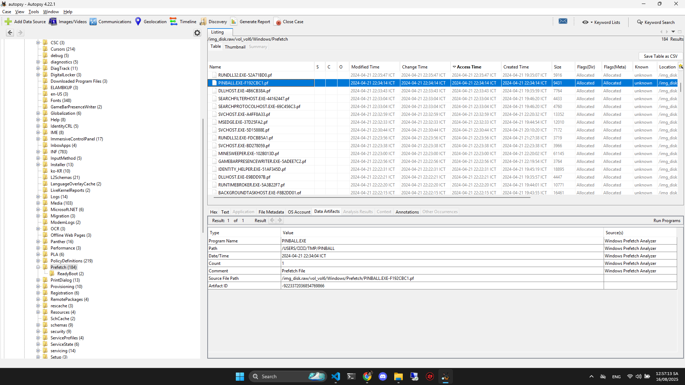
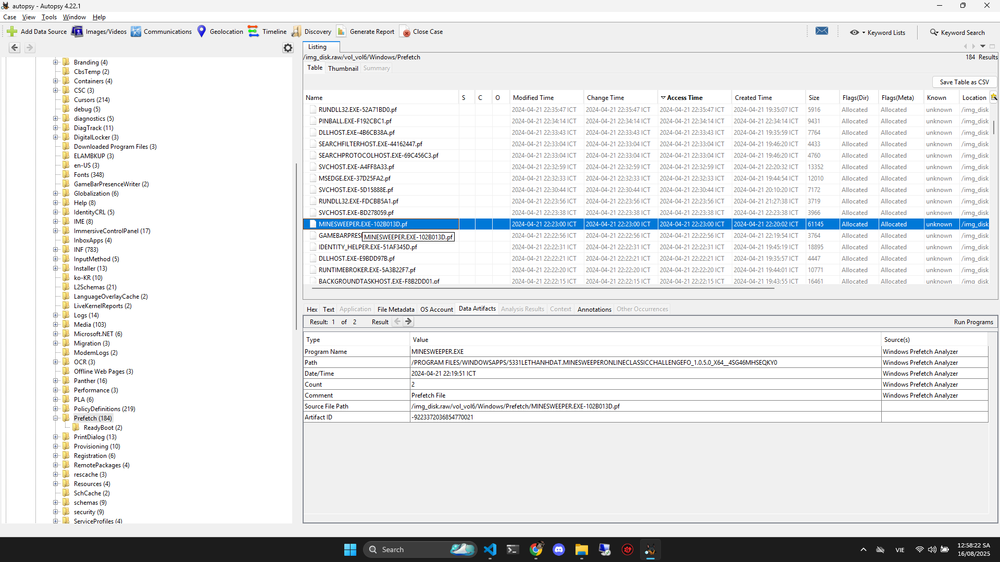
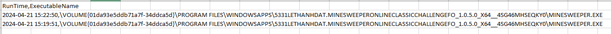
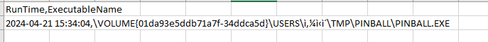

# Write Up

## Prefetch

Tìm trong `Windows` -> `Prefetch`

Vì đây là folder chứa thông tin của những chương trình đã được chạy 





Bạn sẽ thấy có 2 game xuất hiện ở đây

Anh em cũng có thể dùng PrefetchParser (Eric Zimmerman) để xuất ra file `.csv` đọc cho dễ

```powershell
# ví dụ, đổi path cho đúng nơi bạn lưu
.\PrefetchParser.exe "Path\PINBALL.EXE-F192CBC1.pf" --csv > pinball.csv
.\PrefetchParser.exe "Path\MINESWEEPER.EXE-102B013D.pf" --csv > minesweeper.csv
```





---

## Convert

Bây giờ việc cần làm là chuyển về Unix Timestamp thôi

Chuyển từ `2024-04-21 22:19:51` (SE Asia / UTC+7) → UTC = `2024-04-21T15:19:51Z` → epoch seconds = `1713712791`

Chuyển từ `2024-04-21 22:34:04` (SE Asia / UTC+7) → UTC = `2024-04-21T15:34:04Z` → epoch seconds = `1713713644`

---

## Flag

Flag: DH{Minesweeper_1713712791_PINBALL_1713713644}