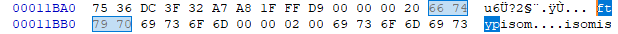
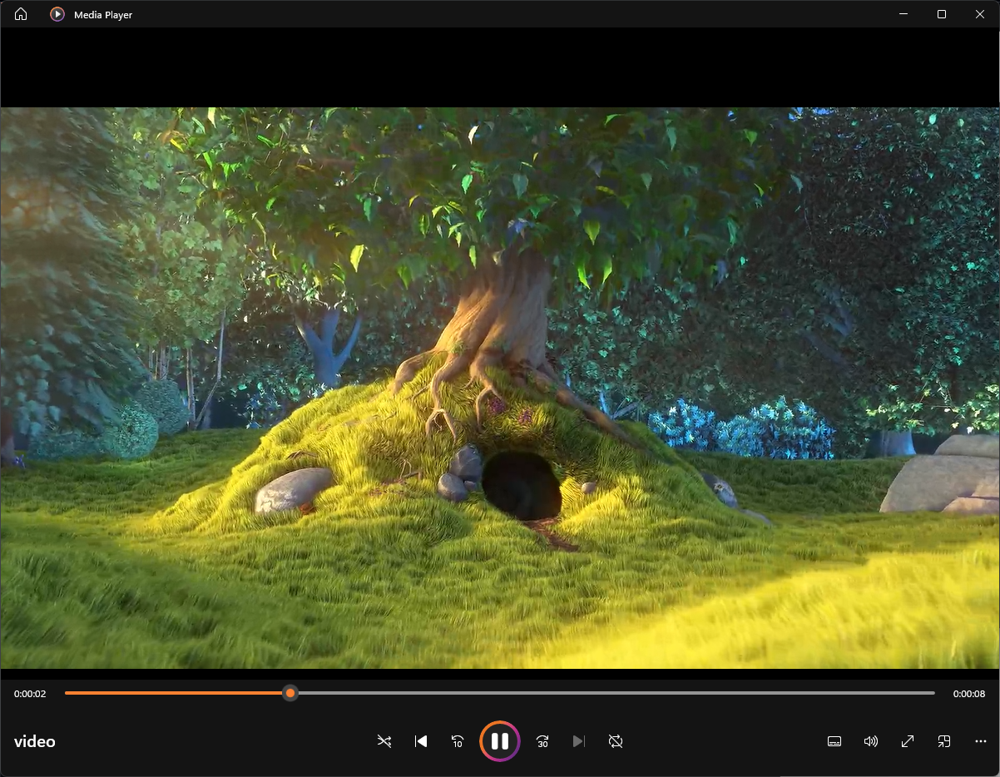
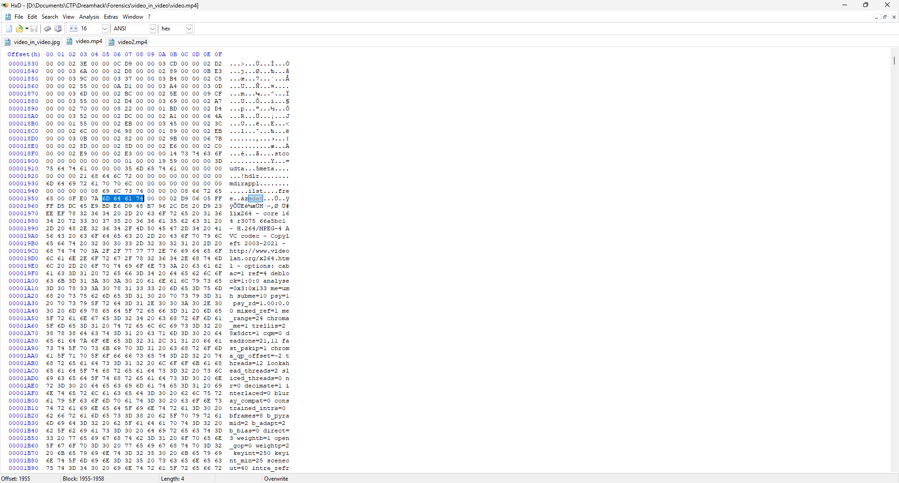
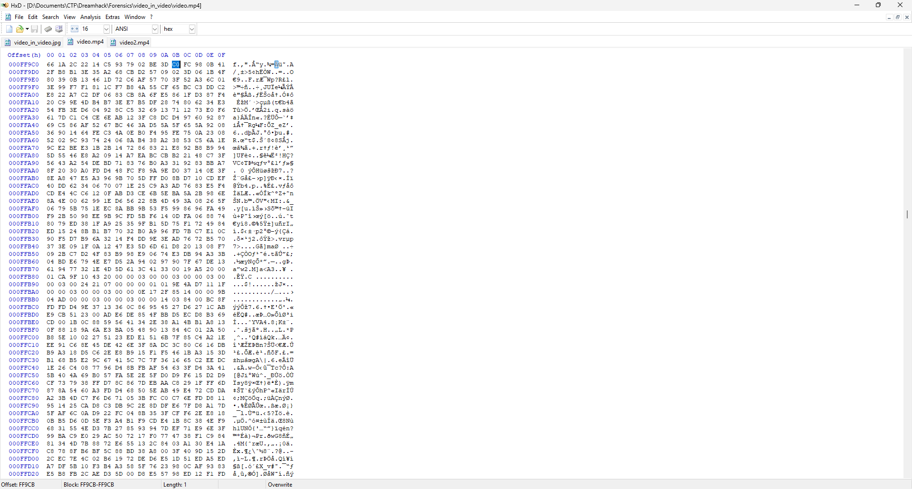

# Write Up

## 1. Phân tích

Anh em sẽ mở file `video_in_video.jpg` bằng `HxD` nhé

Vì tên bài là `video_in_video` nên chúng ta sẽ thử tìm bên trong file `.jpg` có ẩn chứa file video nào không

Chúng ta sẽ tìm magic byte của file `.mp4`: `66 74 79 70` hay `ftyp`



Chúng ta sẽ copy từ đây đến hết file và lưu thành `video.mp4`

Thử mở `video.mp4` lên



Nhận thấy đây chỉ là video thông thường không có gì nên chưa phải flag

Tên bài cũng là `video_in_video` nên có thể sẽ ẩn chứa 1 file video khác bên trong `video.mp4`

---

## 2. File MP4

Trong định dạng `MP4` dữ liệu được tổ chức dưới dạng các `box` hay còn gọi là `atoms`

```txt
| Tên box            | Tên đầy đủ            | Chức năng chính                                                   |
| ------------------ | --------------------- | ----------------------------------------------------------------- |
| `ftyp`             | File Type Box         | Xác định loại định dạng file và các chuẩn tương thích             |
| `moov`             | Movie Box             | Chứa toàn bộ metadata (thông tin video/audio, index, timecode...) |
| `mdat`             | Media Data Box        | Chứa dữ liệu media thô: video, audio                              |
| `free` hoặc `skip` | Free Space or Padding | Đệm không gian, không ảnh hưởng đến dữ liệu                       |
```

Box `moov` là box chứa metadata, bên trong sẽ chứa các box con

```txt
| Box con | Tên đầy đủ       | Chức năng                                     |
| ------- | ---------------- | --------------------------------------------- |
| `mvhd`  | Movie Header Box | Thông tin toàn bộ video (duration, timescale) |
| `trak`  | Track Box        | Thông tin của 1 track (video/audio/sub...)    |
| `udta`  | User Data Box    | Metadata người dùng (title, author...)        |
```

Bên trong `trak` lại chứa nhiều box con khác

```txt
| Box con | Tên đầy đủ       | Chức năng                                               |
| ------- | ---------------- | ------------------------------------------------------- |
| `tkhd`  | Track Header Box | Thông tin cơ bản về track (id, độ dài, width/height...) |
| `mdia`  | Media Box        | Chứa chi tiết về media                                  |
| `edts`  | Edit Box         | Thông tin edit (cắt, đoạn preview\...)                  |
```

Bên trong `mdia` cũng chứa những box con khác nữa

```txt
| Box con | Tên đầy đủ            | Chức năng                         |
| ------- | --------------------- | --------------------------------- |
| `mdhd`  | Media Header Box      | Thông tin thời gian               |
| `hdlr`  | Handler Reference Box | Xác định loại media (video/audio) |
| `minf`  | Media Information Box | Chứa thông tin kỹ thuật media     |
```

Có thể thấy cấu trúc của file `MP4` khá phức tạp

```txttxt
+----------------+
| ftyp           |
+----------------+
| moov           |
| ├─ mvhd        |
| ├─ trak        |
| │  ├─ tkhd     |
| │  ├─ mdia     |
| │  │  ├─ mdhd  |
| │  │  ├─ hdlr  |
| │  │  ├─ minf  |
| │  │     └─ stbl (stsd, stts, stco...)  
+----------------+
| mdat (data)    |
+----------------+
```

Ta có thể nhận thấy dựa trên cấu trúc trên, `mdat` là nơi duy nhất chứa dữ liệu thô

Nói cách khác, box này không có cấu trúc chặt chẽ - nó chỉ chứa _byte stream thô_ của video/audio

Vậy nên đây chính là nơi thích hợp để chèn dữ liệu khác vào mà không gây ảnh hưởng đến file

Còn lại các box khác đều rất nhạy cảm với dữ liệu

Anh em có thể thấy file `PNG` đã nhạy cảm với dữ liệu đến mức nào rồi thì file `MP4` - 1 file video/audio thì chắc chắn sẽ nhạy cảm hơn rồi

Thêm 1 điều nữa là dung lượng của box `mdat` là rất lớn nên sẽ rất phù hợp để ẩn chứa 1 file video/audio khác

---

## 3. Phân tích

Sau khi tìm hiểu qua về `MP4` thì anh em sẽ tìm offset của box `mdat` trong `video.mp4`



Nhưng đừng vội copy từ sau box `mdat` đến hết nhé

Như tôi nói box `mdat` để lưu dữ liệu thô, vậy thì chúng ta cần phải tính xem dữ liệu của file `video.mp4` lưu đến đâu

Để tính được thì ngay trước magic byte `6D 64 61 74` hay `mdat` sẽ là 4 byte lưu độ lớn của box `mdat`

Anh em sẽ tính được độ lớn của box `mdat` là: `00 0F E0 7A` = `1040506`

```txt
Offset_kết_thúc = Offset_bắt_đầu + Độ lớn
                = 0x1951 + 0xfe07a
                = 0xff9cb
```

Vậy chúng ta sẽ tìm đến offset `0xff9cb`



Dễ dàng nhìn ra đằng sau offset kết thúc chứa 1 lượng lớn dữ liệu thừa

Ta sẽ copy từ offset `0xff9cb` đến hết và lưu vào `video2.mp4`

Sau đó chỉ việc mở `video2.mp4` lên là xong

Anh em nhớ mở bằng app `KMPlayer` nhé 

---

## 4. Flag

BISC{codec_based_carving}