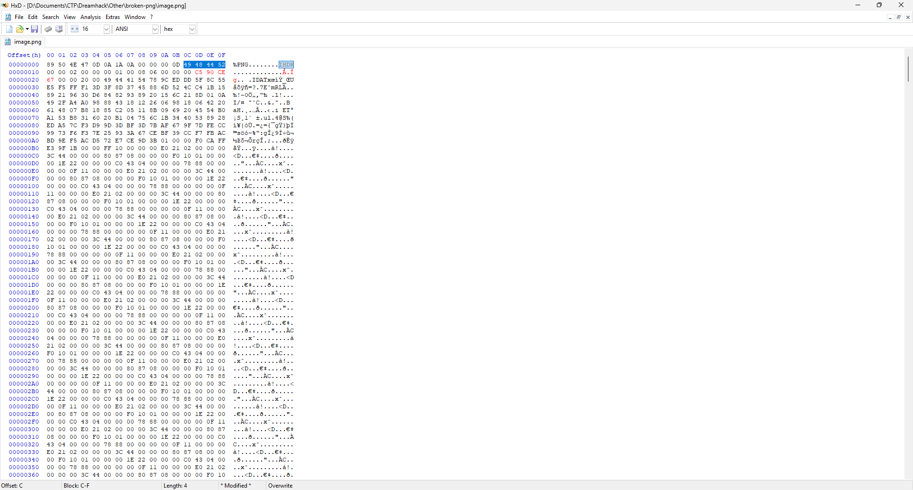
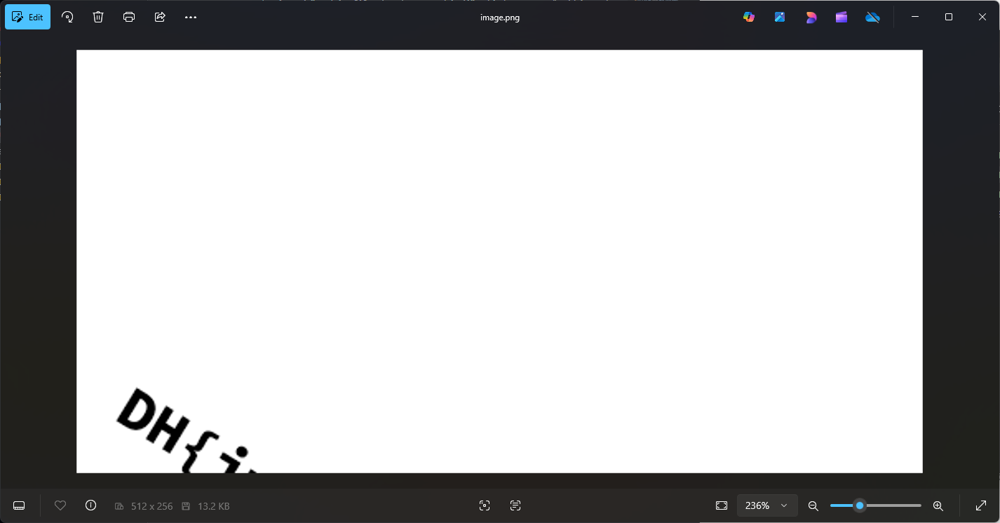
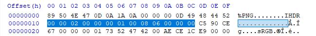
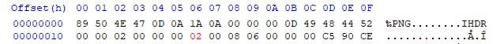
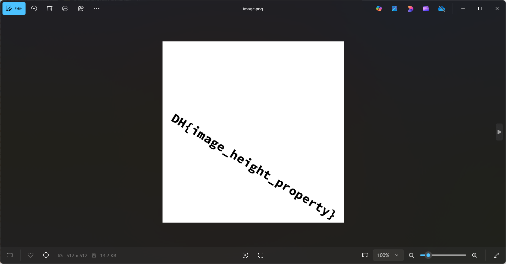

# Write Up

## 1. **Phân tích**

Vì tên bài là `Broken-PNG` nên chúng ta hãy thử check file `image.png` xem sao.

```bash
pngcheck -v image.png
```

Nhận được kết quả như sau:

```bash
$ pngcheck -v image.png
zlib warning:  different version (expected 1.2.13, using 1.3)

File: image.png (13508 bytes)
  chunk IHDR at offset 0x0000c, length 13
    512 x 256 image, 32-bit RGB+alpha, non-interlaced
  CRC error in chunk IHDR (computed c590ce67, expected f478d4fa)
ERRORS DETECTED in image.png
```

Nói qua về các byte trong file `.png`, file `.png` luôn bắt đầu với 8 bytes đặc trưng:

```txt
Byte        | Purpose
--------------------------------------------------------------------------------------------------------------------------------
89          | Giúp phát hiện các hệ thống không hỗ trợ dữ liệu 8-bit, đồng thời giảm khả năng file bị hiểu nhầm là file văn bản.
50 4E 47    | Là ba ký tự "PNG" trong bảng mã ASCII.
0D 0A       | Ký tự xuống dòng kiểu DOS (CRLF), giúp phát hiện sự chuyển đổi dòng giữa hệ điều hành DOS và Unix.
1A          | Ký tự kết thúc file (EOF) trong hệ điều hành DOS, ngăn không cho nội dung tiếp theo hiển thị khi dùng lệnh type.
0A          | Ký tự xuống dòng kiểu Unix (LF), để kiểm tra việc chuyển đổi dòng từ Unix sang DOS.
```

Nói qua về chunk:

```txt
Cấu trúc của 1 chunk:
Phần    | Kích thước    | Ý nghĩa 
---------------------------------------------------------------------------------------------------
Length  | 4 byte        | Độ dài của phần Data, không tính CRC. (là số nguyên không dấu big-endian)
Type    | 4 byte        | Tên loại chunk, là 4 ký tự ASCII phân biệt chữ hoa 
Data    | ...           | Dữ liệu bên trong chunk, có độ dài đúng bằng Length
CRC     | 4 byte        | CRC-32 của Type + Data, dùng để kiểm tra lỗi
```

Về chunk `IHDR` thì `IHDR` là một chunk quan trọng trong file `.png`. Chứa thông tin như: chiều rộng, chiều cao, bit depth, color type... 

Khi chunk này bị hỏng thì ảnh sẽ không hiển thị được.

Đọc lỗi ở trên chúng ta có thể nhận ra được rằng tại chunk `IHDR` ở `offset 0x000c` với `Length=13` thì ảnh đã bị lỗi `CRC`.

---

## 2. **Sửa lỗi**

Dùng `HxD` để đọc file ảnh `.png` và sửa file.



Chúng ta tìm đến đúng offset 0x000c => Đây chính là `IHDR` chunk.
Length = 13 thì đếm lần lượt 13 byte => Byte ngay sau đấy chính là byte cần sửa

Sửa thành `c590ce67` như lỗi trả về và lưu lại file.



Sau khi sửa phần `CRC` tại chunk `IHDR` thì có vẻ ảnh đã khá hơn nhưng chưa đủ để tìm ra flag.

---

## 3. **Phân tích**

Một lần nữa chúng ta phải tiếp tục phân tích chunk `IHDR`:



Như đã đề cập ở trên chunk `IHDR` của ảnh này có `Length = 13` tức là 13 byte data.

Chúng ta sẽ đi sâu hơn về từng byte trong chunk `IHDR`:

```txt
Byte    | Purpose
------------------------------------------------
4 byte  | Width (chiều rộng)
4 byte  | Height (chiều cao)
1 byte  | Depth (độ sâu bit)
1 byte  | Color (loại màu)
1 byte  | Compression method (phương pháp nén)
1 byte  | Filter method (phương pháp lọc)
1 byte  | Interland method (phương pháp nội suy)
```

## 4. **Sửa**

Theo như lý thuyết trên thì 4 byte đầu chính là chiều rộng `00 00 02 00` và 4 byte sau chính là chiều cao `00 00 01 00`.

Chúng ta nhận thấy 2 phần này không khớp nhau và nhìn ảnh có vẻ cũng bị cắt đi 1 nửa, vậy hãy thử sửa cho chúng cân bằng xem sao.



## 6. **Flag**

DH{image_height_property}

