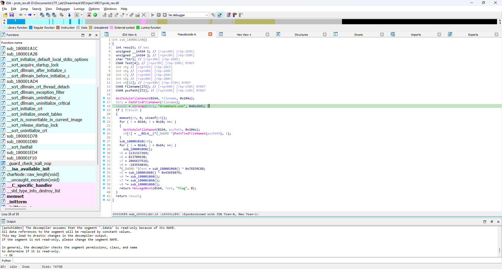

# Write Up

## 1. **Using IDA**



You will see some functions like GetModuleFileNameA, PathFindFileNameA, and strncmp.

First: `GetModuleFileNameA`

This function returns the absolute path of the running file.

Second: `PathFindFileNameA`

This function extracts the filename from the full path of the running file.

Third - The most important function: `strncpy`

This function compares the name of the running file with `dreamhack.exe`.

So all you need to do is create a file named `dreamhack.cpp`, compile it into `dreamhack.exe`, and run it. 

It will load the DLL and print the flag.

## 2. **Script**

```cpp
#include <stdio.h>
#include <windows.h>

int main() {
    LoadLibrary("prob_rev.dll");
    return 0;
}
```

```bash
g++ dreamhack.cpp -o dreamhack.exe
dreamhack.exe
```

## 3. **Flag**

DH{reng@r_is_cute}