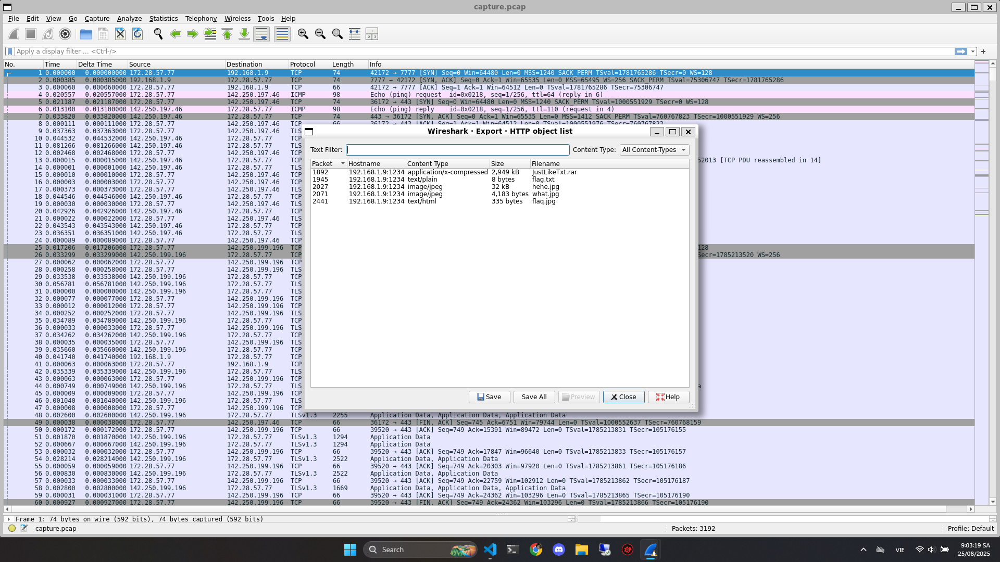
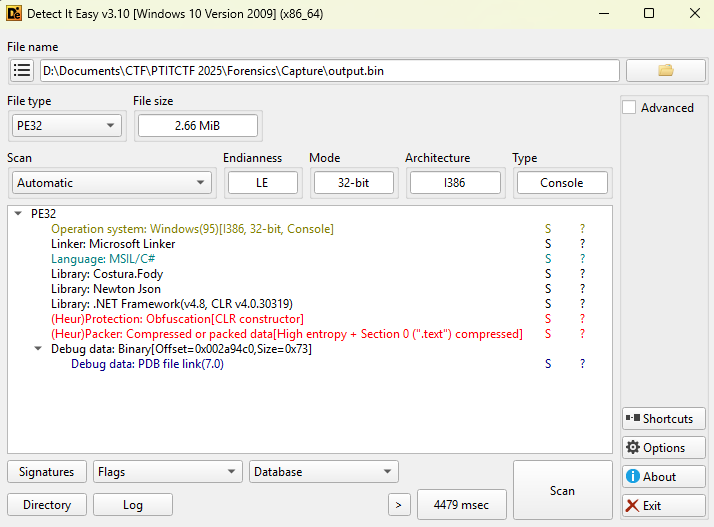
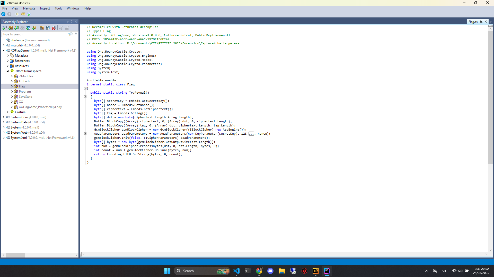
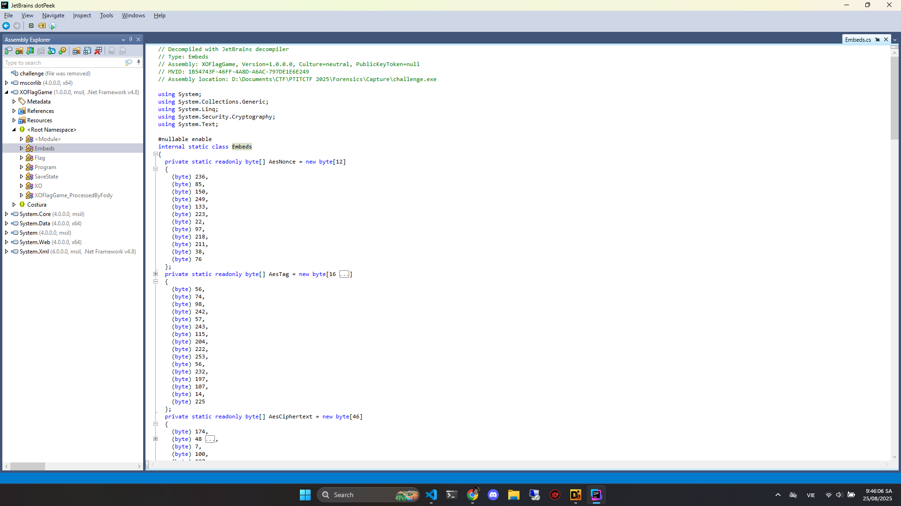

# Forensics - Capture

## Phân tích pcap

Chúng ta xem thử những file nào đã được gửi đi



Export hết ra thử xem sao

---

## Phân tích các file

Tôi đã thử sử dụng `zsteg`, `exiftool`, `binwalk` các kiểu cho các file `.jpg` và `.txt` thì toàn trôn

Sau đó thì thử `unrar` file `JustLikeTxt.rar` thì nó yêu cầu mật khẩu

---

## Crack mật khẩu

Đầu tiên anh em lấy ra `hash` của file

```bash
$ rar2john JustLikeTxt.rar > hash.txt
```

Sau đó là dùng `wordlist` để dò mật khẩu, bài này thì tôi dùng `rockyou.txt`

```bash
$ john --wordlist=/usr/share/wordlists/rockyou.txt hash.txt
Using default input encoding: UTF-8
Loaded 1 password hash (RAR5 [PBKDF2-SHA256 256/256 AVX2 8x])
Cracked 1 password hash (is in /home/kali/john/run/john.pot), use "--show"
No password hashes left to crack (see FAQ)
```

Sau đó mật khẩu sẽ được lưu trong `hash.txt`

```bash
$ john --show hash.txt
JustLikeTxt.rar:peanuts
```

---

## Giải nén

Giải nén bằng mật khẩu

```bash
$ unrar x -ppanuts JustLikeTxt.rar
```

---

## Phân tích file

Sau khi giải nén xong thì sẽ ra rất nhiều file `.txt`, tận 351 file

Sau khi tôi mở vài file ra đọc thì nhận ra rằng đây có thể là 1 phần của đoạn mã hóa base64 nhưng bị tách nhỏ ra thành các file `.txt`

Anh em gộp hết lại thành 1 file `merge.txt`

```bash
$ cat JustLikeTxt/part_*.txt > merge.txt
```

Giải mã base64

```bash
$ base64 -d merge.txt > output.bin
```

Kiểm tra file `output.bin`

```bash
$ file output.bin 
output.bin: PE32 executable for MS Windows 6.00 (console), Intel i386 Mono/.Net assembly, 3 sections
```

---

## Phân tích file output.bin

Sử dụng `Detech It Easy` để xem file được viết bằng ngôn ngữ gì



Đây là file code bằng `C#` nên sẽ không dịch ngược bằng `IDA` được

Thay vào đó anh em sử dụng `dotPeek` hoặc `dnPsy`, tôi thì dùng `dotPeek`

Để phân tích thì trước hết là đổi file sang file `.exe` đã

```bash
$ mv output.bin output.exe
```

---

## dotPeek

Lúc đầu tôi chạy thử file `.exe` trước thì nó là game XO, anh em nên chạy bằng máy ảo nhé, nhỡ đâu nó là malware riel thì lỏ

Sau đó mở bằng `dotPeek` thì sẽ thấy `XOFlagGame`

Tìm sẽ thấy class `Flag`, anh em click vào xem thử



Chúng ta sẽ thấy 1 đoạn như sau

```Csharp
byte[] secretKey = Embeds.GetSecretKey();
byte[] nonce = Embeds.GetNonce();
byte[] ciphertext = Embeds.GetCiphertext();
byte[] tag = Embeds.GetTag();
```

Gọi method `GetSecretKey`, `GetNonce`, `GetCiphertext`, `GetTag` từ class `Embeds`

Vậy nên anh em xem thử class `Embeds` xem có gì khai thác tiếp không



Đoạn này thì là mã hóa AES nên anh em giải mã là ra

---

## Script

Script giải mã

```python
# decrypt_flag.py
# Giải AES-GCM theo đúng logic Flag.TryReveal() & Embeds.*

from Crypto.Cipher import AES

# ===== Embeds =====
AesNonce = bytes([
    236, 85, 150, 249, 133, 223, 22, 97, 218, 211, 38, 76
])

AesTag = bytes([
     56,  74,  98, 242,  57, 243, 115, 204,
    222, 253,  56, 232, 197, 107,  14, 225
])

AesCiphertext = bytes([
    174,  48,   7, 100, 207,  26,  27, 150, 166, 144,  90, 153,
    225, 176, 222, 113, 164, 197, 167,  77, 133, 132, 235,  43,
     43, 115,  86,  82,  85, 184,  28,  28, 219, 201,  31, 202,
     70,  19, 137,  96, 159,  89, 137,  51, 168, 115
])

KeyShard1 = bytes([
    121, 165,  33,  10,  18, 197, 254, 212, 240, 253,  79, 245,
     53,  48, 123,  46, 142, 215,  38, 213,  25, 168,   2, 224,
     53,  25,   9, 191, 221, 152, 199, 246
])

KeyShard2 = bytes([
     63, 201,  64, 109,  80, 176, 151, 184, 148, 152,  61, 183,
     76, 120,  26,  71, 224, 179,  22, 230,  56, 137,  35, 193,
     20,  56,  40, 158, 252, 185, 230, 215
])

# ===== Reconstruct secret key (XOR) =====
assert len(KeyShard1) == 32 and len(KeyShard2) == 32
secretKey = bytes([a ^ b for a, b in zip(KeyShard1, KeyShard2)])

# ===== AES-GCM decrypt =====
cipher = AES.new(secretKey, AES.MODE_GCM, nonce=AesNonce)
plaintext = cipher.decrypt_and_verify(AesCiphertext, AesTag)

print(plaintext.decode("utf-8"))
```

Run

```bash
$ pip install pycryptodome

$ python3 decrypt.py 
PTITCTF{dotn3t_c4nn0t_mak4it_difficult_f0ry0u}
```

---

## Flag

Flag: PTITCTF{dotn3t_c4nn0t_mak4it_difficult_f0ry0u}