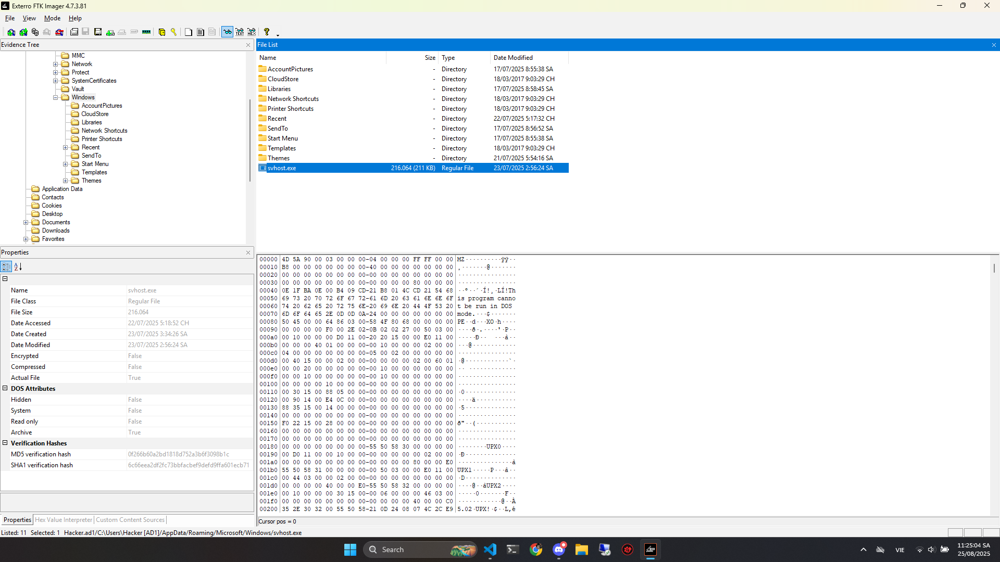
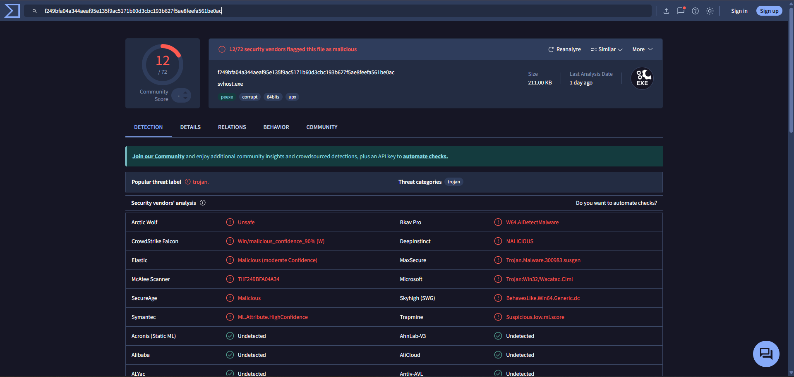

# Forensics - Virtual Image 1

## Phần mềm

Bài này anh em sẽ sử dụng `Exterro FTK Imager` để đọc file `.ad1`

---

## Tìm kiếm

Anh em sẽ thấy `svhost.exe`, 1 file trông sẽ rất bình thường nhưng đáng ra không được xuất hiện trong folder `User` mà sẽ thường là trong folder hệ thống

---

## Threat Label

Anh em paste mã `MD5` lên Virus Total là sẽ thấy được Threat Label

---

## FlagFlag

Flag: PTITCTF{C:\Users\Hacker\AppData\Roaming\Microsoft\Windows\svhost.exe_0f266b60a2bd1818d752a3b6f3098b1c_2025-07-23T02:56:24Z_trojan}