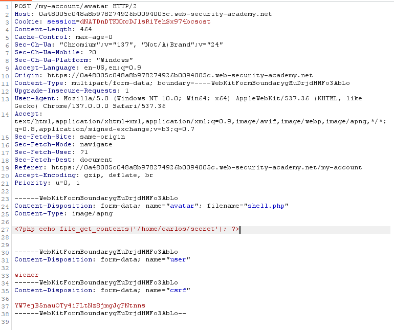
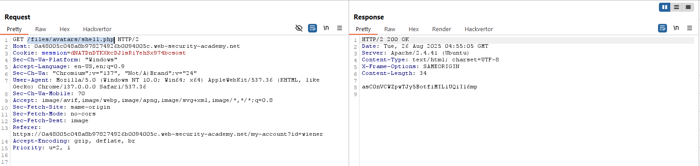

# Write Up

## Gửi code lên Web

Tại api `/my-account/avatar` có method `POST` anh em sẽ gửi file `shell.php` lên để thay avatar

File này sẽ lấy nội dung từ đường dẫn `/home/carlos/secret` để trả về cho anh em đọc

Có thể đổi `Content-Type` thành `image/apng` cho chắc cú

Sau đó send request

## Đọc nội dung

Sau khi anh em gửi được `shell.php` lên, giờ Web đã lưu trữ đoạn lệnh anh em đẩy lên rồi

Để gọi lại `shell.php` đấy cho nó đọc được nội dung từ `/home/carlos/secret` thì việc đơn giản là anh em reload lại page

Lý do reload lại là để Web tải lại trang, tải lại đường dẫn đến avatar, lúc này nó sẽ gọi api `/files/avatars/shell.php`

Web sẽ lấy file `shell.php` nó đã lưu trữ, nhưng khi lấy thì đây không phải file ảnh mà là shell code nên nó sẽ tự động thực thi đoạn mã bên trong

Nó sẽ thực thi lệnh `echo file_get_contents('/home/carlos/secret')` nên chúng ta sẽ lấy được nội dung từ file `secret`

