# Write Up - TryHackMe: Investigating Windows

> This is a challenge that is exactly what is says on the tin, there are a few challenges around investigating a windows machine that has been previously compromised.

---

## 1. Whats the version and year of the windows machine?

```powershell
systeminfo
```

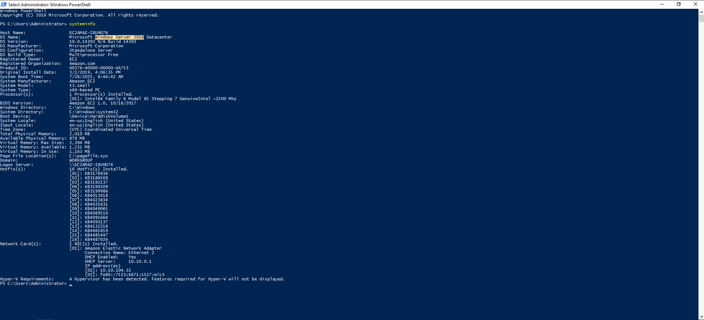

<details>
<summary>Answer</summary>

```txt
Windows Server 2016
```

</details>

---

## 2. Which user logged in last?

```powershell
query user
```

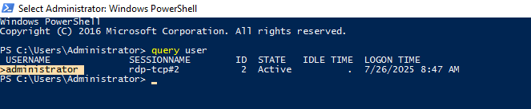

<details>
<summary>Answer</summary>

```txt
administrator
```

</details>

---

## 3. When did John log onto the system last?

```powershell
Get-EventLog -LogName Security -InstanceId 4624 | Where-Object { $_.ReplacementStrings[5] -like "*john*" } | Select-Object TimeGenerated, @{Name="User";Expression={$_.ReplacementStrings[5]}} | Sort-Object TimeGenerated -Descending | Select-Object -First 1
```

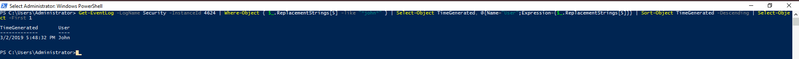

<details>
<summary>Answer</summary>

```txt
03/02/2019 5:48:32 PM
```

</details>

---

## 4. What IP does the system connect to when it first starts?

`regedit` -> `HKEY_LOCAL_MACHINE` -> `SOFTWARE` -> `Microsoft` -> `Windows` -> `CurrentVersion` -> `Run`

<details>
<summary>Answer</summary>

```txt
10.34.2.3
```

</details>

---

## 5. What two accounts had administrative privileges (other than the Administrator user)?

```powershell
Get-LocalGroupMember -Group "Administrators"
```

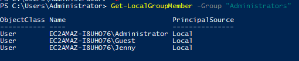

<details>
<summary>Answer</summary>

```txt
Guest, Jenny
```

</details>

---

## 6. Whats the name of the scheduled task that is malicous.

```powershell
Get-ScheduledTask | Select-Object TaskName, State, Actions | Where-Object { $_.State -eq 'Ready' } | Format-Table -Property TaskName, Actions
```

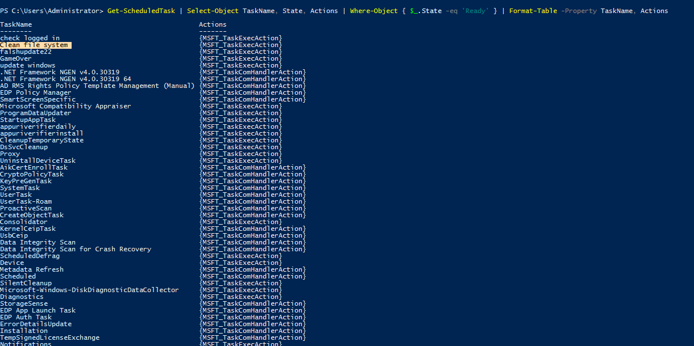

<details>
<summary>Answer</summary>

```txt
Clean file system
```

</details>

---

## 7. What file was the task trying to run daily?

```powershell
Get-ScheduledTask -TaskName "Clean file system" | Select-Object -ExpandProperty Actions
```

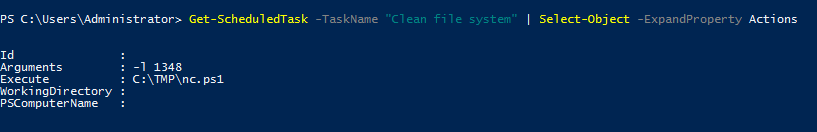

<details>
<summary>Answer</summary>

```txt
nc.ps1
```

</details>

---

## 8. What port did this file listen locally for?

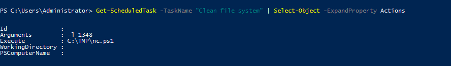

<details>
<summary>Answer</summary>

```txt
1348
```

</details>

---

## 9. When did Jenny last logon?

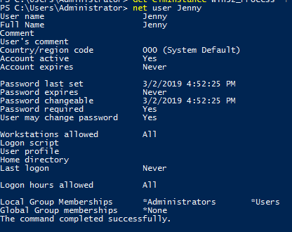

<details>
<summary>Answer</summary>

```txt
Never
```

</details>

---

## 10. At what date did the compromise take place?

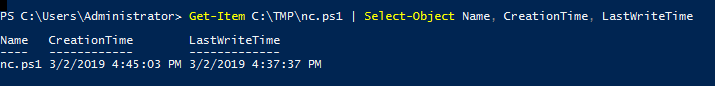

<details>
<summary>Answer</summary>

```txt
03/02/2019
```

</details>

---

## 11.During the compromise, at what time did Windows first assign special privileges to a new logon?

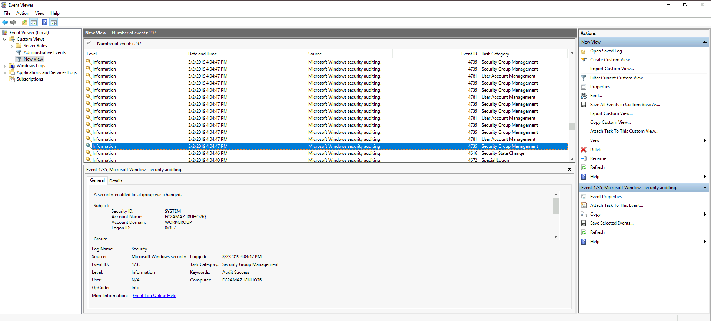

<details>
<summary>Answer</summary>

```txt
3/2/2019 4:04:47 PM
```

</details>

---

## 12. What tool was used to get Windows passwords?

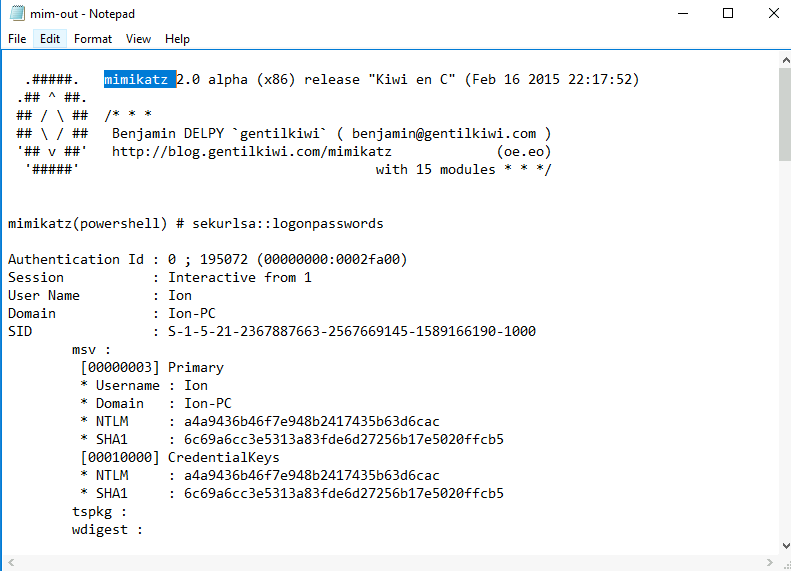

<details>
<summary>Answer</summary>

```txt
mimikatz
```

</details>

---

## 13. What was the attackers external control and command servers IP?

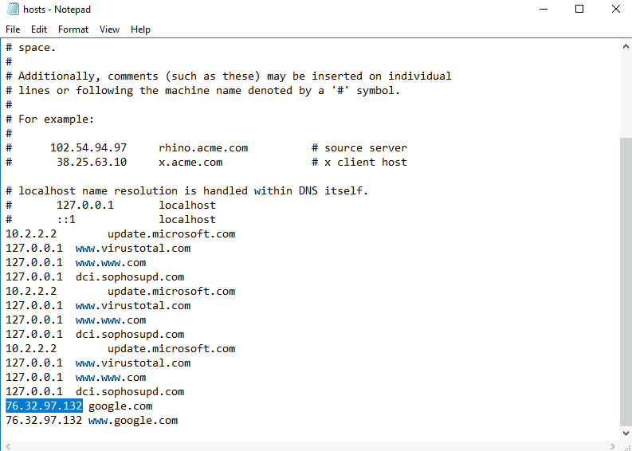

<details>
<summary>Answer</summary>

```txt
76.32.97.132
```

</details>

---

## 14. What was the extension name of the shell uploaded via the servers website?

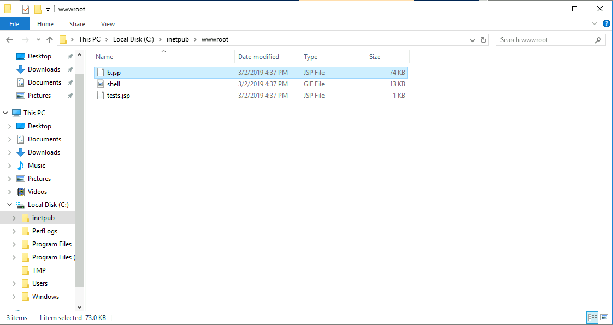

<details>
<summary>Answer</summary>

```txt
.jsp
```

</details>

---

## 15. What was the last port the attacker opened?

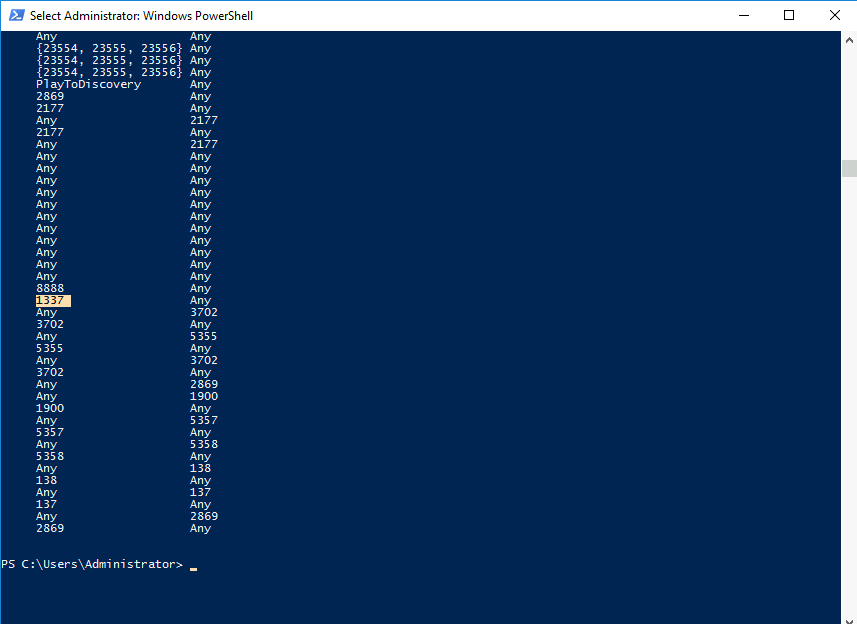

Phát hiện thấy port 1337 -> Port khá nổi tiếng trong giới hacker

<details>
<summary>Answer</summary>

```txt
1337
```

</details>

---

## 16. Check for DNS poisoning, what site was targeted?


Đây không phải IP của google.com

<details>
<summary>Answer</summary>

```txt
goole.com
```

</details>