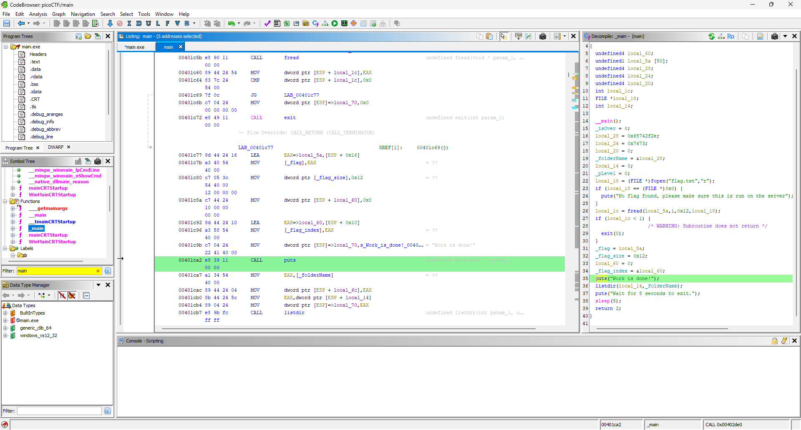
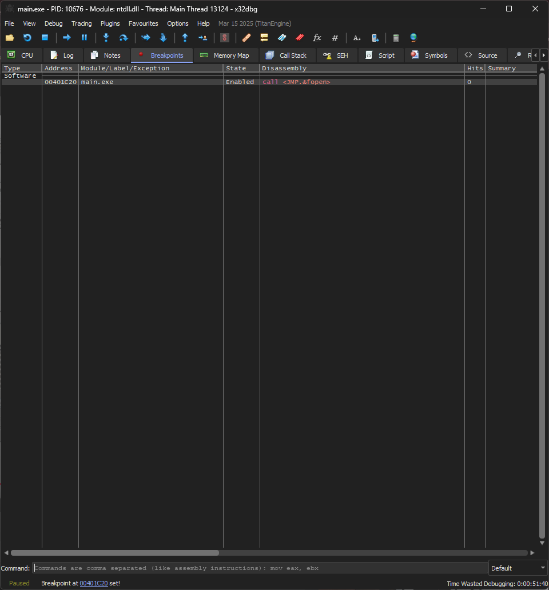
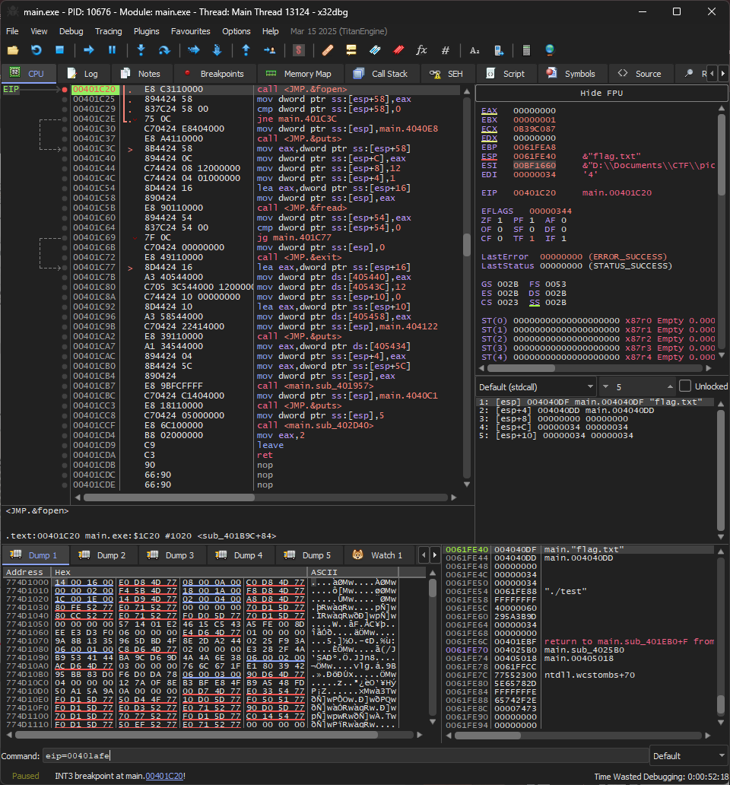

# Write Up

## 1. **Ghidra**

Sử dụng `Ghidra` để phân tích file `main.exe`

```c
int __cdecl _main(int _Argc,char **_Argv,char **_Env)
{
    undefined4 local_60;
    undefined1 local_5a [50];
    undefined4 local_28;
    undefined4 local_24;
    undefined4 local_20;
    int local_1c;
    FILE *local_18;
    int local_14;
    
    __main();
    _isOver = 0;
    local_28 = 0x65742f2e;
    local_24 = 0x7473;
    local_20 = 0;
    _folderName = &local_28;
    local_14 = 0;
    _pLevel = 0;
    local_18 = (FILE *)fopen("flag.txt","r");
    if (local_18 == (FILE *)0x0) {
        puts("No flag found, please make sure this is run on the server");
    }
    local_1c = fread(local_5a,1,0x12,local_18);
    if (local_1c < 1) {
                        /* WARNING: Subroutine does not return */
        exit(0);
    }
    _flag = local_5a;
    _flag_size = 0x12;
    local_60 = 0;
    _flag_index = &local_60;
    puts("Work is done!");
    listdir(local_14,_folderName);
    puts("Wait for 5 seconds to exit.");
    sleep(5);
    return 2;
}
```

Chúng ta nhận thấy rằng sau khi in ra `Work is done!` thì nó gọi 1 hàm là `listdir`, hãy cùng kiểm tra hàm đấy

```c
/* listdir */
void __cdecl listdir(int param_1,undefined4 param_2)
{
    int iVar1;
    BOOL BVar2;
    char local_958 [2048];
    _WIN32_FIND_DATAA local_158;
    HANDLE local_18;
    bool local_11;
    int local_10;
    
    local_18 = (HANDLE)0x0;
    sprintf(local_958,"%s\\*.*");
    local_18 = FindFirstFileA(local_958,&local_158);
    if (local_18 == (HANDLE)0xffffffff) {
        printf("Path not found: [%s]\n");
    }
    else {
        local_10 = 1;
        local_11 = true;
        while (local_11 != false) {
        iVar1 = strcmp(local_158.cFileName,".");
        if ((iVar1 != 0) && (iVar1 = strcmp(local_158.cFileName,".."), iVar1 != 0)) {
            sprintf(local_958,"%s\\%s");
            if ((local_158.dwFileAttributes & 0x10) == 0) {
            if (local_10 == 1) {
                if (param_1 == 0) {
                    hideInFile(local_958);
                }
                else if (param_1 == 1) {
                    decodeBytes(local_958);
                }
            }
            local_10 = 1 - local_10;
            }
            else {
            printf("Folder: %s\n");
            listdir(param_1,local_958);
            }
        }
        if (_isOver != '\0') break;
        BVar2 = FindNextFileA(local_18,&local_158);
        local_11 = BVar2 != 0;
        }
        FindClose(local_18);
    }
    return;
}
```

Có thể thấy rằng nó kiểm tra nếu `param == 1` thì sẽ gọi hàm `decodeBytes`, đây có thể là hàm giải mã và in ra flag

Chúng ta có thể nhận thấy rằng đây là 1 hàm đệ quy, vậy hãy thử kiểm tra xem hàm này được gọi ở những đâu trong chương trình

Ở `Functions` --> Tìm hàm `listdir` --> Chuột phải --> Chọn `Show References to`

Ta sẽ tìm thấy 1 hàm `Undefined` như sau

```c
void UndefinedFunction_00401afe(void)
{
    undefined4 uStack_28;
    undefined4 uStack_24;
    undefined4 uStack_20;
    undefined4 uStack_1c;
    undefined4 uStack_18;
    undefined4 uStack_14;
    undefined4 uStack_10;
    
    uStack_24 = 0x616c6f68;
    uStack_20 = 0x202020;
    uStack_1c = 0;
    uStack_18 = 0;
    uStack_14 = 0;
    _buff_size = 0x12;
    uStack_28 = 0;
    uStack_10 = 1;
    _buff = &uStack_24;
    _buff_index = &uStack_28;
    listdir(1,_folderName);
    printf("value of DECODE %s \n");
    puts("Wait for 5 seconds to exit.");
    sleep(5);
                        /* WARNING: Subroutine does not return */
    exit(0);
}
```

Có vẻ đây sẽ là hàm in ra flag do nó gọi `listdir` với `param = 1`, xem lại ở bên trên thì nếu `param = 1` nó sẽ gọi hàm `decodeByte` --> Khá chắc đây là hàm in ra Flag

Bây giờ chúng ta hãy thử một kỹ thuật mới là đặt breakpoint và nhảy thẳng đến hàm này

Mở `x32dbg` để tiến hành debug



Đầu tiên chúng ta sẽ tìm địa chỉ ngay trước khi gọi `listdir`

Như ảnh trên thì tôi đang ở hàm `puts` gần cuối

Anh em kéo lên tí nữa thấy hàm `puts` lúc gọi khi mở file `flag.txt`

Anh em đặt breakpoint ngay tại đấy vì khi chạy sẽ không có file `flag.txt` nên chương trình sẽ dừng ngay lập tức

Nên chúng ta phải đặt breakpoint tại đây và gọi hàm `Undefined` kia từ đây

```cmd
SetBPX 00401c20
```



Tiếp theo nhảy đến hàm `Undefined`

```cmd
EIP=00401afe
```



---

## 2. **Flag**

picoCTF{M4cTim35!}
