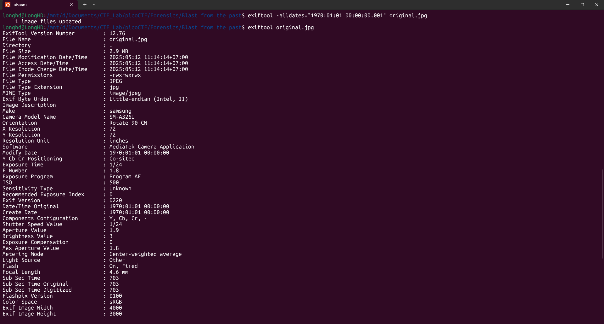

# Write-Up: Blast from the past - picoCTF

**Thể loại:** Forensics  
**Mức độ:** Vừa  
**Tác giả:** Hà Duy Long - AT02 - PTIT

---

# Mô tả

Bài này yêu cầu chúng ta phải chỉnh sửa dữ liệu của các trường thời gian trong ảnh về mốc thời gian `1970:01:01 00:00:00.001` để có thể lấy được flag

---

# Các bước thực hiện

1. **Đầu tiên chúng ta sẽ kiểm tra metadate của ảnh để xem có những trường thời gian nào**
    

2. **Chúng ta sẽ sử dụng công cụ `exiftool` để chỉnh sửa thời gian trong metadate của ảnh**
    Sử dụng

   ```bash
   exiftool -alldates="1970:01:01 00:00:00.001" original.png
   ```  

    
    


    Nộp thử để kiểm tra xem chúng ta đã thay đổi đúng chưa
    

    Ở đây thông báo `SubSecCreateDate` đã sửa không đúng yêu cầu, vậy chúng ta cần sử dụng `exiftool` chỉ đích danh nó để sửa chứ không thể thông qua `alldates`

    

    Kiểm tra và chúng ta lại thấy phần `TimeStamp` chưa đúng yêu cầu
    

    Bây giờ chúng ta phải sử dụng một kỹ thuật khác là đọc từng bytes trong hex-view của ảnh để xem `TimeStamp` sẽ được viết ở những bytes nào và chúng ta sẽ chỉnh sửa những bytes đó
    
    ```bash
    exiftool -v3 original.png
    ```

    

    Chúng ta sẽ thấy `TimeStamp` được viết từ bytes 31 cho đến bytes 30
    Vậy công việc của chúng ta bây giờ là chỉnh sửa hết tất cả những bytes đó
    Mở vim dành cho bytes để sửa
    
    ```bash
    bvi original.png
    ```

    

    Chỉnh sửa file bằng các lệnh sau
    ```bash
    :$: Về cuối file
    Shift R: Replace mode
    ESC: Thoát mode
    :wq: Lưu và thoát
    ```
    

    Gửi lại yêu cầu và chúng ta đã lấy được flag
    

3. **Flag**
   picoCTF{71m3_7r4v311ng_p1c7ur3_3e336564}