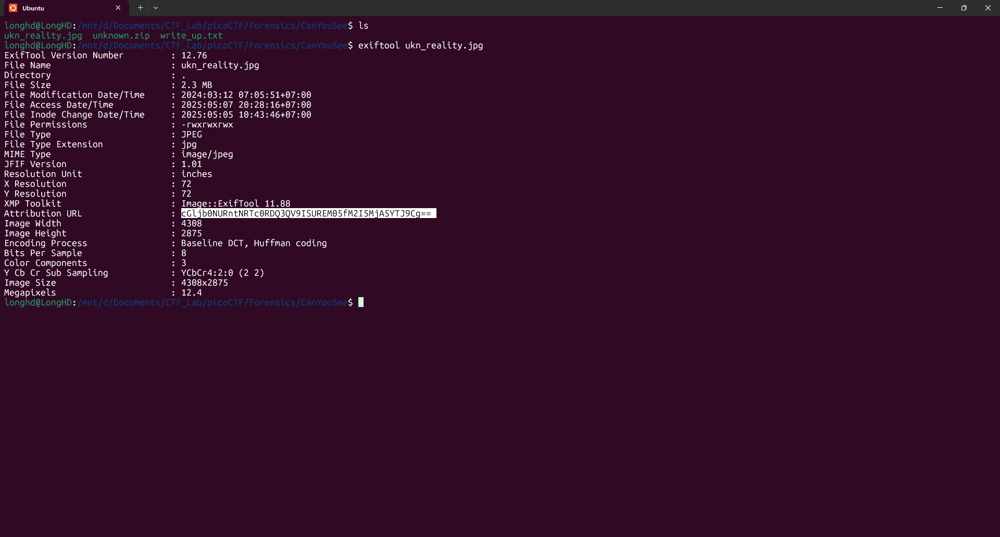
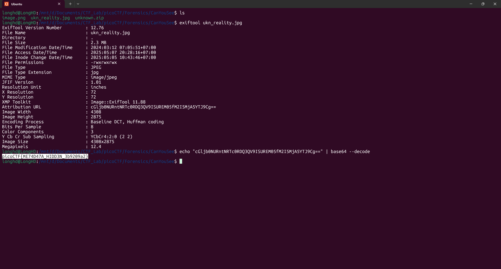

# Write-Up: CanYouSee - picoCTF

**Thể loại:** Forensics  
**Mức độ:** Dễ  
**Tác giả:** Hà Duy Long - AT02 - PTIT

---

# Mô tả

Thử thách yêu cầu người chơi tìm flag được ẩn trong một file hình ảnh. Đây là một dạng bài phổ biến trong CTF, nơi thông tin không nằm trong nội dung hiển thị mà được ẩn trong metadata (siêu dữ liệu) của file.

---

# Các bước thực hiện

1. **Xem metadata của ảnh**  
   Sử dụng công cụ `exiftool` để kiểm tra metadata:

   ```bash
   exiftool ukn_reality.png
   ```
    


2. **Tìm flag trong kết quả đầu ra**
    Để ý sẽ có một chuỗi base64 ở trường Attribution URL
    Giải mã chuỗi này sẽ lấy được flag

3. **Giải mã và lấy flag**
    Xử dụng lệnh decode base64 trong Linux
    ```bash
    echo "cGljb0NURntNRTc0RDQ3QV9ISUREM05fM2I5MjA5YTJ9Cg==" | base64 --decode
    ```
    

4. **Flag**
    picoCTF{ME74D47A_HIDD3N_3b9209a2}