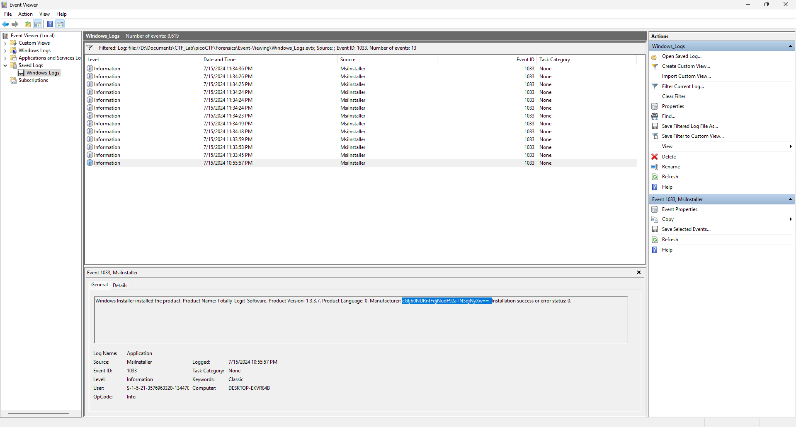
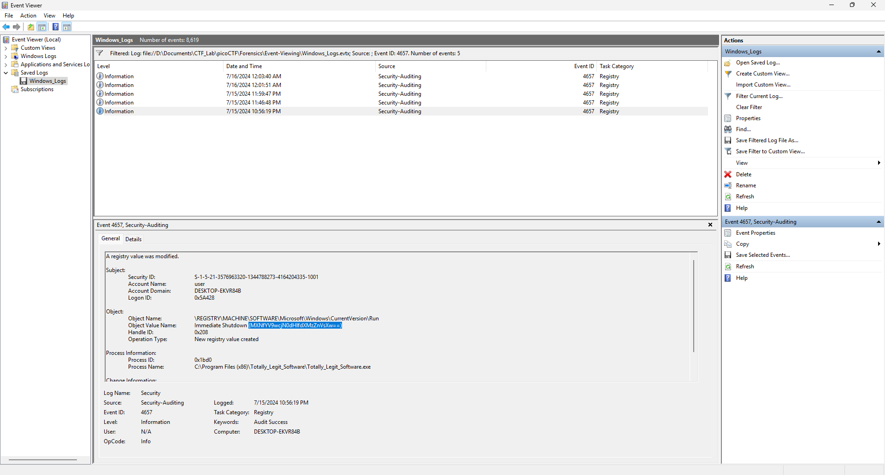
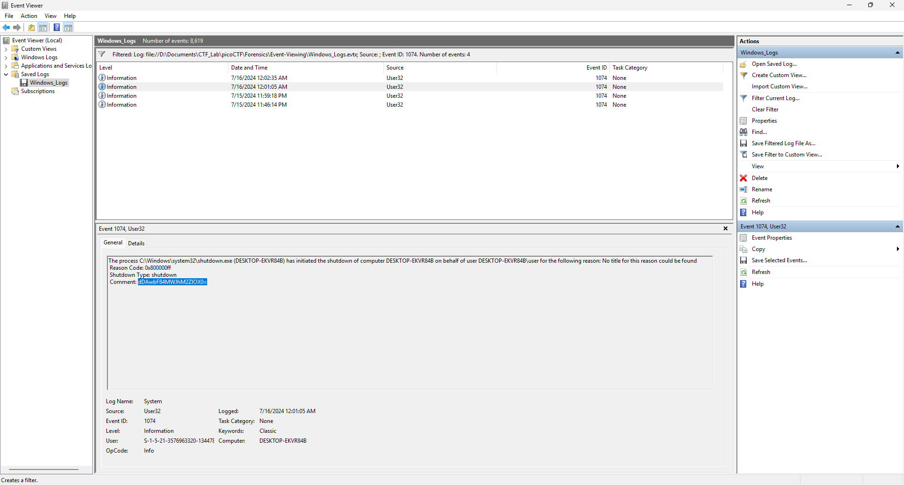

# Write-Up: Event-Viewing - picoCTF

**Thể loại:** Forensics  
**Mức độ:** Vừa  
**Tác giả:** Hà Duy Long - AT02 - PTIT

---

# Mô tả

Bài này yêu cầu chúng ta phải đọc file log của Windows để tìm ra flag 

---

# Các bước thực hiện

1. **Tìm xem người dùng Install file lúc nào theo ID=1033**
    

2. **Tìm xem người dùng đã Run file lúc nào theo ID=4657**
    

3. **Tìm xem người dùng đã Shutdown máy lúc nào theo ID=1074**
    

4. **Flag**
    picoCTF{Ev3nt_vi3wv3r_1s_a_pr3tty_us3ful_t00l_81ba3fe9}