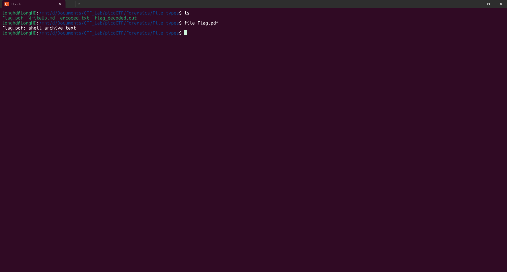
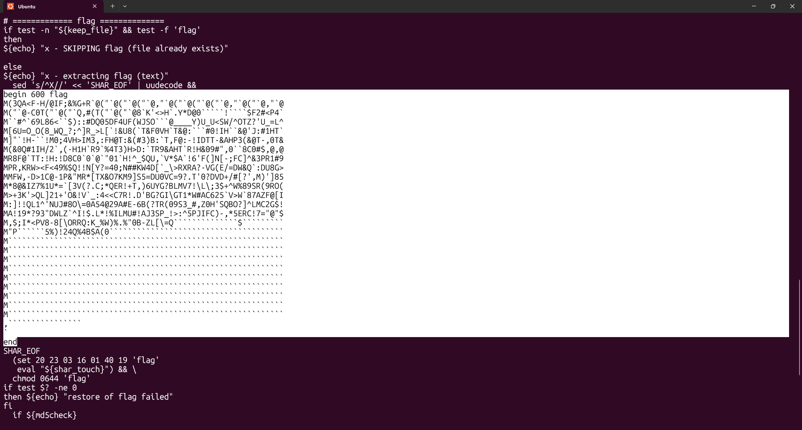
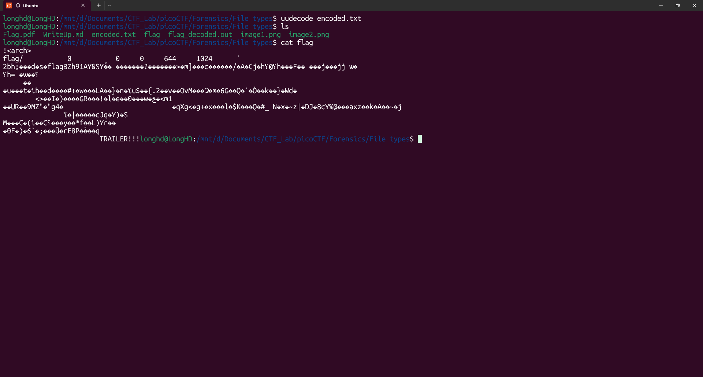

# Write-Up: File types - picoCTF

**Thể loại:** Forensics  
**Mức độ:** Vừa  
**Tác giả:** Hà Duy Long - AT02 - PTIT

---

# Mô tả

Tập tin này được tìm thấy trong một số tập tin được đánh dấu là bí mật nhưng trình đọc pdf của tôi không đọc được, có thể trình đọc của bạn đọc được.

---

# Các bước thực hiện

1. **Kiểm tra file**
    Vì chúng ta không thể mở file pdf lên xem nên hãy thử kiểm tra xem nó có đúng là file pdf hay không
    
    ```bash
    file Flag.pdf
    ```

    

    Nhận thấy rằng đây là 1 file `shell archive text` chứ không phải pdf nên chúng ta thử kiểm tra xem nó viết gì trong file

    ```bash 
    cat Flag.pdf
    ```

    

    Chúng ta tìm được một dạng mã hóa uuencode (Unit-to-Unit-encoding)
    Đặc điểm nhận dạng của dạng mã hóa này là 

    ```bash
    begin 644 example.txt
    ...
    end
    ```

2. **Giải mã**
    Chúng ta lưu đoạn trên ra 1 file `encoded.txt` với nội dung là

    ```txt
    begin 600 flag
    M(3QA<F-H/@IF;&%G+R`@("`@("`@("`@,"`@("`@("`@("`@,"`@("`@,"`@
    M("`@-C0T("`@("`Q,#(T("`@("`@8`K'<>H`.Y*D@0`````!````$F2#<P4`
    M``#^`69L86<``$)::#DQ05DF4UF(WJSO```@____Y)U_U<SW/^OTZ?'U_=L^
    M[6U=O_O(8_WQ_?;^]R_>L[`!&U8(`T&F0VH`T&@:```#0!IH``&@'J:#1HT`
    M]"`!H-``!M0;4VH>IM3,:FH@T:&(#3)B:`T,F@:-!IDTT-&AHP3(&@T-,0T&
    M(&0Q#1IH/2`,(-H1H`R9`%4T3)H>D:`TR9&AHT`R!H&09#",0``8C0#$,@,@
    MR8F@`TT:!H:!D8C0`0`@`"01`H!^_$QU,`V*$A`!6'F(]N[-;FC]^&3PR1#9
    MPR,KRW><F<49%$Q!!N[Y?=40;N##KW4D[`_\>RXRA?-VG(E/=DW&Q`:DU8G>
    MMFW,-D>1C@-1P&"MR*[TX&O7KM9]S5=DU0VC=9?.T'0?DVD+/#[?',M)']85
    M*8@&IZ7%1U*=`[3V(?.C;*QER!+T,)6UYG?BLMV7!\L\;3$+^W%89SR(9RO(
    M>+3K'>QL]21+'O&!V`_:4<<C7R!.D'BG?GI\GT1*W#AC625`V>W`87AZF@[I
    M:]!!QL1^'NUJ#8O\=0A54@29A#E-6B(?TR(09S3_#,Z0H'SQBO?]^LMC2G$!
    MA!19*?93"DWLZ`^I!$.L*!%ILMU#!AJ3SP_!>:^5PJIFC)-,*5ERC!7="@"$
    M,$;I*<PV8-8[\ORRQ:K_%W)%.%"0B-ZL[\=Q``````````````$`````````
    M"P``````5%)!24Q%4B$A(0``````````````````````````````````````
    M````````````````````````````````````````````````````````````
    M````````````````````````````````````````````````````````````
    M````````````````````````````````````````````````````````````
    M````````````````````````````````````````````````````````````
    M````````````````````````````````````````````````````````````
    M````````````````````````````````````````````````````````````
    M````````````````````````````````````````````````````````````
    M````````````````````````````````````````````````````````````
    M````````````````````````````````````````````````````````````
    ,````````````````
    `
    end
    ```

    Sau đó chạy lệnh giải mã trên terminal Ubuntu
    ```bash
    uudecode encoded.txt
    ```

    

    Có vẻ đây chưa phải file chưa flag thật, chúng ta lại kiểm tra tiếp file này
    Chúng ta thấy rằng đây là định dạng nén ar, vì nó nén quá nhiều file nên tôi ghi cho anh em lần lượt các lệnh giải nén nhé:

    ```txt
    ar:     ar x <file>
    cpio:   cpio -idu <file>
    bzip2:  bzip2 -d <file>
    gzip:   gunzip <file>.gz
    lzip:   lzip -d <file>
    LZ4:    lz4 -d <file_zip> <file_out>
    LZMA:   xz -d <file>.xz
    lzop:   lzop -d <file>.lzop
    XZ:     xz -d <file>.xz
    POSIX:  tar -xf <file>.tar
    UPX:    upx -d <file>
    ```

    Sau khi gỉai nén xong anh em sẽ được file `flag.out' với nội dung:

    ```txt
    7069636f4354467b66316c656e406d335f6d406e3170756c407431306e5f
    6630725f3062326375723137795f39353063346665657d0a
    ```

3. **Flag**
   picoCTF{f1len@m3_m@n1pul@t10n_f0r_0b2cur17y_950c4fee}
