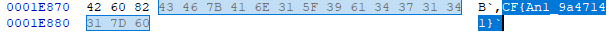

# Write Up

## 1. **Phân tích file**

Đề bài cho chúng ta 3 file `.png` thì chúng ta sẽ kiểm tra thử toàn bộ chúng xem sao

```bash
$ pngcheck mystery.png
zlib warning:  different version (expected 1.2.13, using 1.3)

mystery.png  additional data after IEND chunk
ERROR: mystery.png

$ pngcheck mystery2.png
zlib warning:  different version (expected 1.2.13, using 1.3)

mystery2.png  additional data after IEND chunk
ERROR: mystery2.png

$ pngcheck mystery3.png
zlib warning:  different version (expected 1.2.13, using 1.3)

mystery3.png  additional data after IEND chunk
ERROR: mystery3.png
```

---

Vậy là cả 3 file đều bị thêm 1 phần data nào đấy đằng sau `IEND` chunk

## 2. **Phân tích bằng HxD**

File `mystery.png`



```txt
# Byte
43 46 7B 41 6E 31 5F 39 61 34 37 31 34 31 7D 60

# ASCII
CF{An1_9a47141}`
```

File `mystery2.png`


```txt
# Byte
85 73

# ASCII
…s
```

File `mystery3.png`


```txt
# Byte
69 63 54 30 74 68 61 5F

# ASCII
icT0tha_
```

Vậy là chúng ta đã thành công trích xuất ra các phần data được thêm vào sao chunk `IEND` của các file `.png` tiếp theo hãy phân tích thử file `binary`

---

## 3. **Ghidra**

Chúng ta thấy hàm ghi đè dữ liệu vào ảnh như sau

```c
void main(void)
{
    FILE *__stream;
    FILE *__stream_00;
    FILE *__stream_01;
    FILE *__stream_02;
    long in_FS_OFFSET;
    char local_6b;
    int local_68;
    int local_64;
    int local_60;
    char local_38 [4];
    char local_34;
    char local_33;
    long local_10;
    
    local_10 = *(long *)(in_FS_OFFSET + 0x28);
    __stream = fopen("flag.txt","r");
    __stream_00 = fopen("mystery.png","a");
    __stream_01 = fopen("mystery2.png","a");
    __stream_02 = fopen("mystery3.png","a");
    if (__stream == (FILE *)0x0) {
        puts("No flag found, please make sure this is run on the server");
    }
    if (__stream_00 == (FILE *)0x0) {
        puts("mystery.png is missing, please run this on the server");
    }
    fread(local_38,0x1a,1,__stream);
    fputc((int)local_38[1],__stream_02);
    fputc((int)(char)(local_38[0] + '\x15'),__stream_01);
    fputc((int)local_38[2],__stream_02);
    local_6b = local_38[3];
    fputc((int)local_33,__stream_02);
    fputc((int)local_34,__stream_00);
    for (local_68 = 6; local_68 < 10; local_68 = local_68 + 1) {
        local_6b = local_6b + '\x01';
        fputc((int)local_38[local_68],__stream_00);
    }
    fputc((int)local_6b,__stream_01);
    for (local_64 = 10; local_64 < 0xf; local_64 = local_64 + 1) {
        fputc((int)local_38[local_64],__stream_02);
    }
    for (local_60 = 0xf; local_60 < 0x1a; local_60 = local_60 + 1) {
        fputc((int)local_38[local_60],__stream_00);
    }
    fclose(__stream_00);
    fclose(__stream);
    if (local_10 != *(long *)(in_FS_OFFSET + 0x28)) {
        __stack_chk_fail();
    }
    return;
}
```

---

## 4. **Script**

```python
mystery   = b"CF{An1_9a47141}`"
mystery2  = bytes([0x85, 0x73])
mystery3  = b"icT0tha_"

flag = [None] * 25

flag[1] = mystery3[0]
flag[0] = mystery2[0] - 0x15
flag[2] = mystery3[1]
flag[3] = mystery2[1] - 4

flag[5] = mystery3[2]
flag[4] = mystery[0]

for i in range(1, 5):
    flag[5 + i] = mystery[i]

for i in range(3, 8):
    flag[7 + i] = mystery3[i]

for i in range(5, 15):
    flag[10 + i] = mystery[i]

print(''.join([chr(c) for c in flag if c is not None]))
```

---

## 5. **Flag**

picoCTF{An0tha_1_9a47141}