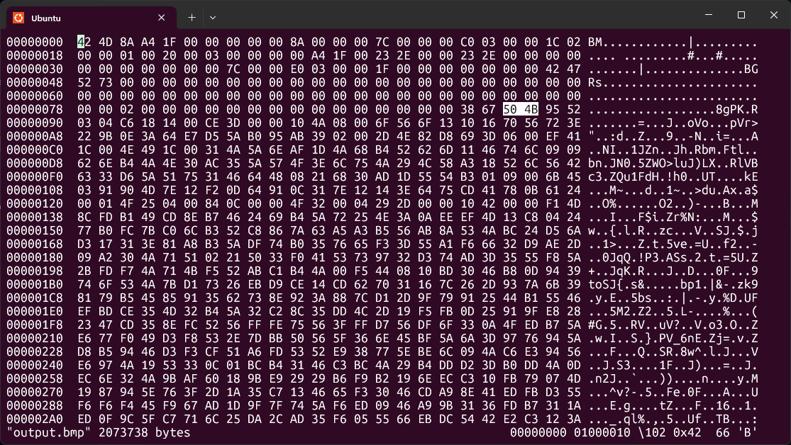
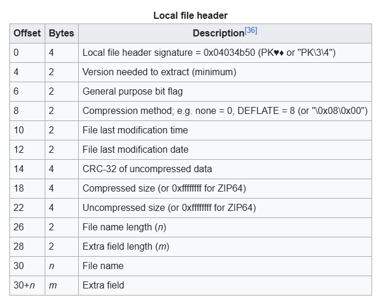

# Write-Up: Invisible WORDs - picoCTF

**Thể loại:** Forensics  
**Mức độ:** Khó  
**Tác giả:** Hà Duy Long - AT02 - PTIT

---

# Mô tả

Phân tích file .bmp

---

# Các bước thực hiện

1. **Kiểm tra những thứ ẩn giấu trong file**
   
   ```bash
   bvi output.bmp
   ```

   

   Ta nhận ra rằng PK là 1 dạng file ZIP

   

2. **Tách file ZIP ra khỏi ảnh**
   Sử dụng `code.py` để phân tách

3. **Flag**
   picoCTF{w0rd_d4wg_y0u_f0und_5h3113ys_m4573rp13c3_539ea4a8}