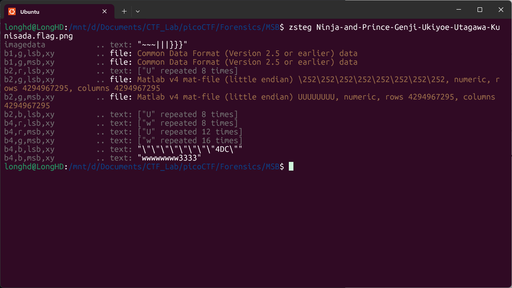

# Write-Up: MSB - picoCTF

**Thể loại:** Forensics  
**Mức độ:** Vừa   
**Tác giả:** Hà Duy Long - AT02 - PTIT

---

# Mô tả

Phân tích MSB của ảnh

---

# Các bước thực hiện

1. **Phân tích qua file ảnh**
   

   Nhận thấy MSB chứa 1 chuỗi text nào đó, có khả năng flag ẩn giấu trong đấy

    Sử dụng sigBits, công cụ Python hỗ trợ việc phân tích MSB, LSB

2. **Flag**
    picoCTF{15_y0ur_que57_qu1x071c_0r_h3r01c_b5e03bc5}