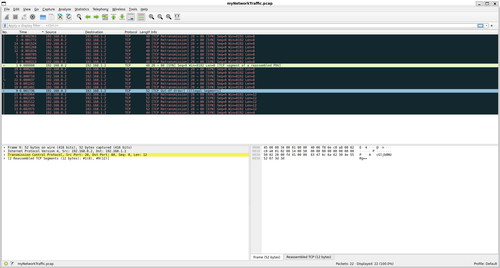

# Write-Up: Ph4t0m 1ntrud3r - picoCTF

**Thể loại:** Forensics  
**Mức độ:** Dễ    
**Tác giả:** Hà Duy Long - AT02 - PTIT

---

# Mô tả

Phân tích file pcap 

---

# Các bước thực hiện

1. **Sử dụng wireshark để phân tích file PCAP**
   

2. **Flag**
   picoCTF{1t_w4snt_th4t_34sy_tbh_4r_e5e8c78d}