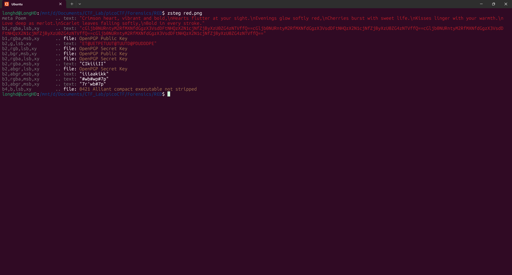

# Write-Up: RED - picoCTF

**Thể loại:** Forensics  
**Mức độ:** Dễ    
**Tác giả:** Hà Duy Long - AT02 - PTIT

---

# Mô tả

Phân tích file png  

---

# Các bước thực hiện

1. **Kiểm tra file png**
   
   ```bash
   zsteg red.png
   ```

   

2. **Flag**
   picoCTF{r3d_1s_th3_ult1m4t3_cur3_f0r_54dn355_}