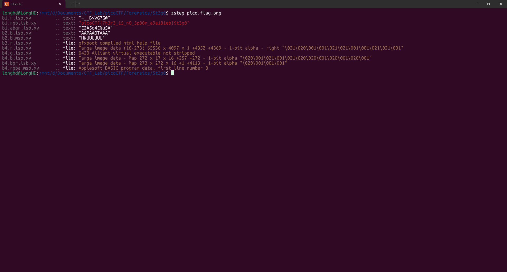

# Write-Up: St3g0 - picoCTF

**Thể loại:** Forensics  
**Mức độ:** Vừa     
**Tác giả:** Hà Duy Long - AT02 - PTIT

---

# Mô tả

Phân tích file png   

---

# Các bước thực hiện

1. **Kiểm tra file png**
   

2. **Flag**
   picoCTF{7h3r3_15_n0_5p00n_a9a181eb}