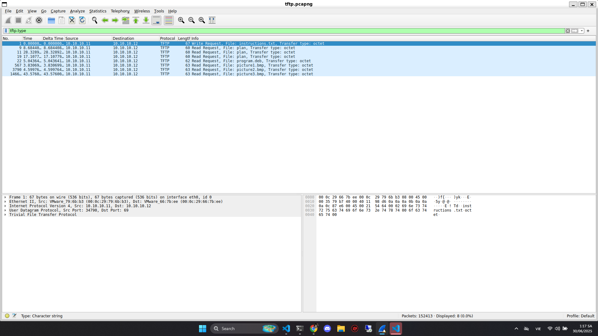

# Write Up

## Wireshark

Mở file `.pcapng` bằng Wireshark

Chúng ta sẽ thấy rất nhiều giao thức `TFTP`

Lọc ra những giao thức truyền file bằng `filter = tftp.type`



Thấy rất nhiều file được truyền đi

Hãy tải hết chúng về và phân tích

File -> Export Object -> TFTP...

---

## Phân tích

Thử với file `instructions.txt`

```bash
$ cat instructions.txt
GSGCQBRFAGRAPELCGBHEGENSSVPFBJRZHFGQVFTHVFRBHESYNTGENAFSRE.SVTHERBHGNJNLGBUVQRGURSYNTNAQVJVYYPURPXONPXSBEGURCYNA
```

Đây là dạng mã hóa `ROT13`

Giải mã

```txt
TFTPDOESNTENCRYPTOURTRAFFICSOWEMUSTDISGUISEOURFLAGTRANSFER.FIGUREOUTAWAYTOHIDETHEFLAGANDIWILLCHECKBACKFORTHEPLAN

TFTP DOESNT ENCRYPT OUR TRAFFIC SO WE MUST DISGUISE OUR FLAG TRANSFER. FIGURE OUT A WAY TO HIDE THE FLAG AND I WILL CHECK BACK FOR THE PLAN
```

Thử với file `plan`

```bash
$ cat plan
VHFRQGURCEBTENZNAQUVQVGJVGU-QHRQVYVTRAPR.PURPXBHGGURCUBGBF
```

Giải mã

```txttxt
IUSEDTHEPROGRAMANDHIDITWITH-DUEDILIGENCE.CHECKOUTTHEPHOTOS

I USED THE PROGRAM AND HID IT WITH-DUE DILIGENCE. CHECKOUT THE PHOTOS
```

Thử với file `program.deb`

Đây là 1 gói cài đặt phần mềm, thử kiểm tra trước khi cài

```bash
$ dpkg-deb -c program.deb
drwxr-xr-x root/root         0 2014-10-15 07:02 ./
drwxr-xr-x root/root         0 2014-10-15 07:02 ./usr/
drwxr-xr-x root/root         0 2014-10-15 07:02 ./usr/share/
drwxr-xr-x root/root         0 2014-10-15 07:02 ./usr/share/doc/
drwxr-xr-x root/root         0 2014-10-15 07:02 ./usr/share/doc/steghide/
-rw-r--r-- root/root      6066 2014-10-15 07:02 ./usr/share/doc/steghide/ABOUT-NLS.gz
-rw-r--r-- root/root      2771 2014-10-15 07:02 ./usr/share/doc/steghide/LEAME.gz
-rw-r--r-- root/root      2488 2003-09-28 22:30 ./usr/share/doc/steghide/README.gz
-rw-r--r-- root/root      1763 2014-10-15 07:01 ./usr/share/doc/steghide/changelog.Debian.gz
-rw-r--r-- root/root       215 2014-10-15 07:01 ./usr/share/doc/steghide/changelog.Debian.amd64.gz
-rw-r--r-- root/root       860 2003-10-11 16:03 ./usr/share/doc/steghide/changelog.gz
-rw-r--r-- root/root      1088 2014-10-15 07:01 ./usr/share/doc/steghide/copyright
-rw-r--r-- root/root       787 2003-05-03 19:41 ./usr/share/doc/steghide/TODO
-rw-r--r-- root/root      1957 2003-10-11 16:03 ./usr/share/doc/steghide/HISTORY
-rw-r--r-- root/root       895 2003-10-11 16:04 ./usr/share/doc/steghide/CREDITS
-rw-r--r-- root/root       598 2003-09-27 14:40 ./usr/share/doc/steghide/BUGS
drwxr-xr-x root/root         0 2014-10-15 07:02 ./usr/share/man/
drwxr-xr-x root/root         0 2014-10-15 07:02 ./usr/share/man/man1/
-rw-r--r-- root/root      3760 2014-10-15 07:02 ./usr/share/man/man1/steghide.1.gz
drwxr-xr-x root/root         0 2014-10-15 07:02 ./usr/share/locale/
drwxr-xr-x root/root         0 2014-10-15 07:02 ./usr/share/locale/ro/
drwxr-xr-x root/root         0 2014-10-15 07:02 ./usr/share/locale/ro/LC_MESSAGES/
-rw-r--r-- root/root     30028 2014-10-15 07:02 ./usr/share/locale/ro/LC_MESSAGES/steghide.mo
drwxr-xr-x root/root         0 2014-10-15 07:02 ./usr/share/locale/fr/
drwxr-xr-x root/root         0 2014-10-15 07:02 ./usr/share/locale/fr/LC_MESSAGES/
-rw-r--r-- root/root     30386 2014-10-15 07:02 ./usr/share/locale/fr/LC_MESSAGES/steghide.mo
drwxr-xr-x root/root         0 2014-10-15 07:02 ./usr/share/locale/de/
drwxr-xr-x root/root         0 2014-10-15 07:02 ./usr/share/locale/de/LC_MESSAGES/
-rw-r--r-- root/root     30268 2014-10-15 07:02 ./usr/share/locale/de/LC_MESSAGES/steghide.mo
drwxr-xr-x root/root         0 2014-10-15 07:02 ./usr/share/locale/es/
drwxr-xr-x root/root         0 2014-10-15 07:02 ./usr/share/locale/es/LC_MESSAGES/
-rw-r--r-- root/root     29198 2014-10-15 07:02 ./usr/share/locale/es/LC_MESSAGES/steghide.mo
drwxr-xr-x root/root         0 2014-10-15 07:02 ./usr/bin/
-rwxr-xr-x root/root    290888 2014-10-15 07:02 ./usr/bin/steghide

$ dpkg-deb -I program.deb
new Debian package, version 2.0.
size 138310 bytes: control archive=1250 bytes.
    826 bytes,    18 lines      control
1184 bytes,    17 lines      md5sums
Package: steghide
Source: steghide (0.5.1-9.1)
Version: 0.5.1-9.1+b1
Architecture: amd64
Maintainer: Ola Lundqvist <opal@debian.org>
Installed-Size: 426
Depends: libc6 (>= 2.2.5), libgcc1 (>= 1:4.1.1), libjpeg62-turbo (>= 1:1.3.1), libmcrypt4, libmhash2, libstdc++6 (>= 4.9), zlib1g (>= 1:1.1.4)
Section: misc
Priority: optional
Description: A steganography hiding tool
Steghide is steganography program which hides bits of a data file
in some of the least significant bits of another file in such a way
that the existence of the data file is not visible and cannot be proven.
.
Steghide is designed to be portable and configurable and features hiding
data in bmp, wav and au files, blowfish encryption, MD5 hashing of
passphrases to blowfish keys, and pseudo-random distribution of hidden bits
in the container data.
```

Hóa ra là `steghide` thôi

Vậy anh thử lệnh `steghide` với 3 file ảnh `.bmp`

Nếu nó hỏi mật khẩu thì khá chắc là `DUEDILIGENCE` vì file `plan` đã chỉ ra như vậy

```bash
$ steghide extract -sf picture1.bmp -p "DUEDILIGENCE"
steghide: could not extract any data with that passphrase!

$ steghide extract -sf picture2.bmp -p "DUEDILIGENCE"
steghide: could not extract any data with that passphrase!

$ steghide extract -sf picture3.bmp -p "DUEDILIGENCE"
wrote extracted data to "flag.txt".
```

Đọc file `flag.txt` vừa tìm được

---

## Flag

Flag: picoCTF{h1dd3n_1n_pLa1n_51GHT_18375919}