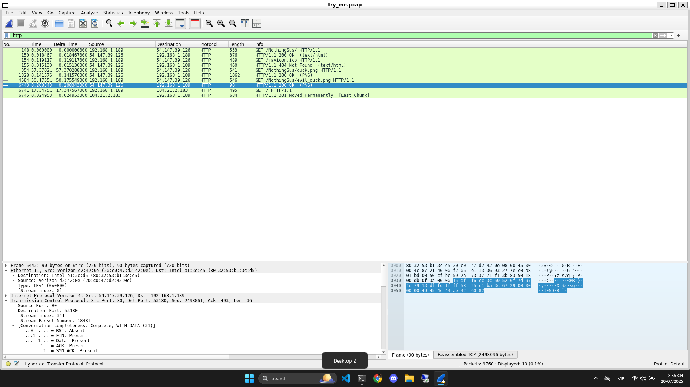
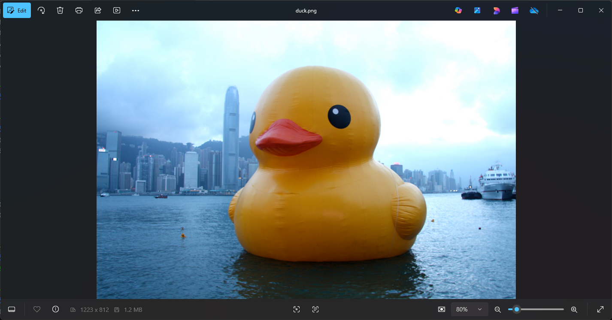
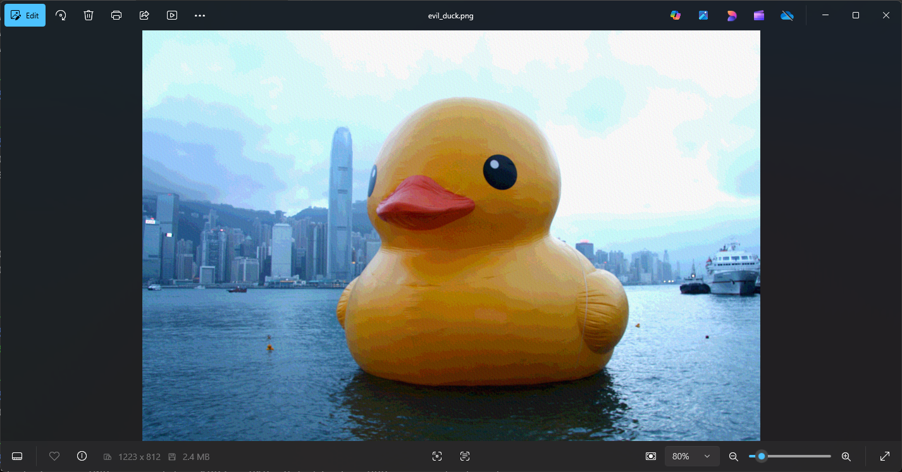
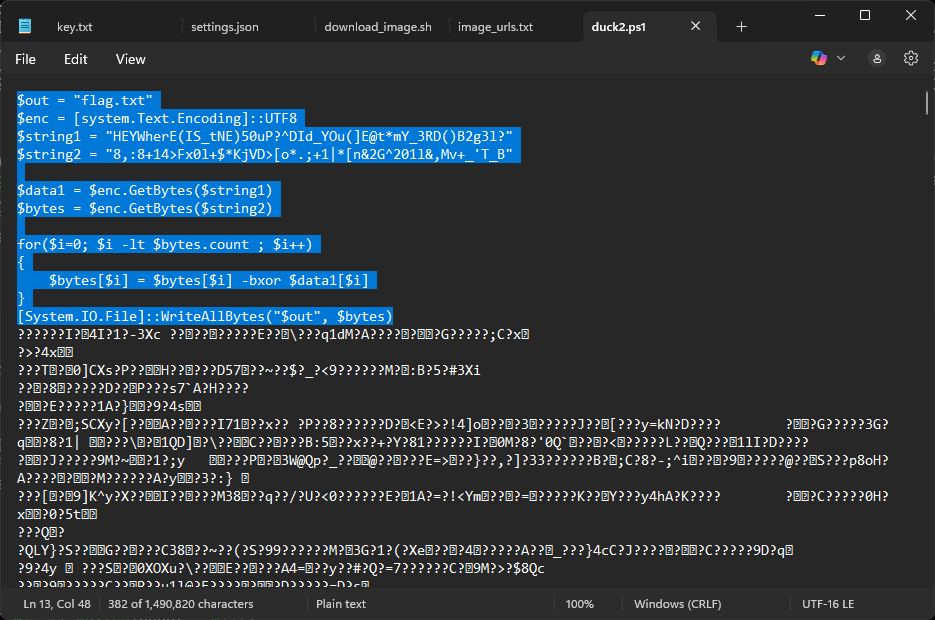

# Write Up

## Wireshark

Chúng ta sẽ mở `Wireshark` và kiểm tra các gói tin được truyền đi



Ở đây tôi đã thấy giao thức `HTTP` gửi 2 file ảnh là `duck.png` và `evil_duck.png`

Anh em cũng có thể dùng `tshark` để lọc ra

```bash
$ tshark -r try_me.pcap -Y http.request -T fields -e http.request.uri > uris.txt

$ cat uris.txt
/NothingSus/
/favicon.ico
*
*
*
*
/NothingSus/duck.png
/NothingSus/evil_duck.png
/
```

Tải 2 file này về

Chọn `File` -> `Export Object` -> `HTTP` -> `Save`

---

## Kiểm tra file PNG

Thử mở 2 ảnh lên xem

```bash
$ xdg-open duck.png
$ xdg-open evil_duck.png
```





Có vẻ không có gì lắm, thử kiểm tra tiếp thêm vài thứ khác

`exiftool`

```bash
$ exiftool duck.png
ExifTool Version Number         : 13.25
File Name                       : duck.png
Directory                       : .
File Size                       : 1284 kB
File Modification Date/Time     : 2025:07:20 15:33:21+07:00
File Access Date/Time           : 2025:07:20 15:38:09+07:00
File Inode Change Date/Time     : 2025:07:20 15:33:21+07:00
File Permissions                : -rwxrwxrwx
File Type                       : PNG
File Type Extension             : png
MIME Type                       : image/png
Image Width                     : 1223
Image Height                    : 812
Bit Depth                       : 8
Color Type                      : RGB
Compression                     : Deflate/Inflate
Filter                          : Adaptive
Interlace                       : Noninterlaced
Profile Name                    : ICC Profile
Profile CMM Type                : Apple Computer Inc.
Profile Version                 : 2.1.0
Profile Class                   : Display Device Profile
Color Space Data                : RGB
Profile Connection Space        : XYZ
Profile Date Time               : 2013:04:12 15:54:47
Profile File Signature          : acsp
Primary Platform                : Apple Computer Inc.
CMM Flags                       : Not Embedded, Independent
Device Manufacturer             :
Device Model                    :
Device Attributes               : Reflective, Glossy, Positive, Color
Rendering Intent                : Perceptual
Connection Space Illuminant     : 0.9642 1 0.82491
Profile Creator                 : Apple Computer Inc.
Profile ID                      : 0
Profile Description             : Display
Profile Description ML (sk-SK)  : Thunderbolt Display
Profile Description ML (ca-ES)  : Thunderbolt Display
Profile Description ML (he-IL)  : Thunderbolt Display
Profile Description ML (pt-BR)  : Thunderbolt Display
Profile Description ML (it-IT)  : Thunderbolt Display
Profile Description ML (hu-HU)  : Thunderbolt Display
Profile Description ML (uk-UA)  : Thunderbolt Display
Profile Description ML (ko-KR)  : Thunderbolt Display
Profile Description ML (nb-NO)  : Thunderbolt Display
Profile Description ML (cs-CZ)  : Thunderbolt Display
Profile Description ML (zh-TW)  : Thunderbolt Display
Profile Description ML (de-DE)  : Thunderbolt Display
Profile Description ML (ro-RO)  : Thunderbolt Display
Profile Description ML (sv-SE)  : Thunderbolt Display
Profile Description ML (zh-CN)  : Thunderbolt Display
Profile Description ML (ja-JP)  : Thunderbolt Display
Profile Description ML (el-GR)  : Thunderbolt Display
Profile Description ML (pt-PT)  : Thunderbolt Display
Profile Description ML (nl-NL)  : Thunderbolt Display
Profile Description ML (fr-FR)  : Thunderbolt Display
Profile Description ML (es-ES)  : Thunderbolt Display
Profile Description ML (th-TH)  : Thunderbolt Display
Profile Description ML (tr-TR)  : Thunderbolt Display
Profile Description ML (fi-FI)  : Thunderbolt Display
Profile Description ML (hr-HR)  : Thunderbolt Display
Profile Description ML (pl-PL)  : Thunderbolt Display
Profile Description ML (ru-RU)  : Thunderbolt Display
Profile Description ML          : Thunderbolt Display
Profile Description ML (da-DK)  : Thunderbolt Display
Profile Copyright               : Copyright Apple, Inc., 2013
Media White Point               : 0.94955 1 1.08902
Red Matrix Column               : 0.44434 0.22476 0.00548
Green Matrix Column             : 0.37944 0.72617 0.07797
Blue Matrix Column              : 0.14041 0.04907 0.74146
Red Tone Reproduction Curve     : (Binary data 2060 bytes, use -b option to extract)
Video Card Gamma                : (Binary data 48 bytes, use -b option to extract)
Native Display Info             : (Binary data 62 bytes, use -b option to extract)
Chromatic Adaptation            : 1.04861 0.02332 -0.05034 0.03018 0.99002 -0.01714 -0.00922 0.01503 0.75172
Make And Model                  : (Binary data 40 bytes, use -b option to extract)
Blue Tone Reproduction Curve    : (Binary data 2060 bytes, use -b option to extract)
Green Tone Reproduction Curve   : (Binary data 2060 bytes, use -b option to extract)
XMP Toolkit                     : XMP Core 5.1.2
Exif Image Width                : 1223
Exif Image Height               : 812
Image Size                      : 1223x812
Megapixels                      : 0.993

$ exiftool evil_duck.png
ExifTool Version Number         : 13.25
File Name                       : evil_duck.png
Directory                       : .
File Size                       : 2.5 MB
File Modification Date/Time     : 2025:07:20 15:33:37+07:00
File Access Date/Time           : 2025:07:20 15:38:54+07:00
File Inode Change Date/Time     : 2025:07:20 15:33:37+07:00
File Permissions                : -rwxrwxrwx
File Type                       : PNG
File Type Extension             : png
MIME Type                       : image/png
Image Width                     : 1223
Image Height                    : 812
Bit Depth                       : 8
Color Type                      : RGB
Compression                     : Deflate/Inflate
Filter                          : Adaptive
Interlace                       : Noninterlaced
Gamma                           : 2.2
White Point X                   : 0.34574
White Point Y                   : 0.35858
Red X                           : 0.65876
Red Y                           : 0.33323
Green X                         : 0.32062
Green Y                         : 0.61359
Blue X                          : 0.15083
Blue Y                          : 0.05271
Profile Name                    : ICC Profile
Profile CMM Type                : Apple Computer Inc.
Profile Version                 : 2.1.0
Profile Class                   : Display Device Profile
Color Space Data                : RGB
Profile Connection Space        : XYZ
Profile Date Time               : 2013:04:12 15:54:47
Profile File Signature          : acsp
Primary Platform                : Apple Computer Inc.
CMM Flags                       : Not Embedded, Independent
Device Manufacturer             :
Device Model                    :
Device Attributes               : Reflective, Glossy, Positive, Color
Rendering Intent                : Perceptual
Connection Space Illuminant     : 0.9642 1 0.82491
Profile Creator                 : Apple Computer Inc.
Profile ID                      : 0
Profile Description             : Display
Profile Description ML (sk-SK)  : Thunderbolt Display
Profile Description ML (ca-ES)  : Thunderbolt Display
Profile Description ML (he-IL)  : Thunderbolt Display
Profile Description ML (pt-BR)  : Thunderbolt Display
Profile Description ML (it-IT)  : Thunderbolt Display
Profile Description ML (hu-HU)  : Thunderbolt Display
Profile Description ML (uk-UA)  : Thunderbolt Display
Profile Description ML (ko-KR)  : Thunderbolt Display
Profile Description ML (nb-NO)  : Thunderbolt Display
Profile Description ML (cs-CZ)  : Thunderbolt Display
Profile Description ML (zh-TW)  : Thunderbolt Display
Profile Description ML (de-DE)  : Thunderbolt Display
Profile Description ML (ro-RO)  : Thunderbolt Display
Profile Description ML (sv-SE)  : Thunderbolt Display
Profile Description ML (zh-CN)  : Thunderbolt Display
Profile Description ML (ja-JP)  : Thunderbolt Display
Profile Description ML (el-GR)  : Thunderbolt Display
Profile Description ML (pt-PT)  : Thunderbolt Display
Profile Description ML (nl-NL)  : Thunderbolt Display
Profile Description ML (fr-FR)  : Thunderbolt Display
Profile Description ML (es-ES)  : Thunderbolt Display
Profile Description ML (th-TH)  : Thunderbolt Display
Profile Description ML (tr-TR)  : Thunderbolt Display
Profile Description ML (fi-FI)  : Thunderbolt Display
Profile Description ML (hr-HR)  : Thunderbolt Display
Profile Description ML (pl-PL)  : Thunderbolt Display
Profile Description ML (ru-RU)  : Thunderbolt Display
Profile Description ML          : Thunderbolt Display
Profile Description ML (da-DK)  : Thunderbolt Display
Profile Copyright               : Copyright Apple, Inc., 2013
Media White Point               : 0.94955 1 1.08902
Red Matrix Column               : 0.44434 0.22476 0.00548
Green Matrix Column             : 0.37944 0.72617 0.07797
Blue Matrix Column              : 0.14041 0.04907 0.74146
Red Tone Reproduction Curve     : (Binary data 2060 bytes, use -b option to extract)
Video Card Gamma                : (Binary data 48 bytes, use -b option to extract)
Native Display Info             : (Binary data 62 bytes, use -b option to extract)
Chromatic Adaptation            : 1.04861 0.02332 -0.05034 0.03018 0.99002 -0.01714 -0.00922 0.01503 0.75172
Make And Model                  : (Binary data 40 bytes, use -b option to extract)
Blue Tone Reproduction Curve    : (Binary data 2060 bytes, use -b option to extract)
Green Tone Reproduction Curve   : (Binary data 2060 bytes, use -b option to extract)
Pixels Per Unit X               : 3779
Pixels Per Unit Y               : 3779
Pixel Units                     : meters
Image Size                      : 1223x812
```

`zsteg`

```bash
$ zsteg duck.png
meta XML:com.adobe.xmp.. text: "<x:xmpmeta xmlns:x=\"adobe:ns:meta/\" x:xmptk=\"XMP Core 5.1.2\">\n   <rdf:RDF xmlns:rdf=\"http://www.w3.org/1999/02/22-rdf-syntax-ns#\">\n      <rdf:Description rdf:about=\"\"\n            xmlns:exif=\"http://ns.adobe.com/exif/1.0/\">\n         <exif:PixelXDimension>1223</exif:PixelXDimension>\n         <exif:PixelYDimension>812</exif:PixelYDimension>\n      </rdf:Description>\n   </rdf:RDF>\n</x:xmpmeta>\n"
b2,b,msb,xy         .. text: "ZU]oWUUi"
b2,rgb,msb,xy       .. text: "VjXU[eQ7}UUUU"
b4,r,lsb,xy         .. text: "\"ED2\"$UVgx"
b4,g,msb,xy         .. text: ";s;w{wwwww"
b4,rgb,msb,xy       .. text: "s6k}QWu]"

$ zsteg evil_duck.png
imagedata           .. text: "U9bQ9c\\3eP4fS9`e7~dAxe@"
b1,rgb,lsb,xy       .. file: OpenPGP Public Key
b1,rgb,msb,xy       .. file: OpenPGP Public Key
b4,b,lsb,xy         .. text: "&w#\"ff'w "
b4,b,msb,xy         .. text: "nNfnNLdD"
b4,rgb,lsb,xy       .. file: OpenPGP Secret Key
b4,bgr,lsb,xy       .. text: "]nF3o6Ai"
```

`binwalk`

```bash
$ binwalk duck.png

DECIMAL       HEXADECIMAL     DESCRIPTION
--------------------------------------------------------------------------------
0             0x0             PNG image, 1223 x 812, 8-bit/color RGB, non-interlaced

$ binwalk evil_duck.png

DECIMAL       HEXADECIMAL     DESCRIPTION
--------------------------------------------------------------------------------
0             0x0             PNG image, 1223 x 812, 8-bit/color RGB, non-interlaced
2862          0xB2E           Zlib compressed data, compressed
```

File `evil_duck.png` có vẻ sú hơn

Extract binwalk

```bash
$ binwalk -e evil_duck.png

DECIMAL       HEXADECIMAL     DESCRIPTION
--------------------------------------------------------------------------------
2862          0xB2E           Zlib compressed data, compressed

WARNING: One or more files failed to extract: either no utility was found or it's unimplemented
```

Theo lệnh `zsteg` trên ta có thể thấy file `evil_duck.png` chứa `OpenPGP Key`

Ta lấy 2 key đó ra

```bash
$ zsteg -E b1,rgb,lsb,xy evil_duck.png > public.asc
$ zsteg -E b4,rgb,lsb,xy evil_duck.png > secret.asc

$ file public.asc secret.asc
public.asc: OpenPGP Public Key
secret.asc: OpenPGP Secret Key
```

Trong metadata của `evil_duck.png` còn chứa password cho một file nào đó, lưu ra để nhỡ sau dùng

```bash
$ echo 'U9bQ9c\3eP4fS9`e7~dAxe@' > pass.txt
$ cat pass.txt
U9bQ9c\3eP4fS9`e7~dAxe@
```

Tiếp theo chúng ta sẽ import public & secret key vào GPG

```bash
$ gpg --import public.asc
gpg: directory '/home/kali/.gnupg' created
gpg: keybox '/home/kali/.gnupg/pubring.kbx' created
gpg: packet(6) with unknown version 131
gpg: read_block: read error: Invalid packet
gpg: import from 'public.asc' failed: Invalid keyring
gpg: Total number processed: 0

$ gpg --allow-secret-key-import --import secret.asc
gpg: packet(5) with unknown version 246
gpg: read_block: read error: Invalid packet
gpg: import from 'secret.asc' failed: Invalid keyring
gpg: Total number processed: 0
```

Sau khi tìm 1 hồi không ra thì tôi thấy có phương pháp mới là `PowerShell Steganography`

---

## PowerShell Steganography

Tải tools Extract PSImage từ link GitHub: https://github.com/imurasheen/Extract-PSImage/blob/master/README.md

```powershell
> Import-Module 'D:\Documents\CTF\picoCTF\Forensics\Very very very Hidden\Extract-Invoke-PSImage.ps1'

> Extract-Invoke-PSImage -Image 'D:\Documents\CTF\picoCTF\Forensics\Very very very Hidden\evil_duck.png' -Out duck.ps1
[Oneliner to extract embedded payload]
sal a New-Object;Add-Type -AssemblyName "System.Drawing";$g=a System.Drawing.Bitmap("D:\Documents\CTF\picoCTF\Forensics\Very very very Hidden\evil_duck.png");$o=a Byte[] 1490837;(0..811)|%{foreach($x in(0..1222)){$p=$g.GetPixel($x,$_);$o[$_*1223+$x]=([math]::Floor(($p.B-band15)*16)-bor($p.G-band15))}};$g.Dispose();[System.Text.Encoding]::ASCII.GetString($o[0..1490831])|Out-File $Out
[First 50 characters of extracted payload]
$out = "flag.txt"
$enc = [system.Text.Encoding]::

> sal a New-Object;Add-Type -AssemblyName "System.Drawing";$g=a System.Drawing.Bitmap("D:\Documents\CTF\picoCTF\Forensics\Very very very Hidden\evil_duck.png");$o=a Byte[] 1490837;(0..811)|%{foreach($x in(0..1222)){$p=$g.GetPixel($x,$_);$o[$_*1223+$x]=([math]::Floor(($p.B-band15)*16)-bor($p.G-band15))}};$g.Dispose();[System.Text.Encoding]::ASCII.GetString($o[0..1490831])|Out-File duck2.ps1

> notepad .\duck2.ps1
```

Mở notepad lên sẽ thấy đoạn giải mã sau:



Paste vào trong PowerShell

---

## Flag

Flag: picoCTF{n1c3_job_f1nd1ng_th3_s3cr3t_in_the_im@g3}