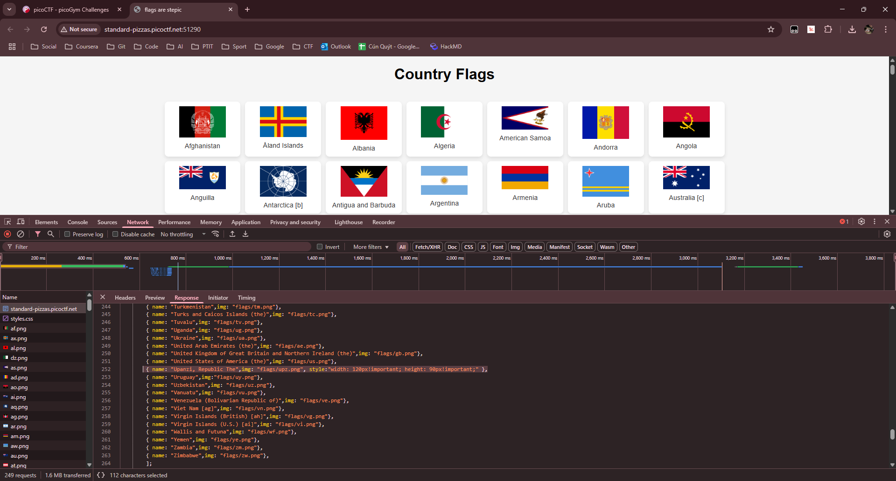

# Write-Up: flags are stepic - picoCTF

**Thể loại:** Forensics  
**Mức độ:** Vừa  
**Tác giả:** Hà Duy Long - AT02 - PTIT

---

# Mô tả

Bài này yêu cầu chúng ta tìm ra cách bọn hackers giao tiếp với nhau thông qua 1 web toàn những lá cờ các quốc gia.

---

# Các bước thực hiện

1. **Tìm ra lá cờ fake**
    Sẽ có 1 lá cờ không thuộc quốc gia nào, anh em có thể tìm bằng cách xem source code của web
    

    Tải lá cờ này xuống và tiến hành phân tích

2. **Phân tích lá cờ fake**
    Vì tên bài là `Stepic` → Thư viện mã nguồn mở trong Python dùng để giấu và trích xuất thông tin từ hình ảnh
    Nên chúng ta sẽ sử dụng thư viện này để kiểm tra ảnh lá cờ fake `upz.png`
    Code nằm trong file `code.py`

3. **Flag**
    picoCTF{fl4g_h45_fl4g9a81822b}